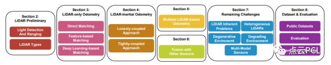
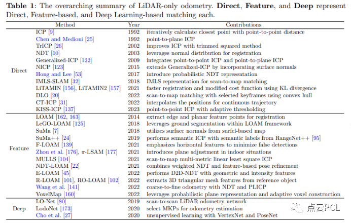
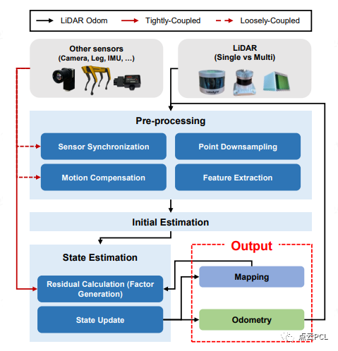
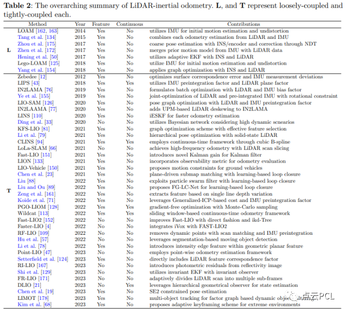
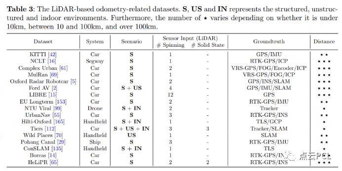
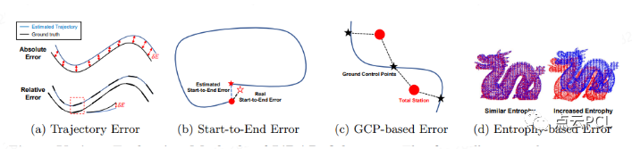
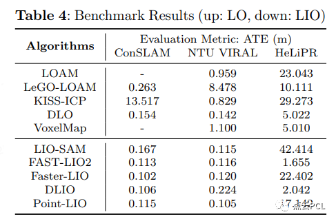

# 激光雷达里程计的最新进展和挑战

**摘要**

里程计对于机器人导航至关重要，尤其是在没有GPS等全球定位方法的情况下。里程计的主要目的是预测机器人的运动并准确确定其当前位置。各种传感器，如轮速编码器、惯性测量单元 (IMU)、摄像头、雷达和光探测与测距 (LiDAR) 等，都可用于机器人里程计。特别是激光雷达，因其能够提供丰富的三维（3D）数据并不受光线变化的影响而备受关注。本综述旨在深入研究激光雷达里程计的进展。首先探讨了激光雷达技术，然后仔细研究了激光雷达里程计，并根据传感器集成方法对其进行了分类。这些方法包括完全依赖激光雷达的方法、将激光雷达与 IMU 相结合的方法、涉及多个激光雷达的策略以及将激光雷达与其他传感器模式相融合的方法。最后讨论了激光雷达里程计面临的现有挑战，并概述了潜在的未来发展方向。此外还分析了用于激光雷达里程计的公共数据集和评估方法。据我们所知，这项调查是对激光雷达里程计的首次全面探索。

**图 1：激光雷达里程计概述**

**主要贡献**

本文的主要贡献如下：

- 
    - 本文全面回顾了激光雷达里程计技术的发展历程。我们将综述分为以下几个部分：激光雷达基础、纯激光雷达里程计、激光雷达-惯性测量里程计、多个激光雷达以及与其他传感器的融合。
- 
    - 我们的论文探讨了激光雷达里程计中尚未解决的难题，为未来研究提供了见解和方向。通过应对这些挑战，我们旨在推动提高激光雷达计精度和稳健性的进步。
- 
    - 我们的论文仔细研究了现有的公共数据集，强调了它们的独特性。此外还概述了相关研究中使用的评估指标，并介绍了基准结果。

**内容概述**

**激光雷达基础**

LiDAR 是 Light Detection And Ranging（光探测和测距）的缩写，是一种强大的遥感技术，用于测量距离并构建物体和环境的高精度三维图像。传感过程开始时，激光雷达系统会向指定区域发射激光脉冲，当这些脉冲遇到障碍物时，部分光线会反射回激光雷达传感器。根据每个激光脉冲返回所需的时间，并利用恒定的光速，激光雷达计算出与目标的距离。将激光雷达系统地应用于大面积区域并合成为距离测量值，可生成点云-三维空间中大量点的集合。这些点有效地建图出区域或物体的三维形状和特征。从本质上讲，激光雷达有助于创建周围世界高度详细和精确的三维图像，在地理空间制图、自主导航和环境监测等各个领域都证明了其价值。

激光雷达可根据其不同的成像结构和测量原理进行分类，激光雷达的成像机制可分为三大类：机械激光雷达、扫描固态激光雷达和非扫描结构的激光雷达。关于测量原理，主要类型包括脉冲飞行时间（ToF）、调幅连续波（AMCW）和调频连续波（FMCW）激光雷达。此外激光雷达还可根据探测距离、视场（FOV）和波长等属性进一步细分。

**仅使用激光雷达的里程计**

仅使用激光雷达里程计是通过分析连续的激光雷达扫描帧来确定机器人的位置。这涉及到扫描帧匹配的应用，而扫描匹配是计算机视觉、模式识别和机器人技术中的一项著名技术。根据扫描匹配的执行方式，纯激光雷达测距可分为三种类型：(1) 直接匹配；(2) 基于特征的匹配；(3) 基于深度学习的匹配。表 1 列出了纯激光雷达测距文献的摘要。

**激光雷达-惯性里程计**

仅使用激光雷达进行李恒基计算效率高，无需额外的传感器。然而，它无法完全解决现实中的一些挑战场景。因此，最近的激光雷达里程测量通常将激光雷达与惯性测量单元（IMU）集成在一起。IMU可提供角速度和线性加速度测量值，因此适合估算粗略的机器人运动，并在与LiDAR配合使用时提高姿态估算精度。根据 LiDAR 和 IMU 数据的融合方式，LiDAR 惯性里程测量可分为两类：(1) 松散耦合和 (2) 紧密耦合。

**图 3：激光雷达里程计流程。激光雷达里程计的整体框架可大致分为三个阶段：预处理、初始估计和状态估计。在集成其他传感器时，根据使用附加传感器数据的具体阶段，将其集成分为松耦合和紧耦合两种。在状态估算阶段，优化状态将在里程测量和绘图中得到利用。**

松耦合方法独立估计每个传感器的状态，将这些状态与权重相结合，然后确定机器人的状态。这种方法具有很高的灵活性，因为它可以单独估计每个传感器的状态。只要为新的传感器模式创建一个合适的里程测量模块，就能轻松适应传感器系统的变化，而无需对现有框架进行大量修改。此外，它还允许为特定传感器分配权重，确保在一个传感器表现不佳时的稳健性，因为里程测量仍可利用其他传感器的数据。另一方面，紧耦合方法利用所有传感器的测量结果来估算机器人的状态。与松耦合方法相比，这种方法在里程估算过程中纳入了更多的约束条件，因此可能会获得更精确的里程估算结果。不过，这种方法的计算负荷较高，因为所有观测数据都必须一并处理。此外，如果某个传感器提供的观测数据质量不佳，这种方法可能更容易失去鲁棒性。表 2 提供了有关激光雷达-惯性里程计的文献摘要。

**多个激光雷达**

激光雷达-惯性里程计展现了令人印象深刻的精度。然而某些激光雷达系统有限的视场（FOV）给状态估计带来了挑战，阻碍了进一步的发展。此外其他传感器的干扰也会遮挡激光雷达视场内的区域。在某些扫描固态激光雷达中观察到的不规则扫描模式也会因稀疏性而对实现精确扫描配准带来挑战。为了应对与单个激光雷达系统相关的挑战，研究人员越来越多地探索在里程计中使用多个激光雷达。多个激光雷达可提供更广泛的扫描覆盖范围，减少额外传感器的干扰，整合多个激光雷达的不同扫描帧模式可提高扫描记录的准确性，从而超越对单一激光雷达非重复扫描模式的依赖。

**与其他传感器的融合**

与视觉传感器不同，激光雷达对光照条件的变化具有很强的适应能力；不过，它在苛刻的环境中也面临着挑战。具体来说，激光雷达里程计在雨、雪和灰尘等不利条件下难以获得精确的测量结果。此外在几何特征有限或地形属性重复的区域，如长隧道或高速公路，激光雷达测量也很脆弱。这种易损性带来了扫描帧匹配方面的挑战，对状态估计的精度产生了负面影响。要解决这些制约因素，就需要探索多种传感器模式的融合，这也是当前研究的一个显著前沿。

**挑战**

不可否认，激光雷达里程计技术在为移动机器人和自动驾驶车辆提供高质量位置方面取得了重大进展，其性能在各种真实环境中得到了验证。然而，尽管取得了这些重大进展，尚未解决的问题仍有进一步研究的价值。

**激光雷达的固有问题**

虽然与 RGB 摄像机相比，激光雷达能提供精确的测量结果并能适应光照条件，但它也不能避免固有的局限性。

**大场景数据**：激光雷达系统可生成大量三维点云，其中包含丰富的环境和物体数据。它在捕捉周围环境的三维信息方面具有显著优势，但其大小也存在问题。这种点云的大小与激光雷达的视场角和分辨率成比例。例如，OS1-128 激光雷达可以产生包含大量点的扫描，在最高频率为 20Hz 的情况下，每帧可扫描 10 万个点。此外，点云中的每个点都包含范围、强度、反射率、环境条件和点采集时间等信息，从而增加了数据量。对如此大量的数据进行实时处理需要强大的计算能力，这对机器人技术提出了特别的挑战，因为实现实时性能对有效操作至关重要。

**运动畸变**：当机器人以相对于传感器数据采集频率的高速移动时，单次激光雷达扫描开始和结束时的数据采集位置之间会出现很大的空间差距。这种空间差距有可能导致激光雷达扫描出现严重畸变。因此为了有效利用激光雷达扫描，有必要采用补偿程序来减轻运动造成的失真，这通常被称为去畸变。去畸变通常采用高频传感器，如 IMU ，将点对准单帧。线性插值可以解决其离散性以及传感器测量值与实际位置不匹配的问题。在没有额外传感器的情况下，采用恒定速度模型可能就足够了，但在激进运动或不确定的速度估计方面缺乏准确性。连续时间插值法 是一种替代方法，它通过 B 样条插值法确定连续轨迹，确保每个激光雷达点的精确变换。然而，这种方法大大增加了计算需求，尤其是在点数较多时，因为每个点都需要单独的状态计算。因此，平衡精度和效率至关重要，具体选择取决于应用的具体需求和限制。

**有限传感视角**：激光雷达虽然能够进行远距离测量，但也存在固有的局限性。一个突出的缺点是其视场角相对较窄，这对于执行感知任务尤其成问题。此外尽管激光雷达的水平视场通常较宽，但其数据往往比标准相机拍摄的图像更为稀疏。近来，垂直腔面发射激光器（VCSEL）技术的进步使密集阵列中大量激光器的布置变得紧凑。尽管这一进步使得传感器的通道增加，数据更密集，但分辨率仍然低于传统相机。此外，在使用机械激光雷达时，通常会将其安装在开放区域，如机器人或自动驾驶车辆的顶部，以实现 360 度可视。然而，这给保护传感器免受外部冲击带来了挑战。如果试图将传感器安装在更隐蔽的位置，就会损失视场能见度，得不偿失。

**异构激光雷达**

激光雷达传感器分为两类的问题：机械式激光雷达和扫描式固态激光雷达。这两类激光雷达具有不同的特点，包括视角、扫描模式等方面的差异。因此这些差异本质上导致需要不同的里程测量算法。此外即使是同一类激光雷达，不同的制造商和产品线在视场角、分辨率和其他因素上也存在差异。这意味着对一种类型有效的算法在应用于另一种类型时，可能需要对其他参数进行调整。由于认识到根据特定传感器修改方法带来的不便，人们越来越需要一种能够在所有类型激光雷达中稳健运行的算法。

**退化环境**

传统的激光雷达里程计主要依赖于几何测量，忽略了纹理和颜色信息的使用。在隧道和长走廊等地物稀少、重复性高的环境中，这种依赖性就变得具有挑战性。虽然激光雷达能在这些环境中有效地进行扫描，但由于缺乏独特的特征，往往会导致扫描匹配的模糊性，从而造成机器人姿态估计的潜在误差。

**恶化环境**

与退化环境不同，恶化环境会对激光雷达的传感能力造成挑战。激光雷达的工作原理是发射激光脉冲，并在与物体相互作用后检测其返回，而这一过程可能会受到阻碍脉冲路径的有害颗粒的干扰。阳光直射、雨、雪或雾等极端天气条件会大大降低激光雷达的探测性能。

**多模态传感器**

在将其他传感器与激光雷达集成时，必须认识到这些附加传感器会带来自身的一系列挑战。此外多种传感器的组合还会带来新的限制和复杂性。

**校准：** 在使用多个传感器时，必须对每个传感器进行内参校准，并在传感器之间进行外在校准。然而，必须注意的是，尽管有校准工具和方法，但校准过程可能非常具有挑战性和复杂性。每个传感器的精确内参校准和多个传感器之间的精确外参校准都存在困难，包括处理各种误差源、考虑环境因素和管理复杂的数学变换。

**安装：** 在没有事先规划的情况下，简单地增加传感器可能不会影响雷达探测性能。在使用多个激光雷达的情况下，进行定位以补充扫描区域有可能提高精度。但是，过度重叠可能会导致冗余，引入不必要的数据并增加计算成本，从而有可能影响精度的提高。因此仔细考虑最佳部署策略至关重要。

**同步：** 整合不同的传感器模式需要解决非同步问题，因为每个传感器都以不同的频率提供数据。虽然有些研究利用 IMU 将离散时间或连续时间中的异构激光雷达数据巧妙地融合在一起，但有关各种传感器模式融合的研究相对有限。探索利用不同传感器模式能力的综合方法具有巨大潜力。

数据集与评估

当自主系统在多样化的动态环境中导航时，无论数据质量如何变化，算法都必须表现出一致的性能。因此跨越各种环境和传感器模式的综合数据集对于开发此类算法的重要性怎么强调都不为过。多样化的数据可以增强鲁棒性，降低过度拟合的风险，扩大技术的通用性。同时建立标准化的评估方法对于确保不同研究工作取得一致、可比的结果至关重要。随着激光雷达里程测量在机器人技术中的作用越来越大，人们越来越重视创建多样化的数据集和完善评估方法。

**公共数据集**

各种激光雷达数据集为里程测量研究做出了重要贡献，每个数据集都具有独特的特征和局限性。表 3 概述了公共激光雷达数据集。

**评估方法**

评估是推进激光雷达里程计的基石。全面、一致的评估方法至关重要，因为通过这些方法可以衡量进展、发现不足并为未来研究提供指导。评估激光雷达计算法对于确定其可靠性和准确性以及促进各种方法之间的可比性至关重要。最终，这将促进激光雷达计技术的不断改进。

**图 4：激光雷达里程计的各种评估方法。该图展示了激光雷达测距的各种评估方法。(a) 轨迹误差显示了估计路径上的局部和整体偏差。(b) 从起点到终点的误差突出显示了从起点到终点的长期漂移。(c) 基于 GCP 的误差评估与 GCP 的对齐情况，以确保实际精度。(d) 基于熵的误差反映了扫描注册质量和整体系统可靠性。**

**基准测试结果**

基于上述数据集和评估方法，我们进行了基准测试，以比较纯激光雷达测距和激光雷达-惯性测距的性能。我们的基准测试分析了六种纯激光雷达里程计和六种激光雷达-惯性里程计的性能。对于纯激光雷达里程计，选定的方法有 LOAM、LeGO-LOAM、KISS-ICP、CT-ICP和 DLO。在激光雷达-惯性里程测量中，我们的重点是 LIO-SAM、FAST-LIO2、VoxelMap、DLIO和 Point-LIO。如表 4 所示，对纯激光雷达和激光雷达惯性里程计工作进行了评估。

**总结**

本文强调了激光雷达里程计技术在机器人技术中的重要作用，强调了它对感知和导航的深远影响。我们的研究几乎涵盖了所有最新的激光雷达里程计技术，并对其优缺点进行了划分。激光雷达测距技术的多功能性显而易见，尤其是在全球定位系统不可靠的环境中，使其成为机器人导航和建图的关键。此外本文还探讨了激光雷达测距中仍然存在的挑战，讨论了该领域的潜在改进和未来发展方向，并介绍了各种数据集和评估指标。

虽然有大量的激光雷达里程计文献，但遗憾的是，没有放之四海而皆准的解决方案。激光雷达里程计涉及到资源和性能之间的权衡，要求用户根据具体的应用要求和可用资源仔细考虑这些因素。对于低运算量，特别是使用低功耗单板计算机的情况，在定义明确的环境中，仅使用激光雷达的方法可能是最佳选择。以松散耦合的方式集成 IMU 可以在不显著增加计算需求的情况下提高结果。对于在各种环境中要求高精度的应用，建议采用紧密耦合的多传感器方法。在一般情况下，将激光雷达与 IMU 结合使用是一种平衡的选择。利用多个激光雷达系统可能有利于解决视场角窄的问题。在纹理受限的情况下，结合使用照相机会更有优势。拥有更多资源的用户可以探索基于深度学习的激光雷达里程里程计所提供的高级功能。

> 来自: 激光雷达里程计的最新进展和挑战
