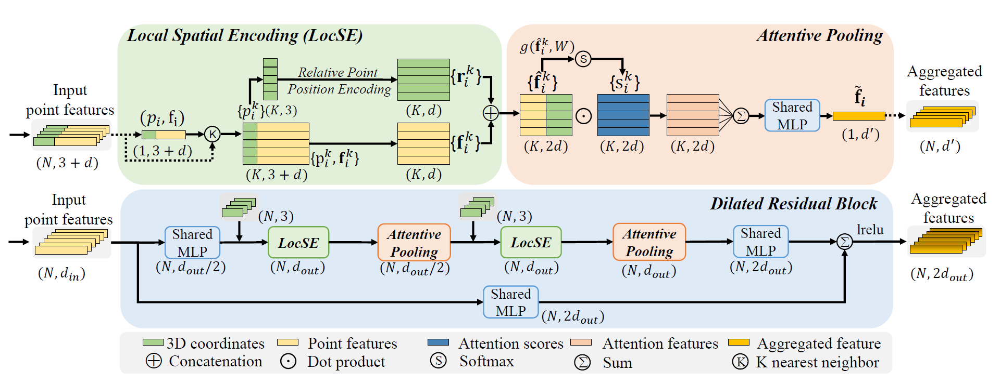

## 一、局部特征聚合模块

### 1.1、局部空间编码(Local Spatial Encoding)

作用:获取每个点的邻域特征。

方法:获取局部空间编码主要有3步，以一个点 A A A为例，

第一步是找邻域点(Finding Neighbouring Points)，通过[KNN算法](https://so.csdn.net/so/search?q=KNN%E7%AE%97%E6%B3%95&spm=1001.2101.3001.7020)找到该点最邻近的K个点(包括该点)；此时该点的邻域表达形式是K X (3+d)的矩阵。

第二步是相对位置编码(Relative Point Encoding)，具体实现是通过一个共享的MLP网络，形式如下：

$ *{i}^{k}=M L P(p*{i} p_{i}^{k} (p_{i}-p_{i}^{k}) |p_{i}-p_{i}^{k}|) $

该公式中的下标 i 指的就是点A， k 指的是A的邻域中的第 k 个点，这一步是对点A邻域内的第 k 个点重新编码。创建一个共享的MLP网络，该网络的输入是中心点A的坐标，第 k 个点的坐标，A和第 k 个点的坐标差值，A和第 k 个点的距离，所以输入尺寸是 3+3+3+1=10，经过MLP之后编码后的相对点的特征 $  $维度是 d（和点云的属性特征尺寸一致），对A的邻域中的K个点都进行相对位置编码。

第三步是点特征增强(Point Feature Augmentation)，对于点A邻域内的第k个点，将重新编码后的位置特征$  $ 和原来的属性特征$ f^{k} *做堆叠*，*得到的是增强后的特征向量*  ，*最终得到K个增强后的特征向量* {…} $。

### 1.2、注意力池化(Attentive Pooling)

作用:聚合邻域特征方法:注意力得分和权重求和第一步、计算注意力得分(Compute Attention Scores):将局部空间编码后的特征向量 $ {…} $作为输入，对第k个特征向量$  $，输入MLP网络，然后通过softmax计算得到与特征向量$  $对应的权重$  $。

第二步、权重求和(Weighted Summation):将计算得到的权重和增强的特征向量相乘，然后对K个加权后的特征向量求和，得到一个新的特征向量f ~ f~。
