## 科研是提出问题、解决问题

在回答"科研是什么"这一问题时，大多数人对科研的定义都会涉及：创新、系统、知识等概念，看起来比较泛化。

本科生普遍将科研归纳为：做竞赛、写论文、做大作业等等；而我对科研的理解是：能在特定领域发现并解决问题的过程，因此科研不一定受限于发表论文，因此参加数据科学竞赛本身、学习之前未知的理论也是一种科研的过程。

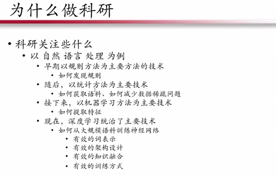

以自然语言处理为例，上图展示了研究人员在此领域一直在关心什么。从技术主线的角度来观察，在早期的时候，人们用规则的方法进行分词、句法研究，科研问题在于如何发现规则。

随后，出现了以统计方法为主的技术，一些语言模型也开始出现，这时候的科研问题在于如何标注语料，减少数据稀疏。

后来机器学习变得流行，如何提取特征变成考虑的重点。如今，深度学习成为了主要的技术，这时核心问题就变成：如何用大规模语料训练神经网络，主要考虑词表示架构设计、有效的知识融合以及有效的训练方式。

通过梳理技术路线可以发现，对于自然语言处理而言，大部分的科研工作都是以技术主线为驱动。这给我们的启示是：**科研需要关注底层技术**。

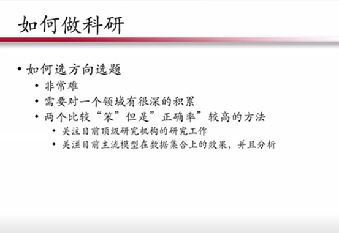

## 如何做科研：多尝试，不灰心

科研除了把握住技术主线，还需要注意如何定义设计问题，也即如何选方向和选题。这非常困难，不仅本科生，有时候一些博士生也会头疼。解决这个问题没有捷径可走，需要对领域有非常深刻的积累，如此才能灵活把握选题方向。

下面介绍对初学者有一定作用的两个方法：**1、关注顶级研究员，follow并研究他们"深思熟虑"的研究方向；2、对于技术熟练的初学者，可以从技术出发，观察模型在数据集上的效果，然后分析它的不足之处。**

对于选题，一个原则是和顶级会议"零同步"。当顶级会议公布数据之后，初学者要花费一到两天把所有的标题过一遍。**顶级会议是研究的风向标**，通过分析顶级会议，可以明确当前的研究热点。

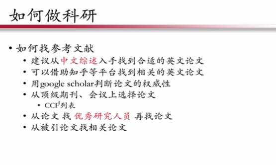

确定题目之后，接下来如何找参考文献？**对于英文水平欠缺的初学者，建议从中文综述入手找到合适的英文论文进行阅读。**

另外一个方式是，**借助知乎等平台找到相关的英文论文，然后用谷歌学术判断论文的权威性**，毕竟现在的英文论文的数量产出也是惊人的。

对于初学者来说，一开始读不懂文献很正常，**建议借助一些自媒体平台，找到有中文的论文概要**。自媒体非常发达，一般把想要看的英文论文题目"丢"到搜索引擎里，70%~80%的概率能够搜索到中文的介绍。换个角度想，如果找不到中文介绍，那么这篇论文大概率关注度不高。

此外，还要不断积累领域单词，这是领域积累的最基本要求。在读论文的时候，我建议找到前继论文，包括引用论文，仔细筛选，保留最小的核心阅读集合，争取一开始把小集合的论文快速阅读完毕。

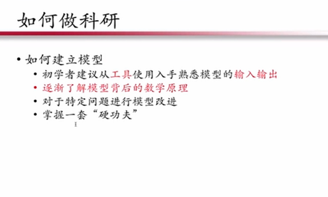

对于初学者来说，最重要的一点是：**必须能够针对具体问题建立模型**。那么如何建立模型呢？或者如何学习模型？建议初学者从工具去入手，熟悉模型的输入输出。也可以形式化观察输入输出并进行描述。**当熟悉数据之后，再慢慢了解背后的数学原理。**

**从长远来看，还是需要掌握一套硬功夫**，这里的硬功夫指的是非常熟悉模型，不用熟悉所有的数学原理，但是需要熟悉至少一类模型。

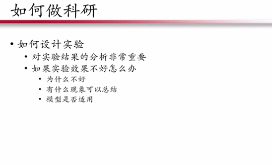

设计实验具有固定的步骤，会涉及到数据集的划分、评测指标的制定、对比方法的选取。当实验效果不好的时候，要分析为什么不好，思考有哪些现象可以总结，以及模型是否适用。

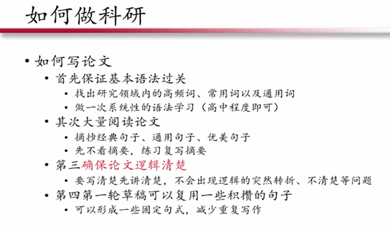

如何写论文呢？对于初学者来说，写英文文章需要基本语法过关。可能你很长时间没用英文写东西，语法水平还不如高中。

第二点，用词要准确。很多时候问题可能不是出在语法，而是用词错误。因此一定要把高频词汇、常用词以及通用词收集起来，然后进行系统的语法学习。一般来说，最多花费两天就能达到高中水平。

第三点，确保论文逻辑清楚，这点尤为重要。要写清楚先讲清楚，不要出现逻輯的突然转折、不清楚等问题。在写作的过程中可以复用一些积攒的句子，形成一些固定的句式，减少重复写作。

## 日常内功修炼：成体系、多精读

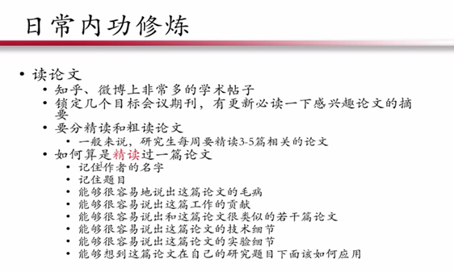

关于读论文，前面也提到要关注自媒体，锁定几个目标会议期刊，有更新第一时间读一下感兴趣的论文摘要。也要分清楚精读和粗读论文，一般来说，研究生每周要精读3~5篇相关的论文。如何算是精读过一篇论文呢？上图展示了几个指标：

- 记住作者的名字
- 记住题目
- 能够很容易地说出这篇论文的毛病
- 能够很容易说出这篇工作的贡献
- 能够很容易说岀和这篇论文很类似的若干篇论文
- 能够很容易说出这篇论文的技术细节
- 能够很容易说出这篇论文的实验细节
- 能够想到这篇论文在自己的研究题目下该如何应用

除了上面几点之外，大家还要有自己的判断。题目和作者的名字是最基础的，这和前面提到的"由人找论文"形成呼应。

如果看论文找不到毛病，或者感觉这篇论文满篇都没有问题，这就说明阅读论文的深度不太够，因此要带着批判的眼光看论文。

关于实验细节和技术细节，**盲目深入可能对你的研究没有特别大的帮助**。有些论文的质量并不高，只要知道这篇论文对你接下来的研究题目有何帮助就可以了，其他的部分可能对你的收益并不大。

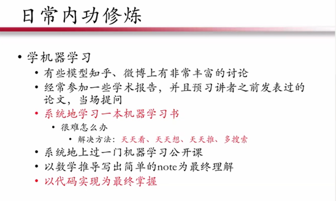

学习机器学习，是本领域研究者学习硬功夫的过程。我个人总结了以上方法，首先**要系统地学习一本机器学习书籍**，当遇到困难的时候，唯一的解决方法是要天天看，天天想，天天推导公式，多用搜索引擎。**检验是否掌握的唯一标准是：是否能用代码实现。**

此外，**还要积极参与学术报告或者预习讲者之前发表过的论文，当场提问**。因为现场交流能够帮助你深入理解，解决闭塞。

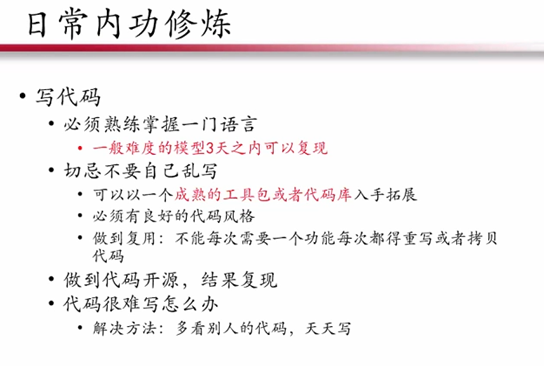

建议大家熟练掌握一门编程语言，或者一个框架。对于一般难度的模型，三天之内能够基本完成。抛开数据处理，如果需要很长时间写一个并不复杂的模型，那么这意味着你的代码能力可能需要极大的加强。

初学者在初级阶段不要"乱写"。代码要有规范，养成自己的代码风格，做到能够复用，写一个功能争取能够"复制拷贝"。

建议没怎么写过代码的同学，一定要找到成熟的工具包或者代码库入手，这样能省去很多绕弯路的环节。

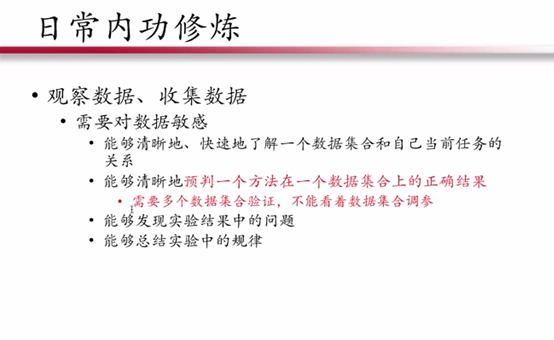

科研人员对于数据一定要非常敏感。数据对科研人员来说，是和应用最直接的沟通，如果不了解真实数据中存在的问题，还进行研究的话，相当于在空想模型。

建议同学如果没有感觉，就用一个方法去运行一个数据集，根据输出结果看问题，总结规律，磨炼自己成为真正对数据极度敏感的人：看到一个数据集，就能想到相关方法，从而预估正确效果。换句话说，了解数据的大概和分布之后，能够迅速在脑袋中找到相对的模型进行处理。

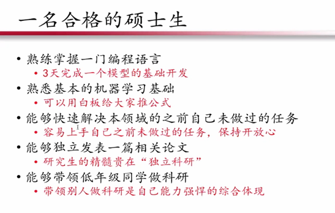

总结一下，怎么样才算是一名合格的硕士生：

1、首先要熟练掌握一门编程语言，能够在较短时间内实现一个基础模型的开发；

2、熟悉基本的机器学习基础，可以在白板上推导公式；

3、能够快速解决本领域的之前自己未做过的任务：容易上手自己之前未做过的任务，保持开放心态；

4、能够独立发表一篇相关论文：研究生的精髓贵在"独立科研"，如果能做到独立，那么研究生2~3年的时间没有白费；

5、最后，能够带领低年级同学做科研：带领别人做科研是自己能力强悍的综合体现。

**在最后一个阶段，需要帮助一名初学者提升数学基础，提升代码能力，然后解决一些问题，"帮助"他写出一篇论文。如果能够做到，说明你的能力已经很强了。**

上面的标准虽然有点高，但却是我们努力向往的目标。

当前在人工智能领域，深度学习为主流。建议大家在学习深度学习的时候，一定要系统地去上一门公开课，精髓在"系统"二字。不能今天学习这门课，明天学习那门课，一定从一而终。另外，推荐大家阅读一些技术帖子、模型解析文章，多使用一个开源的软件框架。国外网站也有很多文章很有深度，细读之后，会发现里面的内容非常有"弹性"。

## 从零起步：打好基础

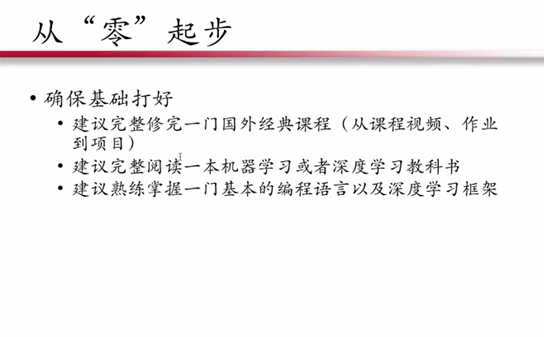

强调一下如何从"零"起步，首先确保基础打好。建议完整修完一门国外经典课程（从课程视频、作业到项目），然后完整阅读一本机器学习或者深度学习教科书，熟练掌握一门基本的编程语言以及深度学习框架。

鼓励多读经典论文，看文章的源代码。建议大家读论文时候配置源代码，否则论文不一定能看懂。还可以从感兴趣的研究领域去入手，比如自然语言处理，当你的研究已经有一些起色的时候，建议关注非常顶级的研究机构的工作。

顶级不一定是国外，国内有些研究机构也非常优秀。关注他们的报告，关注他们的演讲。

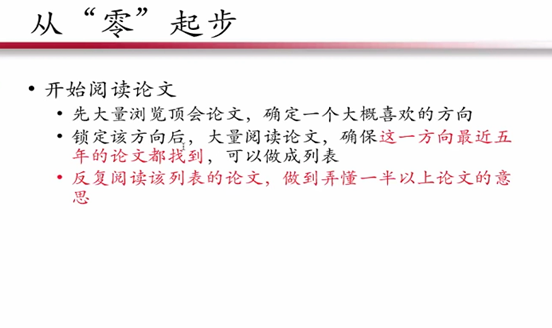

正如前面提到的，开始阅读论文的时候，要大量的浏览标题，如果能读懂，然后看看摘要。

**当然你锁定某一个方向之后，要确保在这个方向最近5年的论文都找到并做成列表**。如果这个方向很火，那么可能有人已经帮你做成列表。反复阅读列表的论文时，**如果能做到基本一半的论文都能大概了解意思，那么就可以开启找idea的过程**。

在这一步的过程中，同样要多阅读论文，只不过多一些分析的色彩。了解每一篇文章的动机，比较研究工作之间的差异，最终聚焦到你非常熟悉的领域。**将自己代入写作者的角色**，要考虑如果你来写这篇文章，你所呈现的和他们有什么不一样。

**也可以从数据出发，运行应用模型发现问题**。试图将他们存在的问题进行建模或者定义，仔细琢磨是否有科学意义。

在建立模型的时候，初学者要善于做到模仿和迁移，可以聚焦某一类模型的解决方案。杜绝启发式规则的方法，但是可以看看如何将规则数学化、通用化。

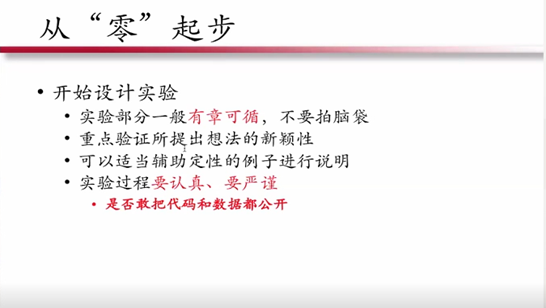

在开始设计实验的时候，要坚持实验部分有章可循的原则，不要"拍脑袋"决定，重点验证所提出想法的新颖性，可以适当用辅助定性的例子进行说明。实验过程要认真、要严谨，敢于把代码和数据都公开。

投稿会议的时候，选择适合水平的会议论文，明白不被录取是常态，积极倾听评审的修改建议。对于一些比较扎实、但是新颖性略逊的工作可以选择期刊进行投稿。多投才能多中，即使被拒也能不断改进。

最后讲一些可能有用的"老生常谈"，**科研是自己的事**，不是老师的事。网络将教育资源逐步平均化，因此，勤奋是任何科研工作的基础。可以一直没有论文，但是确保一直处于进步状态。拒绝纸上谈兵、拒绝眼高手低，需要维持积极的心态和坚毅的态度利用好一切机会学习，不耻下问，重复是熟练的唯一途径。
