## 1. 经典网络部分

### 1.1 LeNet

### 1.1.1 模型介绍

LeNet-5是由 $ LeCun $ 提出的一种用于识别手写数字和机器印刷字符的卷积神经网络（Convolutional Neural Network，CNN）$ ^{[1]} $ ，其命名来源于作者 $ LeCun $的名字，5则是其研究成果的代号，在LeNet-5之前还有LeNet-4和LeNet-1鲜为人知。LeNet-5阐述了图像中像素特征之间的相关性能够由参数共享的卷积操作所提取，同时使用卷积、下采样（池化）和非线性映射这样的组合结构，是当前流行的大多数深度图像识别网络的基础。

### 1.1.2 模型结构

网络结构非常简单，一共有五层（仅包含有参数的层，无参数的池化层不算在网络模型之中）：

- 输入尺寸： $ 32×32 $
- 卷积层：2个
- 池化层：2个
- 全连接层：2个
- 输出层：1个，大小为 $ 10×1 $

### 1.1.3 模型特性

- 卷积网络使用一个3层的序列组合：卷积、下采样（池化）、非线性映射（LeNet-5最重要的特性，奠定了目前深层卷积网络的基础）
- 使用卷积提取空间特征
- 使用映射的空间均值进行下采样
- 使用 $ tanh $ 或 $ sigmoid $ 进行非线性映射
- 多层神经网络（MLP）作为最终的分类器
- 层间的稀疏连接矩阵以避免巨大的计算开销

### 1.2 AlexNet

### 1.2.1 模型介绍

AlexNet是由 $ Alex $ $ Krizhevsky $ 提出的首个应用于图像分类的深层卷积神经网络，该网络在2012年ILSVRC（ImageNet Large Scale Visual Recognition Competition）图像分类竞赛中以15.3%的top-5测试错误率赢得第一名$ ^{[2]} $。AlexNet使用GPU代替CPU进行运算，使得在可接受的时间范围内模型结构能够更加复杂，它的出现证明了深层卷积神经网络在复杂模型下的有效性，使CNN在计算机视觉中流行开来，直接或间接地引发了深度学习的热潮。

### 1.2.2 模型结构

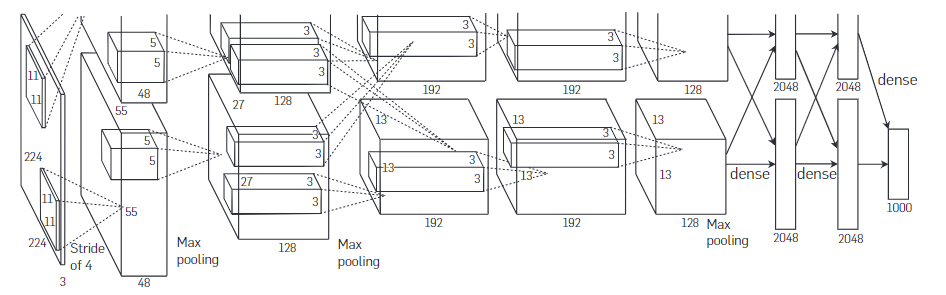

AlexNet和LeNet的整体结构还是非常类似的，都是一系列的卷积池化操作最后接上全连接层。该网络一共有8层（不包括池化）。

- 输入尺寸： $ 227×227×3 $
- 卷积层：5个
- 池化层：3个
- 全连接层：2个
- 输出层：1个，大小为 $ 1000×1 $

### 1.2.3 模型特性

- 使用ReLU作为CNN的激活函数，并验证其效果在较深的网络超过了Sigmoid，成功解决了Sigmoid在网络较深时的梯度弥散问题，此外，加快了训练速度，因为训练网络使用梯度下降法，非饱和的非线性函数训练速度快于饱和的非线性函数。虽然ReLU激活函数在很久之前就被提出了，但是直到AlexNet的出现才将其发扬光大。
- 训练时使用Dropout随机忽略—部分神经元，以避免模型过拟合。Dropout虽有单独的论文论述，但是AlexNet将其实用化，通过实践证实了它的效果。在AlexNet中主要是最后几个全连接层使用了Dropout。
- 在CNN中使用重叠的最大池化。此前CNN中普遍使用平均池化，AlexNet全部使用最大池化，避免平均池化的模糊化效果。并且AlexNet中提出让步长比池化核的尺寸小，这样池化层的输出之间会有重叠和覆盖，提升了特征的丰富性。
- 提出了LRN层，对局部神经元的活动创建竞争机制，使得其中响应比较大的值变得相对更大，并抑制其他反馈较小的神经元，增强了模型的泛化能力。此方法在之后的VGG中被认为是无效的。
- 使用CUDA加速深度卷积网络的训练，利用GPU强大的并行计算能力，处理神经网络训练时大量的矩阵运算。AlexNet使用了两块GTX580GPU进行训练，单个GTX580只有3GB显存，这限制了可训练的网络的最大规模。因此作者将AlexNet分布在两个GPU上，在每个GPU的显存中储存一半的神经元的参数。
- 数据增强，随机地从$ 256×256 *的原始图像中截取* 224×224 $大小的区域(以及水平翻转的镜像），相当于增加了 $ (256×224)2×2=2048 $ 倍的数据量。如果没有数据增强，仅靠原始的数据量，参数众多的CNN会陷入过拟合中，使用了数据增强后可以大大减轻过拟合，提升泛化能力。进行预测时，则是取图片的四个角加中间共5个位置，并进行左右翻转，一共获得10张图片，对他们进行预测并对10次结果求均值。

### 1.3 ZFNet

### 1.3.1 模型介绍

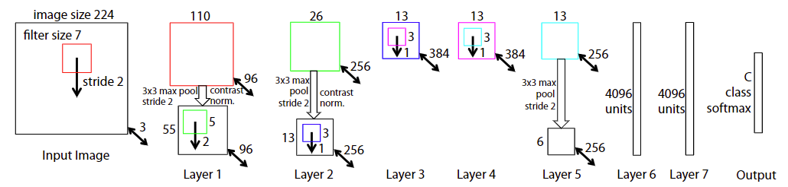

ZFNet是由 $ Matthew $ $ D.Zeiler $ 和 $ Rob $ $ Fergus $ 在AlexNet基础上提出的大型卷积网络，在2013年ILSVRC图像分类竞赛中以11.19%的错误率获得冠军（实际上原ZFNet所在的队伍并不是真正的冠军，原ZFNet以13.51%错误率排在第8，真正的冠军是 $ Clarifai *这个队伍*，*而* Clarifai $这个队伍所对应的一家初创公司的CEO又是 $ Zeiler ，*而且* Clarifai *对ZFNet的改动比较小*，*所以通常认为是ZFNet获得了冠军*） ^{[3-4]} $。ZFNet实际上是微调（fine-tuning）了的AlexNet，并通过反卷积（Deconvolution）的方式可视化各层的输出特征图，进一步解释了卷积操作在大型网络中效果显著的原因。

### 1.3.2 模型结构

ZFNet的网络结构和AlexNet的结构基本是一致的，主要的改变就是在AlexNet的第一层将卷积核的大小由 $ 11×11 $ 变成了 $ 7×7 $,并且将步长s由 $ 4 $ 变成了 $ 2 $ 。虽然模型改动较小，但是ZFNet的贡献在于提出了一种逆变换的思想来可视化了神经网络，将卷积核变小也是因为可视化而产生的结论，即小卷积核使网络效果更好。

### 1.3.3 模型特性

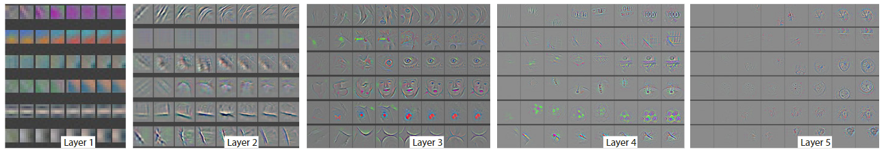

- 可视化技术揭露了激发模型中每层单独的特征图。
- 可视化技术允许观察在训练阶段特征的演变过程且诊断出模型的潜在问题。
- 可视化技术用到了多层解卷积网络，即由特征激活返回到输入像素空间。
- 可视化技术进行了分类器输出的敏感性分析，即通过阻止部分输入图像来揭示那部分对于分类是重要的。
- 可视化技术提供了一个非参数的不变性来展示来自训练集的哪一块激活哪个特征图，不仅需要裁剪输入图片，而且自上而下的投影来揭露来自每块的结构激活一个特征图。
- 可视化技术依赖于解卷积操作，即卷积操作的逆过程，将特征映射到像素上。

### 1.4 Network in Network

### 1.4.1 模型介绍

Network In Network (NIN)是由 $ Min Lin $ 等人提出，在CIFAR-10和CIFAR-100分类任务中达到当时的最好水平，因其网络结构是由三个多层感知机堆叠而被成为NIN $ ^{[5]} $ 。NIN以一种全新的角度审视了卷积神经网络中的卷积核设计，通过引入子网络结构代替纯卷积中的线性映射部分，这种形式的网络结构激发了更复杂的卷积神经网络的结构设计，下面介绍的GoogLeNet的Inception结构就是来源于这个思想。

### 1.4.2 模型结构

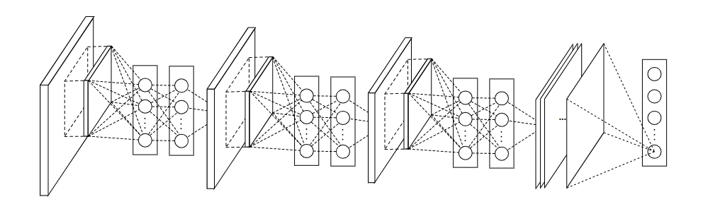

NIN由三层的多层感知卷积层（MLPConv Layer）构成，每一层多层感知卷积层内部由若干层的局部全连接层和非线性激活函数组成，代替了传统卷积层中采用的线性卷积核。在网络推理（inference）时，这个多层感知器会对输入特征图的局部特征进行滑窗计算，并且每个滑窗的局部特征图对应的乘积的权重是共享的，这两点是和传统卷积操作完全一致的，最大的不同在于多层感知器对局部特征进行了非线性的映射，而传统卷积的方式是线性的。

### 1.4.3 模型特性

- 使用多层感知机结构来代替卷积的滤波操作，不但有效减少卷积核数过多而导致的参数量暴涨问题，还能通过引入非线性的映射来提高模型对特征的抽象能力。
- 使用全局平均池化来代替最后一个全连接层，能够有效地减少参数量（没有可训练参数），同时池化用到了整个特征图的信息，对空间信息的转换更加鲁棒，最后得到的输出结果可直接作为对应类别的置信度。

### 1.5 VGGNet

### 1.5.1 模型介绍

VGGNet是由牛津大学视觉几何小组（Visual Geometry Group, VGG）提出的一种深层卷积网络结构，他们以7.32%的错误率赢得了2014年ILSVRC分类任务的亚军（冠军由GoogLeNet以6.65%的错误率夺得）和25.32%的错误率夺得定位任务（Localization）的第一名（GoogLeNet错误率为26.44%）$ ^{[5]} $ ，网络名称VGGNet取自该小组名缩写。VGGNet是首批把图像分类的错误率降低到10%以内模型，同时该网络所采用的 $ 3 $ 卷积核的思想是后来许多模型的基础，该模型发表在2015年国际学习表征会议（International Conference On Learning Representations, ICLR）。

### 1.5.2 模型结构

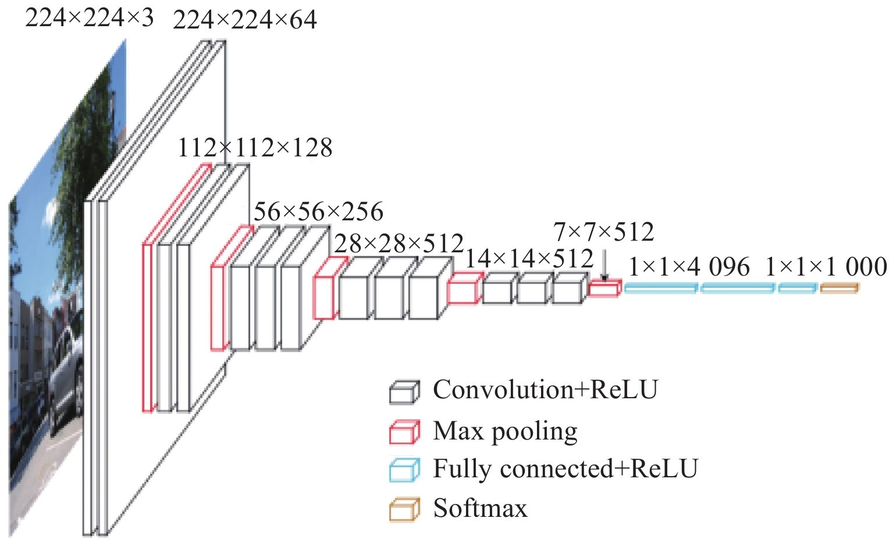

在原论文中的VGGNet包含了6个版本的演进，分别对应VGG11、VGG11-LRN、VGG13、VGG16-1、VGG16-3和VGG19，不同的后缀数值表示不同的网络层数（VGG11-LRN表示在第一层中采用了LRN的VGG11，VGG16-1表示后三组卷积块中最后一层卷积采用卷积核尺寸为 $ 1 $ ，相应的VGG16-3表示卷积核尺寸为 $ 3 $ ）。

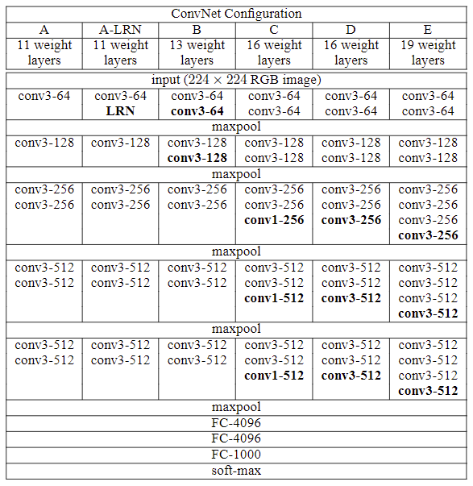

### 1.5.3 模型特性

- 整个网络都使用了同样大小的卷积核尺寸 $ 3 $ 和最大池化尺寸 $ 2 $。
- $ 1 $ 卷积的意义主要在于线性变换，而输入通道数和输出通道数不变，没有发生降维。
- 两个 $ 3 $的卷积层串联相当于1个 $ 5 $ 的卷积层，感受野大小为 $ 5 $。同样地，3个 $ 3 $ 的卷积层串联的效果则相当于1个 $ 7 $ 的卷积层。这样的连接方式使得网络参数量更小，而且多层的激活函数令网络对特征的学习能力更强。
- VGGNet在训练时有一个小技巧，先训练浅层的的简单网络VGG11，再复用VGG11的权重来初始化VGG13，如此反复训练并初始化VGG19，能够使训练时收敛的速度更快。
- 在训练过程中使用多尺度的变换对原始数据做数据增强，使得模型不易过拟合。

### 1.6 GoogLeNet

### 1.6.1 模型介绍

GoogLeNet作为2014年ILSVRC在分类任务上的冠军，以6.65%的错误率力压VGGNet等模型，在分类的准确率上面相比过去两届冠军ZFNet和AlexNet都有很大的提升。从名字**GoogLe**Net可以知道这是来自谷歌工程师所设计的网络结构，而名字中Goog**LeNet**更是致敬了LeNet。GoogLeNet中最核心的部分是其内部子网络结构Inception，该结构灵感来源于NIN，至今已经经历了四次版本迭代（$ Inception_{v1-4} $）。

### 1.6.2 模型结构

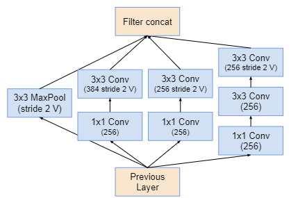

GoogLeNet相比于以前的卷积神经网络结构，除了在深度上进行了延伸，还对网络的宽度进行了扩展，整个网络由许多块状子网络的堆叠而成，这个子网络构成了Inception结构。 $ Inception_{v1} $ 在同一层中采用不同的卷积核，并对卷积结果进行合并; $ Inception_{v2} $ 组合不同卷积核的堆叠形式，并对卷积结果进行合并; $ Inception_{v3} $ 则在 $ v_2 $ 基础上进行深度组合的尝试; $ Inception_{v4} $ 结构相比于前面的版本更加复杂，子网络中嵌套着子网络。

### 1.6.3 模型特性

- 采用不同大小的卷积核意味着不同大小的感受野，最后拼接意味着不同尺度特征的融合；
- 之所以卷积核大小采用1、3和5，主要是为了方便对齐。设定卷积步长stride=1之后，只要分别设定pad=0、1、2，那么卷积之后便可以得到相同维度的特征，然后这些特征就可以直接拼接在一起了；
- 网络越到后面，特征越抽象，而且每个特征所涉及的感受野也更大了，因此随着层数的增加，$ 3×3 $ 和 $ 5×5 $ 卷积的比例也要增加。但是，使用$ 5×5 $ 的卷积核仍然会带来巨大的计算量。 为此，文章借鉴NIN2，采用 $ 1×1 $ 卷积核来进行降维。

### 1.7 ResNet

### 1.7.1 模型介绍

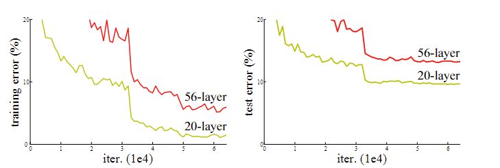

ResNet$ ^{[12]} $ 是何凯明团队于2015年提出的一种网络；作为2015年ILSVRC比赛冠军，在分类识别定位等各个赛道碾压之前的各种网络。在ResNet提出之前，深度学习网络中普遍存在的问题——随着网络层数的加深，网络训练结果并不能得到提升，反而会发生下降的问题，这种现象被称之为网络退化问题。当发生网络退化问题后，人们一度认为深度学习就到这里为止了，直到ResNet的出现才解决了这一问题。ResNet使得网层数可以无限堆叠，对深度学习发展产生了非常深远的影响。

### 1.7.2 模型结构

ResNet论文中结构有18层、34层、50层、101层和152层，比较常用的ResNet深度是50层、101层和152层。

### 1.7.3 模型特性

- 容易优化，并且能够通过增加相当的深度来提高准确率。
- 内部的残差块使用了跳跃连接，缓解了在深度神经网络中增加深度带来的梯度消失问题。
- 提出了一种bottleneck的结构块来代替常规的Resedual block。
- 使用较少池化层,大量采用下采样,提高传播效率。

### 1.8 DenseNet

### 1.8.1 模型介绍

DenseNet(Dense Convolutional Network)$ ^{[13]} $ 由Gao Huang等人于2016年提出，获得了 CVPR 2017年 的 Oral ，对于每一层，前面所有层的特征映射作为输入，并将特征映射作为后续所有层的输入 ；它缓解了 消失梯度问题，加强了特征传播 ，鼓励了特征重用，并大大减少了参数量；

### 1.8.2 模型结构

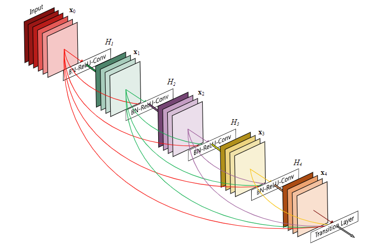

为确保网络中各层之间的信息流动最大化，将所有层(具有匹配的特征图大小)直接连接起来 ；每一层从所有前面的层获得额外的输入，并将自己的特征映射传递给所有后面的层 ；在传统的 $ L $ 层网络 中引入了 $ L $ 连接，而在 DenseNet 中引入了 $ L(L+1) / 2 $连接 。

### 1.8.3 模型特性

- 缓解了梯度消失的问题。
- 加强了特征的传播，鼓励重复利用特征。
- 极大地减少了参数个数。
- 具有正则化的效果，即使在较少的训练集上，也可以减少过拟合的现象。

## 2. 热门轻量化网络部分

### 2.1 SqueezeNet&SqueezeNext

### 2.1.1 模型介绍

2016年，Iandola等提出了SqueezeNet$ ^{[14]} $ 轻量化网络，该网络借鉴了Inception网络的设计思想，通过Fire module基本模块实现SqueezeNet网络的构建，其Fire module结构下图上部分所示。Fire module中主要包含了Squeeze层和Expand层，其中Squeeze层采用 $ 1×1 $ 的卷积核来减少参数量，Expand层则采用 $ 1×1 $ 和 $ 3×3 $ 卷积核分别得到对应特征图后进行拼接，由此得到Fire module的输出。利用卷积层、Fire module和池化层构建的SqueezeNet 模型大小只有4.8MB，却在ImageNet上达到了相比AlexNet 略优的57.5%的TOP-1分类精度。

2018 年，Gholami等基于SqueezeNet提出了改进版的SqueezeNext $ ^{[15]} $ 轻量化网络，其主要采用了如下图下部分所示的模块结构。该结构中采用通道数减半的两层Squeeze层对输入进行处理，然后通过 $ 3×1 $ 和 $ 1×3 $ 搭配的低秩卷积核进行卷积，之后利用一个卷积层实现数据维度匹配。此外，SqueezeNext借鉴ResNet网络结构思想实现了shortcut 连接，并通过硬件实验指导网络设计，其参数量相比SqueezeNet 有了明显降低，但却实现了高达 69.8% 的TOP-1分类精度。

### 2.1.2 模型结构

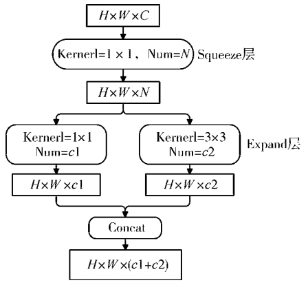

### 2.1.3 模型特性

**SqueezeNet**

- 使用 $ 1×1 $ 卷积核代替 $ 3×3 $ 卷积核，减少参数量；
- 通过squeeze layer限制通道数量，减少参数量；
- 借鉴Inception思想，将 $ 1×1 $ 和 $ 3×3 $ 卷积后结果进行concat；为了使其feature map的size相同，$ 3×3 $ 卷积核进行了padding；
- 减少池化层，并将池化操作延后，给卷积层带来更大的激活层，保留更多地信息，提高准确率；
- 使用全局平均池化代替全连接层；

**SqueezeNext**

- 通过两个 $ 1×1 $ 卷积作为squeeze module来进一步削减参数量。
- 通过 $ 1×3 $ 卷积与 $ 3×1 $ 卷积进一步减少模型的参数量，并且移除了额外的 $ 1×1 $ 卷积。即相比于原来的squzzenet没有了分支结构。

### 2.2 MobileNet v1v2

### 2.2.1 模型介绍

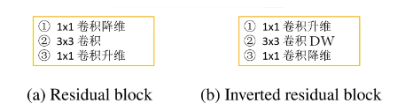

2017年，Howard等提出了 $ MobileNet   v1^{[16]} *轻量化网络*，*该网络使用了深度可分离卷积*（*DepthwiseSeparableConvolution*，*DSC*）*结构代替传统卷积结构*，*将传统卷积结构中* N $ 个 $ D_k ×D_k ×C $ 卷积核分解为 $ C $ 个 $ D_k×D_k×1 $ 和$ N $ 个 $ 1×1×C $ 卷积核叠加的形式，其结构图如图（a）所示，通过该方法可使卷积操作运算量降低为原有的 $ 1/8-1/9 $ 。于此同时，通过引入时间因子$ α$ 和分辨率因子 $ ρ $ 进一步降低模型参数量，最终MobileNet v1参数量约为4.2 M，且在ImageNet数据集上实现了70.6%的TOP-1 分类精度。

2018年，Mark等在Mobilenet v1的基础上提出了Mobilenet v2 $ ^{[17]} $ 轻量化网络，该网络最大的特点是引入了反向残差（也叫倒残差）和线性瓶颈结构，反向残差结构如图（b）所示，其不同于常规残差结构“压缩一卷积—扩张”过程，而是采用“扩张——卷积——压缩”的反向式操作，充分利用深度可分离卷积可有效降低中间卷积运算计算量的优势来保证算法性能，且通过去掉ReLU来避免信息损失。MobileNetv2的参数量约为6.9M，其在ImageNet数据集上实现了74.7%的TOP-1分类精度。

### 2.2.2 模型结构

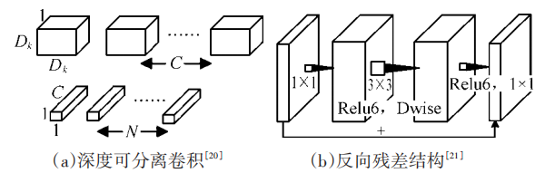

### 2.2.3 MobileNet V2中的bottleneck为什么先扩张通道数在压缩通道数呢？

1. 因为MobileNet 网络结构的核心就是Depth-wise，此卷积方式可以减少计算量和参数量。而为了引入shortcut结构，若参照Resnet中先压缩特征图的方式，将使输入给Depth-wise的特征图大小太小，接下来可提取的特征信息少，所以在MobileNet V2中采用先扩张后压缩的策略。
2. 激活函数的使用会对低维特征造成大量损失，因此在拓张通道数之后，对高维特征造成的损失较小。

### 2.3 ShuffleNet v1v2

### 2.3.1 模型介绍

2017年，Zhang等人提出了ShuffleNet v1$ ^{[18]} $ 轻量化网络，其基本模块结构如下图ShuffleNet v1所示。ShuffleNet v1对常规残差结构进行了改进，将与输入特征图相连的第一个 $ 1×1 $ 卷积层替换为分组卷积，并利用Channel shuffle操作对分组卷积各组输出结果进行信息交互，以此实现在降低运算量的情况下保证网络性能，ShuffleNet v1最终在ImageNet数据集上实现了73.7%的TOP-1分类精度。

2018年，Ma等在ShuffleNet v1的基础上又提出了ShuffleNet v2$ ^{[19]} $ 轻量化网络，该网络的基本模块结构如下图ShuffleNet v2所示，其在对输入特征图进行处理时首先进行了通道划分，其中一个分支不采取任何操作，另一个分支经过卷积处理后，与前一个分支拼接后再进行Channel Shuffle操作，以此实现信息交互，最终ShuffleNet v2在ImageNet数据集上实现了74.9%的TOP-1分类精度。

### 2.3.2 模型结构

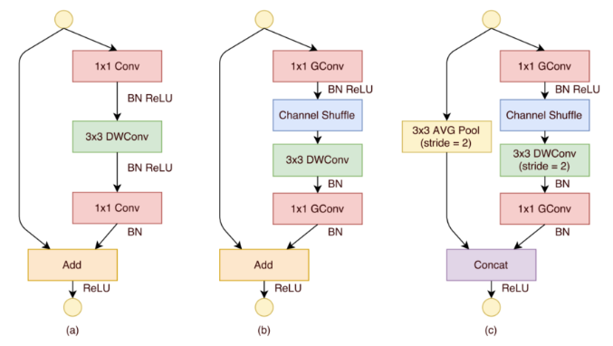

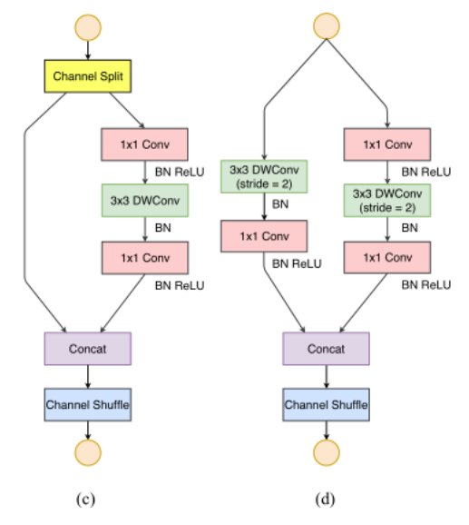

### 2.4 Xception

### 2.4.1 模型介绍

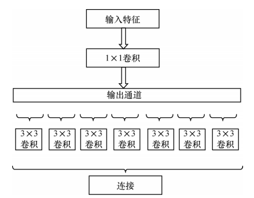

Xception$ ^{[20]} $ 是谷歌于 2017 年在 Inception V3的基础上，基于空间相关性和通道相关性设计的轻量化网络结构，虽然深度可分离卷积可大幅减少计算量，又能保持较高的分类精度，但是存在计算零散的问题，Xception的设计理念就是为了解决这一问题。

### 2.4.2 模型结构

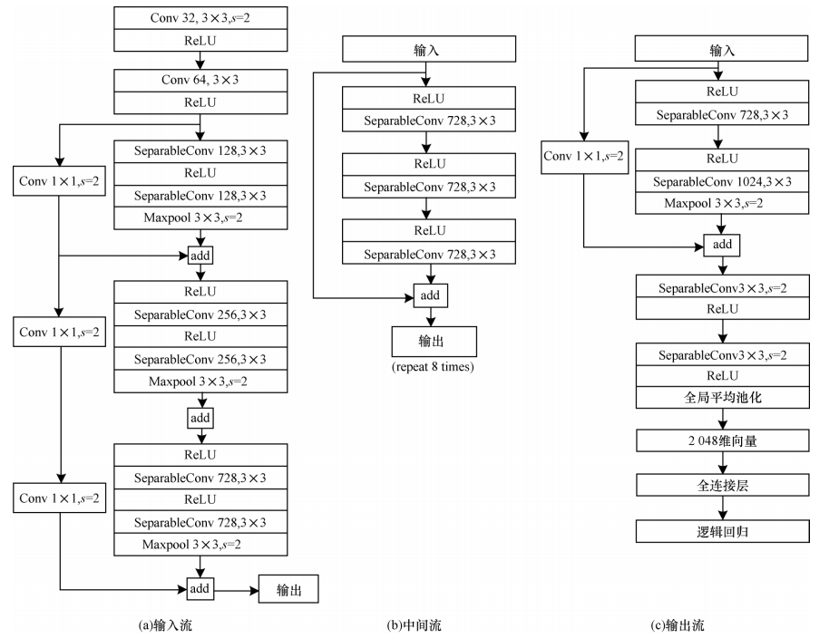

Xception模块与深度可分离卷积的不同之处在于∶

1）深度可分离卷积先进行同一平面卷积得到空间相关性，再在不同通道之间进行卷积得到通道相关性，而Xception模块采用相反的方法，先得到通道之间的相关性，再学习空间相关性；

2）Xception在空间相关性和通道相关性的学习过程中未使用激活函数，实验证明这一改进有效地加快了收敛速度，提升了网络性能。

Xception 网络基于残差网络进行构建，但将其中的卷积层换成了Xception模块。如上图所示，Xception 网络被分为输入流部分、中间流部分和输出流部分，其中，ReLU表示激活函数，SeparableConv表示深度可分离卷积，Maxpool表示最大值池化操作。输入流部分通过下采样模块来降低特征图的空间维度；中间流部分通过优化网络特征提取来学习关联关系；输出流部分将特征进行汇总输出，最终由全连接层进行表达。

### 2.4.3 模型特性

Xception作为Inception v3的改进，主要是在Inception v3的基础上引入了depthwise separable convolution，在基本不增加网络复杂度的前提下提高了模型的效果。

### 2.5 GhostNet

### 2.5.1 模型介绍

传统深度神经网络的轻量化方法研究主要集中于减少参数量及改进卷积方式。2020年，HAN等对深度神经网络特征图进行分析，发现常规卷积中特征图的冗余性在神经网络结构中很少被关注，如下图所示，对常规卷积生成的特征图进行可视化，其中同色方框内的特征图非常相似，这说明在训练好的神经网络进行前向传播时，中间过程使用的特征图中含有大量相似的冗余特征，为了从特征图冗余的角度实现网络结构轻量化 ，华为方舟实验室提出GhostNet[21]。

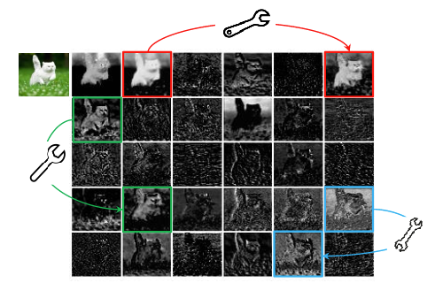

### 2.5.2 模型结构

GhostNet为了使用更低的成本完成更多的特征映射，采用线性变化得到Ghost特征。GhostNet模块下图所示，其中 $ Φ_k $ ，表示对初次卷积之后的特征图进行线性变换。首先使用较少的卷积核对输入进行常规卷积，获得通道较少的输出特征并将其作为内在特征图，然后对内在特征图的每个通道进行线性变换，得到其对应的Ghost特征图，最后将内在特征图与Ghost特征图进行通道连接，取得最终的GhostNet卷积输出特征。

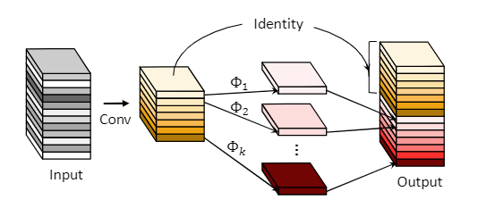

### 2.5.3 模型特性

GhostNet使用GhostNet模块代替传统MobileNet 中的bottleneck层，GhostNet模块具有很强的即插即用性，可以用于优化现有深度神经网络结构或者轻量化网络结构，对于神经网络运算速度优化效果较明显，但不能有效降低轻量化过程中的参数量及存储空间。

## 3. 使用深度可分离卷积的轻量化神经网络创新点对比

1）MobileNet。创新点和优势为引入深度可分离卷积进行网络结构轻量化设计。劣势为网络结构单一，且过量使用激活函数导致神经元易失活。

2）MobileNetV2。创新点和优势为引入反残差模块。劣势为由于深度可分离卷积中卷积核较小，激活后易为0。

3）ShuffleNet。创新点和优势为引入通道转换。劣势为输入输出特征通道数不同、过量使用组卷积、网络碎片化、元素级操作过多。

4）ShuffleNet V2。创新点和优势为引入通道分离、输入输出特征通道数相等、基础单元中使用常规卷积代替组卷积及使用concat代替元素级操作add。劣势为运行速度和存储空间有待进一步提升。

> 为什么现在的CNN模型都是在GoogleNet、VGGNet或者AlexNet上调整的？
> - 评测对比：为了让自己的结果更有说服力，在发表自己成果的时候会同一个标准的baseline及在baseline上改进而进行比较，常见的比如各种检测分割的问题都会基于VGG或者Resnet101这样的基础网络。
> - 时间和精力有限：在科研压力和工作压力中，时间和精力只允许大家在有限的范围探索。
> - 模型创新难度大：进行基本模型的改进需要大量的实验和尝试，并且需要大量的实验积累和强大灵感，很有可能投入产出比比较小。
> - 资源限制：创造一个新的模型需要大量的时间和计算资源，往往在学校和小型商业团队不可行。
> - 在实际的应用场景中，其实是有大量的非标准模型的配置。

**参考文献**

[1] Y. LeCun, L. Bottou, Y. Bengio, and P. Haffner. Gradient-based learning applied to document recognition. *Proceedings of the IEEE*, november 1998.

[2] A. Krizhevsky, I. Sutskever and G. E. Hinton. ImageNet Classification with Deep Convolutional Neural Networks. *Advances in Neural Information Processing Systems 25*. Curran Associates, Inc. 1097–1105.

[3] LSVRC-2013. [http://www.image-net.org/challenges/LSVRC/2013/results.php](http://www.image-net.org/challenges/LSVRC/2013/results.php)

[4] M. D. Zeiler and R. Fergus. Visualizing and Understanding Convolutional Networks. *European Conference on Computer Vision*.

[5] M. Lin, Q. Chen, and S. Yan. Network in network. *Computing Research Repository*, abs/1312.4400, 2013.

[6] K. Simonyan and A. Zisserman. Very Deep Convolutional Networks for Large-Scale Image Recognition. *International Conference on Machine Learning*, 2015.

[7] Bharath Raj. [a-simple-guide-to-the-versions-of-the-inception-network](https://towardsdatascience.com/a-simple-guide-to-the-versions-of-the-inception-network-7fc52b863202), 2018.

[8] Christian Szegedy, Sergey Ioffe, Vincent Vanhoucke, Alex Alemi. [Inception-v4, Inception-ResNet and
the Impact of Residual Connections on Learning](https://arxiv.org/pdf/1602.07261.pdf), 2016.

[9] Sik-Ho Tsang. [review-inception-v4-evolved-from-googlenet-merged-with-resnet-idea-image-classification](https://towardsdatascience.com/review-inception-v4-evolved-from-googlenet-merged-with-resnet-idea-image-classification-5e8c339d18bc), 2018.

[10] Zbigniew Wojna, Christian Szegedy, Vincent Vanhoucke, Sergey Ioffe, Jonathon Shlens. [Rethinking the Inception Architecture for Computer Vision](/assets/files/personal/masterlearn/科研修炼手册/经典热门网络结构/1512.00567v3.pdf), 2015.

[11] Christian Szegedy, Wei Liu, Yangqing Jia, Pierre Sermanet, Scott Reed, Dragomir Anguelov, Dumitru Erhan, Vincent Vanhoucke, Andrew Rabinovich. [Going deeper with convolutions](/assets/files/personal/masterlearn/科研修炼手册/经典热门网络结构/1409.4842v1.pdf), 2014.

[12]Kaiming He, Xiangyu Zhang, Shaoqing Ren, & Jian Sun (2015). Deep Residual Learning for Image Recognition arXiv: Computer Vision and Pattern Recognition.

[13]Gao Huang, Zhuang Liu, Laurens van der Maaten, & Kilian Q. Weinberger (2016). Densely Connected Convolutional Networks computer vision and pattern recognition.

[14]Forrest Iandola, Song Han, Matthew W. Moskewicz, Khalid Ashraf, William J. Dally, & Kurt Keutzer (2016). SqueezeNet: AlexNet-level accuracy with 50x fewer parameters and <0.5MB model size arXiv: Computer Vision and Pattern Recognition.

[15]Amir Gholami, Ki-seok Kwon, Bichen Wu, Zizheng Tai, Xiangyu Yue, Peter H. Jin, Sicheng Zhao, & Kurt Keutzer (2018). SqueezeNext: Hardware-Aware Neural Network Design computer vision and pattern recognition.

[16]Andrew Howard, Menglong Zhu, Bo Chen, Dmitry Kalenichenko, Weijun Wang, Tobias Weyand, M. Andreetto, & Hartwig Adam (2017). MobileNets: Efficient Convolutional Neural Networks for Mobile Vision Applications arXiv: Computer Vision and Pattern Recognition.

[17]Mark Sandler, Andrew Howard, Menglong Zhu, Andrey Zhmoginov, & Liang-Chieh Chen (2018). MobileNetV2: Inverted Residuals and Linear Bottlenecks computer vision and pattern recognition.

[18]Xiangyu Zhang, Xinyu Zhou, Mengxiao Lin, & Jian Sun (2018). ShuffleNet: An Extremely Efficient Convolutional Neural Network for Mobile Devices computer vision and pattern recognition.

[19]Ningning Ma, Xiangyu Zhang, Hai-Tao Zheng, & Jian Sun (2018). ShuffleNet V2: Practical Guidelines for Efficient CNN Architecture Design european conference on computer vision.

[20]François Chollet (2017). Xception: Deep Learning with Depthwise Separable Convolutions computer vision and pattern recognition.

[21]Kai Han, Yunhe Wang, Qi Tian, Jianyuan Guo, Chunjing Xu, & Chang Xu (2019). GhostNet: More Features from Cheap Operations computer vision and pattern recognition.
