## 0. 基本概念


**机器学习**

机器学习就是利用计算机、概率论、统计学等知识，输入数据，让计算机学会新知识。机器学习的过程，就是训练数据去优化目标函数的过程。

**深度学习**

深度学习是机器学习的一个研究方向，深度学习是学习样本数据的内在规律和表示层次，这些学习过程中获得的信息对诸如文字，图像和声音等数据的解释有很大的帮助。它的最终目标是让机器能够像人一样具有分析学习能力，能够识别文字、图像和声音等数据。 深度学习是一个复杂的机器学习算法，在语音和图像识别方面取得的效果，远远超过先前相关技术。

## 1. 前向传播与反向传播

神经网络的计算主要有两种：

**前向传播**(foward propagation, FP)作用于每一层的输入，通过逐层计算得到输出结果；

**反向传播**(backward propagation, BP)作用于网络的输出，通过计算梯度由深到浅更新网络参数。

### 1.1 前向传播

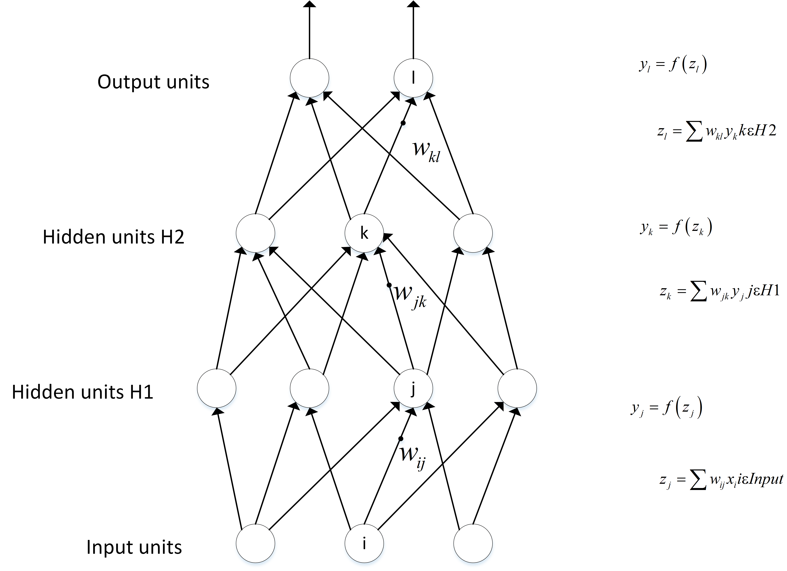

假设上一层结点 $ i,j,k,… $ 等一些结点与本层的结点 w 有连接，那么结点 w 的值怎么算呢？就是通过上一层的 $ i,j,k,… $ 等结点以及对应的连接权值进行加权和运算，最终结果再加上一个偏置项(图中为了简单省略了)，最后在通过一个非线性函数(即激活函数)，如 $ ReLu $ ，$ Sigmoid $ 等函数，最后得到的结果就是本层结点 w 的输出。

最终不断的通过这种方法一层层的运算，得到输出层结果。

### 1.2 反向传播

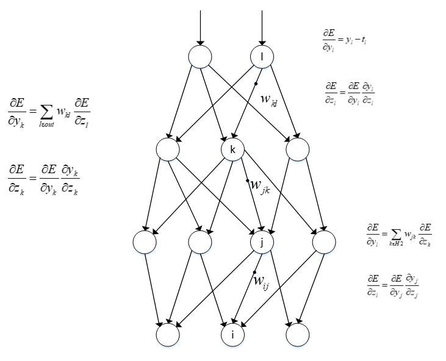

由于我们前向传播最终得到的结果，以分类为例，最终总是有误差的，那么怎么减少误差呢，当前应用广泛的一个算法就是梯度下降算法，但是求梯度就要求偏导数，下面以图中字母为例讲解一下：

设最终误差为 E 且输出层的激活函数为线性激活函数，对于输出那么 E 对于输出节点 $ y_l $ 的偏导数是  $ y_l-t_l $ ，其中 $ t_l $ 是真实值， $  $ 是指上面提到的激活函数， $ z_l $ 是上面提到的加权和，那么这一层的 E 对于 $ z_l $ 的偏导数为

$  =   $

。同理，下一层也是这么计算，只不过 $  $ 计算方法变了，一直反向传播到输入层，最后有

$  =   $

，且 $  = w_i j $ 。然后调整这些过程中的权值，再不断进行前向传播和反向传播的过程，最终得到一个比较好的结果。

## 2. 深度学习框架该怎么选择？

近几年随着深度学习算法的发展，出现了许多深度学习框架。每种框架都有着自己的特色与优点，大家可以根据自己的任务需求选择优先掌握哪种框架。

### 2.1 TensorFlow


谷歌的`TensorFlow`可以说是当今工业界最受欢迎的开源深度学习框架，可用于各类深度学习相关的任务中。

- `TensorFlow`支持Python、JavaScript、C ++、Java、Go、C＃、Julia和R等多种编程语言。
- `TensorFlow`不仅拥有强大的计算集群，还可以在IOS和Android等移动平台上运行模型。
- `TensorFlow`编程入门难度较大。初学者需要仔细考虑神经网络的架构，正确评估输入和输出数据的维度和数量。
- `TensorFlow`使用静态计算图进行操作。也就是说，我们需要先定义图形，然后运行计算，如果我们需要对架构进行更改，则需要重新训练模型。选择这样的方法是为了提高效率，但是许多现代神经网络工具已经能够在学习过程中改进，并且不会显著降低学习速度。在这方面，`TensorFlow`的主要竞争对手是`PyTorch`。

### 2.2 Keras


`Keras`是一个对小白用户非常友好且简单的深度学习框架。如果想快速入门深度学习， `Keras`将是不错的选择。

`Keras`是`TensorFlow`高级集成API，可以非常方便地和TensorFlow进行融合。`Keras`在高层可以调用`TensorFlow`、`CNTK`、`Theano`，还有更多优秀的库也在被陆续支持中。`Keras`的特点是能够快速搭建模型，是高效地进行科学研究的关键。

`Keras`的基本特性如下：

- 高度模块化，搭建网络非常简洁；
- API简单，具有统一的风格；
- 易扩展，易于添加新模块，只需要仿照现有模块编写新的类或函数即可。

### 2.3 Caffe


`Caffe`是由AI科学家贾扬清在加州大学伯克利分校读博期间主导开发的，是以C++/CUDA代码为主的早期深度学习框架之一，比`TensorFlow`、`MXNet`、`PyTorch`等都要早。`Caffe`需要进行编译安装，支持命令行、Python和Matlab接口，单机多卡、多机多卡等都可以很方便使用。

`Caffe`的基本特性如下：

- 以C++/CUDA/Python代码为主，速度快，性能高。
- 工厂设计模式，代码结构清晰，可读性和可拓展性强。
- 支持命令行、Python和Matlab接口，使用方便。
- CPU和GPU之间切换方便，多GPU训练方便。
- 工具丰富，社区活跃。

`Caffe`的缺点也比较明显，主要包括如下几点：

- 源代码修改门槛较高，需要实现正向/反向传播。
- 不支持自动求导。
- 不支持模型级并行，只支持数据级并行。
- 不适合非图像任务。

### 2.4 Pytorch


`Pytorch`是Facebook团队于2017年1月发布的一个深度学习框架，虽然晚于`TensorFlow`、`Keras`等框架，但自发布之日起，其受到的关注度就在不断上升，目前在GitHub上的热度已经超过`Theano`、`Caffe`、`MXNet`等框架，目前`Pytorch`是学术界应用最广的框架。

`PyTroch`主要提供以下两种核心功能：

- 支持GPU加速的张量计算；
- 方便优化模型的自动微分机制。

`PyTorch`的主要优点如下:

- 简洁易懂：`PyTorch`的API设计相当简洁一致，基本上是tensor、autograd、nn三级封装，学习起来非常容易。
- 便于调试：`PyTorch`采用动态图，可以像普通Python代码一样进行调试。不同于`TensorFlow`，`PyTorch`的报错说明通常很容易看懂。
- 强大高效：`PyTorch`提供了非常丰富的模型组件，可以快速实现想法。

### 2.5 Theano


`Theano`诞生于2008年，由蒙特利尔大学的LISA实验室开发并维护，是一个高性能的符号计算及深度学习框架。它完全基于Python，专门用于对数学表达式的定义、求值与优化。得益于对GU的透明使用，`Theano`尤其适用于包含高维度数组的数学表达式，并且计算效率比较高。

因`Theano`出现的时间较早，后来涌现出一批基于`Theano`的深度学习库，并完成了对`Theano`的上层封装以及功能扩展。在这些派生库中，比较著名的就是`Keras`。`Keras`将一些基本的组件封装成模块，使得用户在编写、调试以及阅读网络代码时更加清晰。

### 2.6 CNTK


`CNTK`(Microsoft Cognitive Toolkit)是微软开源的深度学习工具包，它通过有向图将神经网络描述为一系列计算步骤。在有向图中，叶节点表示输入值或网络参数，其他节点表示其输入上的矩阵运算。

`CNTK`允许用户非常轻松地实现和组合流行的模型，包括前馈神经网络(DNN)、卷积神经网络(CNN)和循环神经网络(RNN、LSTM)。与目前大部分框架一样，`CNTK`实现了自动求导，利用随机梯度下降方法进行优化。

`CNTK`的基本特性如下:

- `CNTK`性能较好，按照其官方的说法，它比其他的开源框架性能都要好。
- 适合做语音任务，`CNTK`本就是微软语音团队开源的，自然更适合做语音任务，便于在使用RNN等模型以及时空尺度时进行卷积。

### 2.7 MXNet


`MXNet`框架允许混合符号和命令式编程，以最大限度地提高效率和生产力。`MXNet`的核心是一个动态依赖调度程序，可以动态地自动并行化符号和命令操作。其图形优化层使符号执行更快，内存效率更高。

`MXNet`的基本特性如下:

- 灵活的编程模型：支持命令式和符号式编程模型。
- 多语言支持：支持C++、Python、R、Julia、JavaScript、Scala、Go、Perl等。事实上，它是唯一支持所有R函数的构架。
- 本地分布式训练：支持在多CPU/GPU设备上的分布式训练，使其可充分利用云计算的规模优势。
- 性能优化：使用一个优化的C++后端引擎实现并行I/O和计算，无论使用哪种语言都能达到最佳性能。
- 云端友好：可直接与S3、HDFS和Azure兼容。

### 2.8 ONNX


`ONNX`(Open Neural Network eXchange，开放神经网络交换)项目由微软、亚马逊、Facebook和IBM等公司共同开发，旨在寻找呈现开放格式的深度学习模型。`ONNX`简化了在人工智能不同工作方式之间传递模型的过程，具有各种深度学习框架的优点。

`ONNX`的基本特性如下:

- `ONNX`使模型能够在一个框架中进行训练并转移到另一个框架中进行预测。
- `ONNX`模型目前在`Caffe`、`CNTK`、`MXNet`和`PyTorch`中得到支持，并且还有与其他常见框架和库的连接器。

## 3. 超参数

### 3.1 什么是超参数？

机器学习模型中有两类参数：

- 一类需要从数据中学习和估计得到，称为模型参数(Parameter)—即模型本身的参数。比如，卷积核和 $ BN $ 层的参数。
- 一类则是机器学习算法中的调优参数(tuning parameters)，需要人为设定，称为超参数(Hyperparameter)。比如学习率(learning rate)、批样本数量(batch size)、不同优化器的参数以及部分损失函数的可调参数。

### 3.2 超参数如何影响模型性能？

| **超参数** | **如何影响模型容量** | **影响原因** |
| --- | --- | --- |
| 学习率 | 调至最优，提升有效容量 | 过高或者过低的学习率，都会由于优化失败而导致降低模型有效容限。 |
| 损失函数部分超参数 | 调至最优，提升有效容量 | 损失函数超参数大部分情况都会可能影响优化，不合适的超参数会使即便是对目标优化非常合适的损失函数同样难以优化模型，降低模型有效容限。 |
| 批样本数量 | 过大过小，容易降低有效容量 | 大部分情况下，选择适合自身硬件容量的批样本数量，并不会对模型容限造成。 |
| 丢弃法 | 比率降低会提升模型的容量 | 较少的丢弃参数意味着模型参数量的提升，参数间适应性提升，模型容量提升，但不一定能提升模型有效容限 |
| 权重衰减系数 | 调至最优，提升有效容量 | 权重衰减可以有效的起到限制参数变化的幅度，起到一定的正则作用 |
| 优化器动量 | 调至最优，可能提升有效容量 | 动量参数通常用来加快训练，同时更容易跳出极值点，避免陷入局部最优解。 |
| 模型深度 | 同条件下，深度增加，模型容量提升 | 同条件，下增加深度意味着模型具有更多的参数，更强的拟合能力。 |
| 卷积核尺寸 | 尺寸增加，模型容量提升 | 增加卷积核尺寸意味着参数量的增加，同条件下，模型参数也相应的增加。 |

### 3.3 为什么要进行超参数调优？

本质上，这是模型优化寻找最优解和正则项之间的关系。网络模型优化调整的目的是为了寻找到全局最优解，而正则项又希望模型尽量拟合到最优。两者通常情况下存在一定的对立，但两者的目标是一致的，即最小化期望风险。模型优化希望最小化经验风险，而容易陷入过拟合，正则项用来约束模型复杂度。所以如何平衡两者之间的关系，得到最优或者较优的解就是超参数调整优化的目的。

> 调整超参数的案例：
> 学习率可以说是模型训练最为重要的超参数。通常情况下，一个或者一组优秀的学习率既能加速模型的训练，又能得到一个较优甚至最优的精度。过大或者过小的学习率会直接影响到模型的收敛。我们知道，当模型训练到一定程度的时候，损失将不再减少，这时候模型的一阶梯度接近零，对应Hessian矩阵通常是两种情况，一、正定，即所有特征值均为正，此时通常可以得到一个局部极小值，若这个局部极小值接近全局最小则模型已经能得到不错的性能了，但若差距很大，则模型性能还有待于提升，通常情况下后者在训练初最常见。二，特征值有正有负，此时模型很可能陷入了鞍点，若陷入鞍点，模型性能表现就很差。以上两种情况在训练初期以及中期，此时若仍然以固定的学习率，会使模型陷入左右来回的震荡或者鞍点，无法继续优化。所以，学习率衰减或者增大能帮助模型有效的减少震荡或者逃离鞍点。

### 3.4 如何寻找超参数的最优值？

在使用机器学习算法时，总有一些难调的超参数。例如权重衰减大小，高斯核宽度等等。这些参数需要人为设置，设置的值对结果产生较大影响。常见设置超参数的方法有：

1. 猜测和检查：根据经验或直觉，选择参数，一直迭代，沐神说过“全凭手感”。
2. 网格搜索：让计算机尝试在一定范围内均匀分布的一组值。
3. 随机搜索：让计算机随机挑选一组值。
4. 贝叶斯优化：使用贝叶斯优化超参数，会遇到贝叶斯优化算法本身就需要很多的参数的困难。
5. 遗传算法。

### 3.5 超参数搜索一般过程？

超参数搜索一般过程：

6. 将数据集划分成训练集、验证集及测试集。
7. 在训练集上根据模型的性能指标对模型参数进行优化。
8. 在验证集上根据模型的性能指标对模型的超参数进行搜索。
9. 步骤2和步骤3交替迭代，最终确定模型的参数和超参数，在测试集中验证评价模型的优劣。

其中，搜索过程需要搜索算法，一般有：网格搜索、随机搜过、启发式智能搜索、贝叶斯搜索。

## 4. 激活函数

### 4.1 激活函数的概念

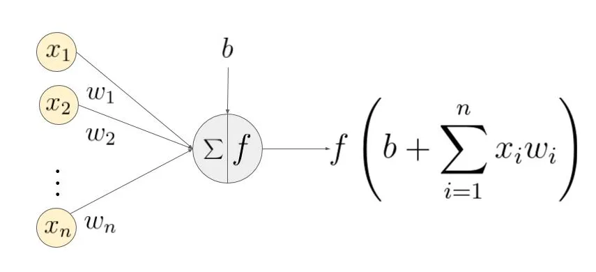

激活函数(Activation functions)对于人工神经网络模型去学习、理解非常复杂和非线性的函数来说具有十分重要的作用。它们将非线性特性引入到神经网络中。在下图中，输入的 $ inputs $ 通过加权，求和后，还被作用了一个函数 $ f $，这个函数 $ f $ 就是激活函数。引入激活函数是为了增加神经网络模型的非线性。

### 4.2 为什么要引入激活函数？

如果不用激活函数，每一层输出都是上层输入的线性函数，无论神经网络有多少层，输出都是输入的线性组合，这种情况就是最原始的感知机(Perceptron)。

如果使用激活函数，激活函数给神经元引入了非线性因素，使得神经网络可以任意逼近任何非线性函数，这样神经网络就可以应用到众多的非线性模型中。

### 4.3 为什么激活函数是非线性函数？

如果使用线性激活函数，那么输入跟输出之间的关系为线性的，无论神经网络有多少层都是线性组合，这样就做不到用非线性来逼近任意函数。

使用非线性激活函数是为了**增加神经网络模型的非线性因素**，以便使网络更加强大，增加它的能力，使它可以学习复杂的事物，复杂的表单数据，以及表示输入输出之间非线性的复杂的任意函数映射。

### 4.4 常见的激活函数

**4.4.1 Sigmoid**

$ {Sigmoid}(x)=(x)=
$

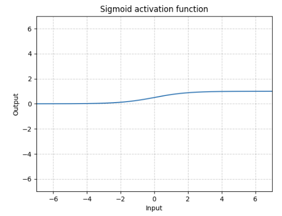

```python
m = nn.Sigmoid()
input = torch.randn(2)
output = m(input)
```

优点：

- $ Sigmoid $ 函数的输出在 (0,1) 之间，输出范围有限，优化稳定，可以用作输出层。
- 连续函数，便于求导。

缺点：

- $ Sigmoid $ 函数在变量取绝对值非常大的正值或负值时会出现饱和现象，意味着函数会变得很平，并且对输入的微小改变会变得不敏感。在反向传播时，当梯度接近于 0，权重基本不会更新，很容易就会出现梯度消失的情况，从而无法完成深层网络的训练。
- $ Sigmoid $ 函数的输出不是 0 均值的，会导致后层的神经元的输入是非 0 均值的信号，这会对梯度产生影响。
- 计算复杂度高，因为 $ Sigmoid $ 函数是指数形式。

**4.4.2 Tanh**

$ (x)=(x)=
$

```python
m = nn.Tanh()
input = torch.randn(2)
output = m(input)
```

**4.4.3 ReLU**

$ (x)=(x)^{+}=(0, x)
$

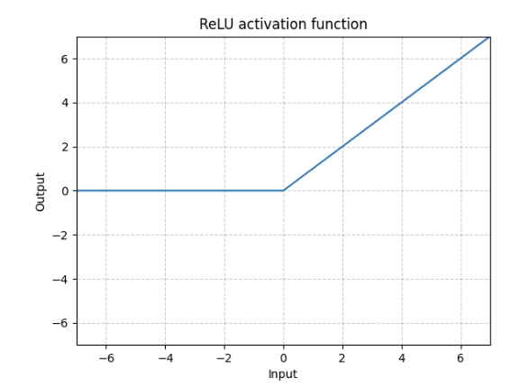

```python
m = nn.ReLU()
input = torch.randn(2)
output = m(input)
An implementation of CReLU - https://arxiv.org/abs/1603.05201m = nn.ReLU()
input = torch.randn(2).unsqueeze(0)
output = torch.cat((m(input),m(-input)))
```

**4.4.4 LeakyReLU**

$ LeakyReLU(x)=(0, x) + negative-slope * (0, x)
$

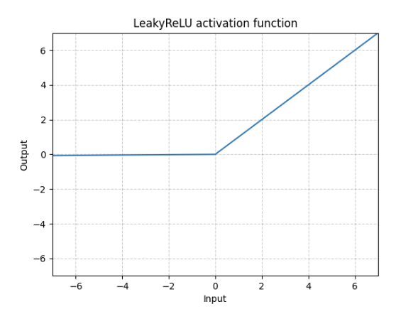

```python
m = nn.LeakyReLU(0.1)
input = torch.randn(2)
output = m(input)
```

**4.4.5 Softmax**

$ (x_{i})=
$

```python
m = nn.Softmax(dim=1)
input = torch.randn(2, 3)
output = m(input)
```

**4.4.6 SiLU**

$ (x)=x * (x)  (x)  $

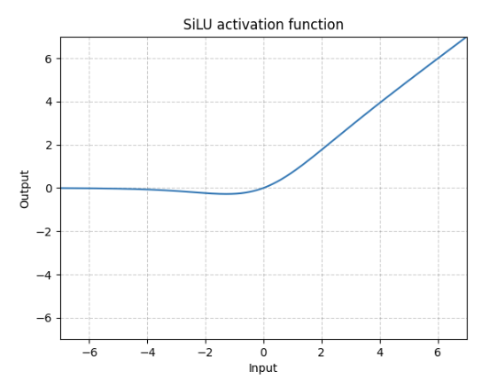

```python
m = nn.SiLU()
input = torch.randn(2)
output = m(input)
```

**4.4.7 ReLU6**

$  6(x)=((0, x), 6)
$

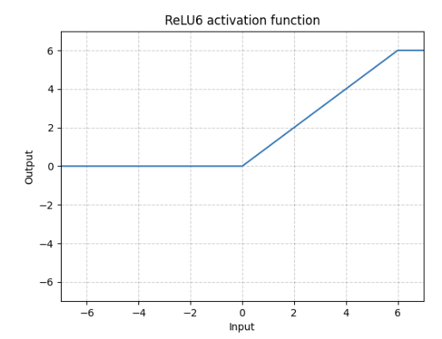

```python
m = nn.ReLU6()
input = torch.randn(2)
output = m(input)
```

**4.4.8 Mish**

$ Mish(x)=x∗Tanh(Softplus(x))
$

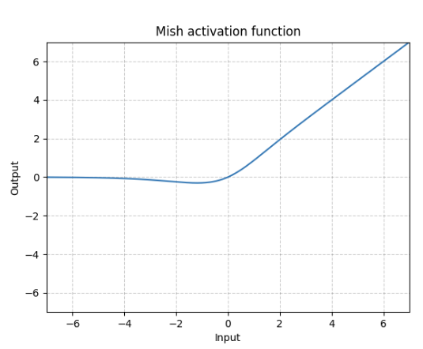

```python
m = nn.Mish()
input = torch.randn(2)
output = m(input)
```

### 4.5 激活函数性质

10. **非线性** ：当激活函数是非线性的，一个两层的神经网络就可以基本上逼近所有的函数。但如果激活函数是恒等激活函数的时候，即 $ f(x)=x $ ，就不满足这个性质，而且如果 $ MLP $ 使用的是恒等激活函数，那么其实整个网络跟单层神经网络是等价的；
11. **可微性**：可微性保证了在优化中梯度的可计算性。传统的激活函数如 $ Sigmoid $ 等满足处处可微。对于分段线性函数比如 $ ReLU $ ，只满足几乎处处可微(即仅在有限个点处不可微)。对于 $ SGD $ 算法来说，由于几乎不可能收敛到梯度接近零的位置，有限的不可微点对于优化结果不会有很大影响。
12. **计算简单**：非线性函有很多。激活函数在神经网络前向的计算次数与神经元的个数成正比，因此简单的非线性函数自然更适合用作激活函数。这也是 $ ReLU $ 比其它使用 $ Exp $ 等操作的激活函数更受欢迎的其中一个原因。
13. **非饱和性(saturation)**：饱和指的是在某些区间梯度接近于零(即梯度消失)，使得参数无法继续更新的问题。最经典的例子是 $ Sigmoid $ ，它的导数在 x 为比较大的正值和比较小的负值时都会接近于 0 。更极端的例子是阶跃函数，由于它在几乎所有位置的梯度都为 0 ，因此处处饱和，无法作为激活函数。 $ ReLU $ 在 $ x>0 $ 时导数恒为 1，因此对于再大的正值也不会饱和。但同时对于 $ x<0 $ ，其梯度恒为 0，这时候它也会出现饱和的现象。 $ Leaky ReLU $ 和 $ PReLU $ 的提出正是为了解决这一问题。
14. **单调性(monotonic)**：即导数符号不变。当激活函数是单调的时候，单层网络能够保证是凸函数。
15. **输出范围有限**：有限的输出范围使得网络对于一些比较大的输入也会比较稳定，这也是为什么早期的激活函数都以此类函数为主，如 $ Sigmoid $ 、 $ Tanh $。但这导致了前面提到的梯度消失问题，而且强行让每一层的输出限制到固定范围会限制其表达能力。因此现在这类函数仅用于某些需要特定输出范围的场合，比如概率输出(此时 $ loss $ 函数中的 $ log $ 操作能够抵消其梯度消失的影响)、 $ LSTM $ 里的 $ gate $ 函数。
16. **接近恒等变换(identity)**： $ f(x)≈x $ ，即约等于 x。这样的好处是使得输出的幅值不会随着深度的增加而发生显著的增加，从而使网络更为稳定，同时梯度也能够更容易地回传。这个与非线性是有点矛盾的，因此激活函数基本只是部分满足这个条件。
17. **参数少**：大部分激活函数都是没有参数的。像 $ PReLU $ 带单个参数会略微增加网络的大小。还有一个例外是Maxout，尽管本身没有参数，但在同样输出通道数下 k 路 $ Maxout $ 需要的输入通道数是其它函数的k倍，这意味着神经元数目也需要变为k倍；但如果不考虑维持输出通道数的情况下，该激活函数又能将参数个数减少为原来的k倍。
18. **归一化(normalization)**：对应的激活函数是 $ SELU $ ，主要思想是使样本分布自动归一化到零均值、单位方差的分布，从而稳定训练。归一化的思想也被用于网络结构的设计，比如Batch Normalization。

### 4.6 如何选择激活函数？

目前激活函数非常的多，选择一个最适合的激活函数并不容易，需要考虑很多因素，通常的做法是，如果不确定哪一个激活函数效果更好，可以把它们都试试，然后在验证集或者测试集上进行评价。然后看哪一种表现的更好，就去使用它。在实际应用过程中通常可以考虑目前使用最广泛的，比如 $ ReLU $ ， $ SiLU $ 等。

以下是常见的选择情况：

19. 如果输出是 0、1 值(二分类问题)，则输出层选择 $ Sigmoid $ 函数，然后其它的所有单元都选择 $ Relu $ 函数。
20. 如果在隐藏层上不确定使用哪个激活函数，那么通常会使用 $ Relu $ 激活函数。有时，也会使用 $ Tanh $ 激活函数，但 $ Relu $ 的一个优点是：当是负值的时候，导数等于 0。
21. $ Sigmoid $ 激活函数：除了输出层是一个二分类问题基本不会用它。
22. $ Tanh $ 激活函数：$ Tanh $ 是非常优秀的，几乎适合所有场合。
23. $ ReLu $ 激活函数：最常用的默认函数，如果不确定用哪个激活函数，就使用 $ ReLu $ 或者 $ Leaky ReLu $ ，再去尝试其他的激活函数。
24. 如果遇到了一些死的神经元，我们可以使用 $ Leaky ReLU $ 函数。

## 5. BatchSize

### 5.1 Epoch、 Iteration和BatchSize的关系

> 深度学习中经常看到epoch、 iteration和batchsize，下面按自己的理解说说这三个的区别：
> `batchsize`：批大小。在深度学习中，一般采用SGD训练，即每次训练在训练集中取`batchsize`个样本训练；
> 
> `iteration`： 1 1 1个`iteration`等于使用`batchsize`个样本训练一次；
> 
> `epoch`： 1 1 1个`epoch`等于使用训练集中的全部样本训练一次；
> 
> 举个例子，训练集有 1000 1000 1000个样本，`batchsize`= 10 10 10，那么：
> 
> 训练完整个样本集需要：
> 
> 100 100 100次`iteration`， 1 1 1次`epoch`。

### 5.2 BatchSize的选择

Batch的选择，首先决定的是下降的方向。那么越准确的数据量，决定的梯度下降的方向就越准确，对于小的数据集来说，BatchSize可以选择全部数据集大小，但是对于大的数据集来说，如果BatchSize选择的过大，将导致运行内存不足，无法训练下去等问题。对于在线学习的数据集，我们把BatchSize设置为 1 1 1。

BatchSize不宜选的太小，太小了容易修正方向导致不收敛，或者需要经过很大的Epoch才能收敛；也没必要选的太大，太大的话会导致显存爆炸，其次可能会因为迭代次数的减少而造成参数修正变的缓慢。如果数据集足够充分，那么用一半(甚至少得多)的数据训练算出来的梯度与用全部数据训练出来的梯度是几乎一样的。

### 5.3 BatchSize是否越大越好？

25. 使用大BatchSize内存利用率提高了，大矩阵乘法的并行化效率提高，但是内存可能发生爆炸。
26. 大BatchSize跑完一次epoch(全数据集)所需的迭代次数减少，对于相同数据量的处理速度进一步加快。
27. 在一定范围内，一般来说BatchSize越大，其确定的下降方向越准，引起训练震荡越小，但是BatchSize 增大到一定程度，其确定的下降方向已经基本不再变化。
28. 并且BatchSize过大容易造成内存溢出、训练时间增加、收敛缓慢、局部最优，泛化性差等问题。

### 5.4 调节 BatchSize 对训练效果有什么影响？

29. BatchSize太小，模型表现效果极其糟糕(error飙升)。
30. 随着BatchSize增大，处理相同数据量的速度越快，达到相同精度所需要的epoch数量越来越多。
31. 由于上述两种因素的矛盾， BatchSize增大到某个时候，达到时间上的最优。
32. 由于最终收敛精度会陷入不同的局部极值，因此BatchSize增大到某些时候，达到最终收敛精度上的最优。

## 6. 标准化与归一化

归一化：

$  $

标准化：

$  $

归一化就是要把需要处理的数据经过处理后(通过某种算法)限制在你需要的一定范围内。首先归一化是为了后面数据处理的方便，其次是保证程序运行时收敛加快。归一化的具体作用是归纳统一样本的统计分布性。归一化在 $ 0-1 $ 之间是统计的概率分布，归一化在某个区间上是统计的坐标分布。

标准化和归一化本质上都是不改变数据顺序的情况下对数据的线性变化，而它们最大的不同是归一化(Normalization)会将原始数据规定在一个范围区间中，而标准化(Standardization)则是将数据调整为标准差为 $ 1 $ ，均值为$ 0$对分布。

另外归一化只与数据的最大值和最小值有关，缩放比例为 $ α=X_{max}-X_{min} $ ，而标准化的缩放比例等于标准差 $ α=σ $ ，平移量等于均值 $ β=μ $ ，当除了极大值极小值的数据改变时他的缩放比例和平移量也会改变。

### 6.1 为什么要归一化？

引入归一化，是由于不同的特征之间，其量纲或者量纲单位往往不同，变化区间也处于不同的数量级，若不进行归一化，可能导致某些指标被忽略，影响到数据分析的结果。

例如：影响房价的两个特征，面积和房间数量，面积有 $ 80 $, $ 90 , 100 $ 等，房间数有 $ 1 $, $ 2 $ ,$ 3 $ 等，这两个指标度量方式根本不在一个数量级上。

为了消除特征之间的量纲影响，需要进行归一化处理，以解决特征指标之间的可比性，原始数据，经归一化处理后，各个指标处于同一种数量级，可以直接对比评价。

### 6.2 为什么归一化能提高求解最优解速度？

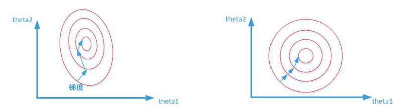

上图是代表数据是否均一化的最优解寻解过程(圆圈可以理解为等高线)。左图表示未经归一化操作的寻解过程，右图表示经过归一化后的寻解过程。

当使用梯度下降法寻求最优解时，很有可能走“之字型”路线(垂直等高线走)，从而导致需要迭代很多次才能收敛；而右图对两个原始特征进行了归一化，其对应的等高线显得很圆，在梯度下降进行求解时能较快的收敛。

因此如果机器学习模型使用梯度下降法求最优解时，归一化往往非常有必要，否则很难收敛甚至不能收敛。

### 6.3 常用归一化方式

**1. 线性归一化**

$ x^{} = 
$

适用范围：比较适用在数值比较集中的情况。

缺点：如果 max 和 min 不稳定，很容易使得归一化结果不稳定，使得后续使用效果也不稳定。

**2. 标准差标准化**

$ x^{prime} =  {}
$

**含义**：经过处理的数据符合标准正态分布，即均值为 0，标准差为 1 其中 $ *为所有样本数据的均值*， $ 为所有样本数据的标准差。

**3. 非线性归一化**

**适用范围**：经常用在数据分化比较大的场景，有些数值很大，有些很小。通过一些数学函数，将原始值进行映射。该方法包括 $ log $ 、指数，正切等。

### 6.4 局部响应归一化(Local Response Normalization，LRN)

这是一个争议比较大的方法，$ LRN $ 技术主要是深度学习训练时的一种提高准确度的技术方法。其中caffe、tensorflow等里面是很常见的方法，其跟激活函数是有区别的， $ LRN $ 一般是在激活、池化后进行的一种处理方法。$ LRN $ 归一化技术首次在 $ AlexNet $ 模型中提出这个概念。通过实验确实证明它可以提高模型的泛化能力，但是提升的很少，以至于后面不再使用，甚至有人觉得它是一个“伪命题”，因而它饱受争议，在此不做过多介绍。

详细的描述大家可以参考这篇论文：[/assets/files/personal/masterlearn/科研修炼手册/深度学习基础/imagenet.pdf](/assets/files/personal/masterlearn/科研修炼手册/深度学习基础/imagenet.pdf)

### 6.5 批归一化(Batch Normalization，BN)

在之前的神经网络训练中，只是对输入层数据进行归一化处理，却没有在中间层进行归一化处理。要知道，虽然我们对输入数据进行了归一化处理，但是输入数据经过 $ (WX+b) $ 这样的矩阵乘法以及非线性运算之后，其数据分布很可能被改变，而随着深度网络的多层运算之后，数据分布的变化将越来越大。如果我们能在网络的中间也进行归一化处理，是否对网络的训练起到改进作用呢？答案是肯定的。

这种在神经网络中间层也进行归一化处理，使训练效果更好的方法，就是批归一化**Batch Normalization(BN)**。

那么使用Batch Normalization到底有哪些**优点**呢？

33. 减少了人为选择参数。在某些情况下可以取消 $ Dropout $ $ L2 $ 正则项参数,或者采取更小的 $ L2 $ 正则项约束参数；
34. 减少了对学习率的要求。现在我们可以使用初始很大的学习率或者选择了较小的学习率，算法也能够快速训练收敛；
35. 可以不再使用局部响应归一化。$ BN $ 本身就是归一化网络(局部响应归一化在 $ AlexNet $ 网络中存在) ；
36. 破坏原来的数据分布，一定程度上缓解过拟合(防止每批训练中某一个样本经常被挑选到，文献说这个可以提高 $ 1% $ 的精度)；
37. 减少梯度消失，加快收敛速度，提高训练精度。

### 6.6 Batch Normalization算法流程

下面给出 B N BN BN算法在训练时的过程

输入：上一层输出结果  $ X = {x_1, x_2, …, x_m} $ ，学习参数 $ , $

算法流程：

38. 计算上一层输出数据的均值

$ *{} =  *{i=1}^m(x_i)
$

其中，$ m $ 此次训练样本 $ batch $ 的大小。

39. 计算上一层输出数据的标准差

$ *{}^2=  *{i=1}^m (x_i - _{})^2
$

40. 归一化处理，得到

$ x_i = 
$

其中  $ $ 是为了避免分母为 $ 0 $而加进去的接近于 $ 0 $ 的很小值。

41. 重构，对经过上面归一化处理得到的数据进行重构，得到

$ y_i = x_i + 
$

其中， $ , $ 为可学习参数。

> 注：上述是 $ BN $训练时的过程，但是当在投入使用时，往往只是输入一个样本，没有所谓的均值 $ {} $ 和标准差 $ {}^2 $。此时，均值 $ {} $ 是计算所有batch  $ {} $ 值的平均值得到，标准差 $ {}^2 $ 采用每个batch $ {}^2 $ 的无偏估计得到。

### 6.7 群组归一化(Group Normalization，GN )

Group Normalization是何恺明团队2018年提出来的, $ GN $优化了 $ BN $ 在比较小的 $ mini-batch $ 情况下表现不太好的劣势。

Group Normalization(GN)首先将Channels划分为多个groups，再计算每个group内的均值和方差，以进行归一化。$ GN $ 的计算与BatchSize无关，因此对于高精度图片小batchSize的情况也是非常稳定的。

### 6.8 权重归一化(Weight Normalization，WN)

$ BN / LRN / GN $ 都是在数据的层面上做的归一化，而Weight Normalization( $ WN $ )是对网络权值 $ W $ 做的归一化。$ WN $ 的做法是将权值向量 $ w *在其欧氏范数和其方向上解耦成了参数向量* v *和参数标量* g *后使用SGD分别优化这两个参数*。 WN $也是和样本量无关的，所以可以应用在batchsize较小以及RNN等动态网络中；另外 $ BN $使用的基于mini-batch的归一化统计量代替全局统计量，相当于在梯度计算中引入了噪声。而 $ WN *则没有这个问题*，*所以在生成模型*，*强化学习等噪声敏感的环境中* WN *的效果也要优于* BN $。

$ WN *没有额外参数*，*不需要额外的存储空间来保存minibatch的均值和方差*，*这样更节约显存*。*同时* WN *的计算效率也要优于要计算归一化统计量的* BN $。

但是，$ WN *不具备* BN *把每一层的输出Y固定在一个变化范围的作用*。*因此采用* WN $的时候要特别注意参数初始值的选择。

### 6.9 批归一化在网络中的位置

- 把批归一化放在激活层之前，可以有效避免批归一化破坏非线性特征的分布；另外，批归一化还可以使数据点尽量不落入激活函数的饱和区域，缓解梯度消失问题。
- 由于现在的激活函数是 $ ReLU $，他没有 $ Sigmoid $、 $ Tanh $ 函数的那些问题，因此也可以把批归一化放在激活函数之后，避免数据在激活层之前被转化成相似的模式从而使得非线性特征分布趋于同化。

在具体实践中，原始论文是将批归一化放在激活函数之前的，但学术界和工业界也有不少人曾表示倾向于将批归一化放在激活函数之后(Keras作者Francois，Kaggle首席科学家jeremy Howard等)，从近两年的论文来看，有一大部分是将批归一化放在激活层之后，比如MobileNet V2，ShuffleNet V2等，到底放在什么位置，还是一个比较有争议的问题。

## 7. 预训练与微调(fine tuning)

### 7.1 特征提取和模型微调

**特征提取**

微调首先要弄清楚一个概念：**特征提取**。

用于图像分类的卷积神经网络包括两部分：一系列的卷积层和池化层(卷积基) + 一个密集连接分类器。对于卷积神经网络而言，特征提取就是取出之前训练好的网络的卷积基，用新数据训练一个新的分类器。

那么为什么要重复使用之前的卷积基，而要训练新的分类器呢？

这是因为卷积基学到的东西更加通用，而分类器学到的东西则针对于模型训练的输出类别，并且密集连接层舍弃了空间信息。

卷积基的通用性取决于该层在模型中的深度。模型中更靠近输入的层提取的特征更通用，更靠近输出的层提取的特征更抽象。

在特征提取时，应冻结卷积基，不对其进行训练，即训练过程中不改变卷积基的权重，只训练最后的dense层。在keras中，冻结方法为将卷积基每层的trainable属性设为False。

**模型微调**

模型微调与特征提取互为补充。对于用于特征提取的冻结的卷积基，微调是指将其靠近输出的几层解冻，并将这几层与分类器联合训练，让模型更加适用于当前要解决的问题。

> 微调案例：CNN在图像识别这一领域取得了巨大的进步。如果想将CNN应用到我们自己的数据集上，这时通常就会面临一个问题：我们的dataset都不会特别大，一般不会超过1万张，甚至更少，每一类图片只有几十或者十几张。这时候，直接应用这些数据训练一个网络的想法就不可行了，因为深度学习成功的一个关键性因素就是大量带标签数据组成的训练集。如果只利用手头上这点数据，即使我们利用非常好的网络结构，也达不到很高的 performance。这时候，fine-tuning的思想就可以很好解决我们的问题：我们通过对 ImageNet上训练出来的模型(如CaffeNet，VGGNet，ResNet) 进行微调(即冻结卷积基，将靠近出口的部分解冻训练)，然后应用到我们自己的数据集上。

### 7.2 微调和直接训练有什么不同

42. finetune的过程相当于继续训练，跟直接训练的区别是初始化方式不同。
43. 直接训练是按照网络定义指定的方式初始化。
44. finetune是用你已经有的参数文件来初始化。

### 7.3 微调模型的三种方式

45. 方式一：只预测，不训练。
特点：相对快、简单，针对那些已经训练好，现在要实际对未知数据进行标注的项目，非常高效；
46. 方式二：训练，但只训练最后分类层。
特点：fine-tuning的模型最终的分类以及符合要求，现在只是在他们的基础上进行类别降维。
47. 方式三：完全训练，分类层+之前卷积层都训练
特点：跟状态二的差异很小，当然状态三比较耗时和需要训练GPU资源，不过非常适合fine-tuning到自己想要的模型里面，预测精度相比状态二也提高不少。

### 7.4 实际应用中的微调方法

是否微调以及微调的方法要根据自己的数据集大小、数据集与预训练模型数据集的相似程度来选择。

不同情况下的微调方法：

数据量少，相似度高：修改最后几层；

数据量少，相似度低：保留预训练模型的前几层，训练后面的层；

数据量大，相似度高：这是最理想的情况。使用预训练的权重初始化模型，重新训练整个模型；

数据量大，相似度低：直接重新训练整个模型。

## 8. 权重初始化

权重初始化(weight initialization)又称参数初始化，在深度学习模型训练过程的本质是对 $ weight (*即参数W*)*进行更新*，*但是在最开始训练的时候是无法更新的*，*这需要每个参数有相应的初始值*。*在进行权重初始化后*，*神经网络就可以对权重参数* w $不停地迭代更新，以达到较好的性能。

### 8.1 全零初始化

在神经网络中全零初始化是我们要避免的，它无法训练网络。因为全零初始化后，神经网络训练时，在反向传播时梯度相同，参数更新也一样，最后会出现输出层两个权值相同，隐层神经元参数相同，也就是说神经网络失去了特征学习的能力。

通俗点说，在神经网络中考虑梯度下降的时候，设想你在爬山，但身处直线形的山谷中，两边是对称的山峰。由于对称性，你所在之处的梯度只能沿着山谷的方向，不会指向山峰；你走了一步之后，情况依然不变。结果就是你只能收敛到山谷中的一个极大值，而走不到山峰上去。

### 8.2 随机初始化

随机初始化是很多人经常使用的方法，一般初始化的权重为高斯或均匀分布中随机抽取的值。然而这是有弊端的，一旦随机分布选择不当，就会导致网络优化陷入困境。

**把权重初始化为较小的值**，如均值为 $ 0 $，方差为 $ 0.01 *的高斯分布*，*随着层数的增加*，*输出值迅速向* 0 $靠拢，在后几层中，几乎所有的输出值 $ x *都很接近* 0 $。高斯初始化，给权重较小的值，这种更新方式在小型网络中很常见，然而当网络deep的时候，会出现**梯度消失**的情况。

但是如果把**权重初始成一个比较大的值**，如均值为$ 0 ，*方差为* 1 $的高斯分布，几乎所有的值集中在 $ −1 $ 或 $ 1 $ 附近，则会造成前向传播时，神经元要么被抑制，要么被饱和。当神经网络的层数增多时，会发现越往后面的层的激活函数($ Tanh $ 在 $ -1 $ 和 $ 1 $附近的gradient都接近 $ 0 $ )的输出值几乎都接近于 $ 0 $。梯度更新时，梯度非常接近于 $ 0 $，就会导致**梯度消失**。

### 8.3 Xavierc初始化

也称为`Glorot初始化`，因为发明人为 $ Xavier Glorot $ 。`Xavier初始化`是 $ Glorot *等人为了解决随机初始化的问题提出来的另一种初始化方法*，*他们的思想就是尽可能的让输入和输出服从相同的分布*，*这样就能够避免后面层的激活函数的输出值趋向于* 0 $。
`Xavier初始化`在$ Sigmoid *和* Tanh *激活函数上有很好的表现*，*但是在* Relu $激活函数上表现很差。

### 8.4 He 初始化

`He初始化`是何凯明等提出的一种鲁棒的神经网络参数初始化方法，可以保证信息在前向传播和反向传播过程中能够有效流动，使不同层的输入信号的方差大致相等。`He初始化`对应的是非线性激活函数( $ Relu *和* Prelu $)。

### 8.5 偏差初始化

将`偏差初始化`为零是可能的，也是很常见的，因为非对称性破坏是由权重的小随机数导致的。因为$ ReLU $具有非线性特点，所以有些人喜欢使用将所有的偏差设定为小的常数值如 $ 0.01 $，因为这样可以确保所有的 $ ReLU $ 单元在最开始就激活触发(fire)并因此能够获得和传播一些梯度值。然而，这是否能够提供持续的改善还不太清楚(实际上一些结果表明这样做反而使得性能更加糟糕)，所以更通常的做法是简单地将偏差初始化为 $ 0 $ 。

### 8.6 初始化方式小结

好的初始化方法可以防止前向传播过程中的信息消失，也可以解决反向传递过程中的梯度消失。

激活函数选择双曲正切或者 $ Sigmoid $ 时，建议使用`Xaizer初始化`方法。

激活函数选择 $ ReLU $ 或 $ Leakly ReLU $ 时，推荐使用`He初始化`方法。

## 9. 学习率

### 9.1 学习率的作用

在机器学习中，监督式学习通过定义一个模型，并根据训练集上的数据估计最优参数。梯度下降法是一个广泛被用来最小化模型误差的参数优化算法。梯度下降法通过多次迭代，并在每一步中最小化成本函数(cost 来估计模型的参数。学习率 (learning rate)，在迭代过程中会控制模型的学习进度。

在梯度下降法中，都是给定的统一的学习率，整个优化过程中都以确定的步长进行更新， 在迭代优化的前期中，学习率较大，则前进的步长就会较长，这时便能以较快的速度进行梯度下降，而在迭代优化的后期，逐步减小学习率的值，减小步长，这样将有助于算法的收敛，更容易接近最优解。故而如何对学习率的更新成为了研究者的关注点。

### 9.2 常见学习率衰减参数

| 参数名称 | 参数说明 |
| --- | --- |
| learning_rate | 初始学习率 |
| global_step | 用于衰减计算的全局步数，非负，用于逐步计算衰减指数 |
| decay_steps | 衰减步数，必须是正值，决定衰减周期 |
| decay_rate | 衰减率 |
| end_learning_rate | 最低的最终学习率 |
| cycle | 学习率下降后是否重新上升 |
| alpha | 最小学习率 |
| num_periods | 衰减余弦部分的周期数 |
| initial_variance | 噪声的初始方差 |
| variance_decay | 衰减噪声的方差 |

### 9.3 常见学习率衰减方法

在模型优化中，常用到的几种学习率衰减方法有：分段常数衰减、多项式衰减、指数衰减、自然指数衰减、余弦衰减、线性余弦衰减、噪声线性余弦衰减。

### 9.3.1 指数衰减

以指数衰减方式进行学习率的更新，学习率的大小和训练次数指数相关，其更新规则为：

$ decayed_learning_rate =learning_rate*decay_rate^{}
$

这种衰减方式简单直接，收敛速度快，是最常用的学习率衰减方式，如下图所示，绿色的为学习率随训练次数的指数衰减方式，红色的即为分段常数衰减，它在一定的训练区间内保持学习率不变。

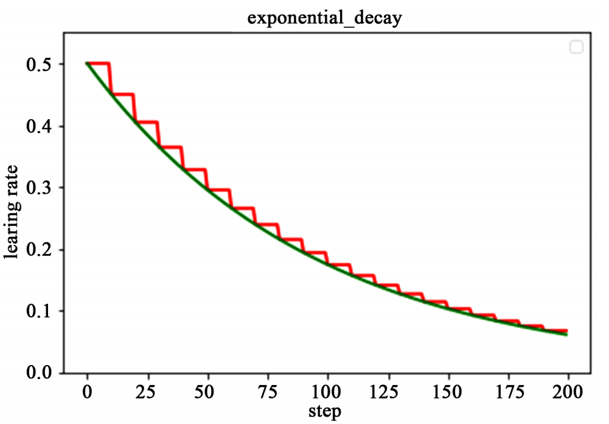

### 9.3.2 自然指数衰减

它与指数衰减方式相似，不同的在于它的衰减底数是 $ e $，故而其收敛的速度更快，一般用于相对比较容易训练的网络，便于较快的收敛，其更新规则如下

$ decayed{_}learning{_}rate =learning{_}rate*e^{} $

下图为为分段常数衰减、指数衰减、自然指数衰减三种方式的对比图，红色的即为分段常数衰减图，阶梯型曲线。蓝色线为指数衰减图，绿色即为自然指数衰减图，很明可以看到自然指数衰减方式下的学习率衰减程度要大于一般指数衰减方式，有助于更快的收敛。

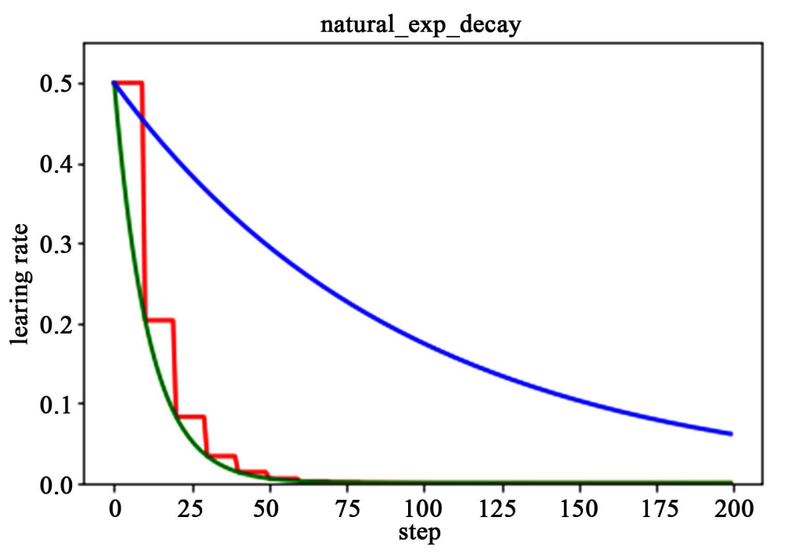

### 9.3.3 多项式衰减

应用多项式衰减的方式进行更新学习率，这里会给定初始学习率和最低学习率取值，然后将会按照给定的衰减方式将学习率从初始值衰减到最低值,其更新规则如下式所示。

$ global{_}step = min(global{_}step,decay{_}steps) $

$ decayed_learning_rate =(learning_rate-end_learning_rate) * ( 1-)^{power} + end_learning_rate $

需要注意的是，有两个机制，降到最低学习率后，到训练结束可以一直使用最低学习率进行更新，另一个是再次将学习率调高，使用 decay_steps 的倍数，取第一个大于 global_steps 的结果，如下式所示.它是用来防止神经网络在训练的后期由于学习率过小而导致的网络一直在某个局部最小值附近震荡，这样可以通过在后期增大学习率跳出局部极小值。

$ decay_steps = decay_steps * ceil ( {decay_steps}) $

如下图所示，红色线代表学习率降低至最低后，一直保持学习率不变进行更新，绿色线代表学习率衰减到最低后，又会再次循环往复的升高降低。

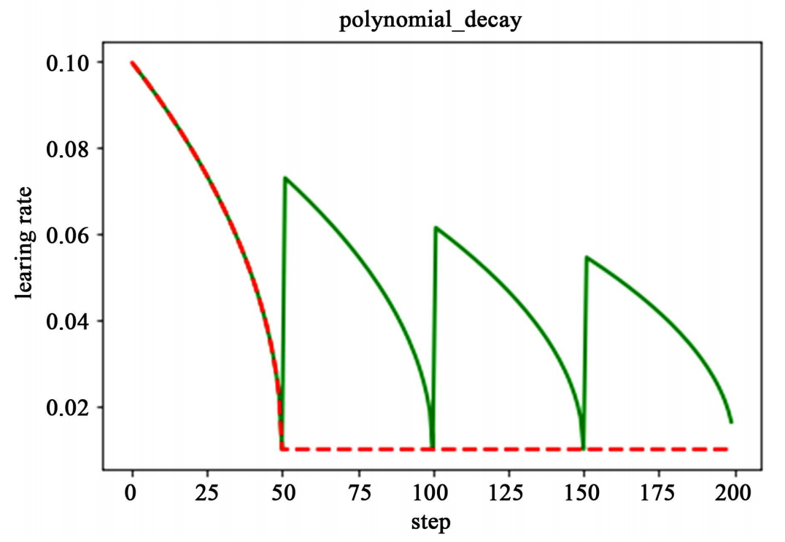

### 9.3.4 余弦衰减

余弦衰减就是采用余弦的相关方式进行学习率的衰减，衰减图和余弦函数相似。其更新机制如下式所示：

$ global{_}step=min(global{_}step,decay{_}steps) $

$ cosine{_}decay=0.5 *( 1+cos( )) $

$ decayed=(1-)*cosine{_}decay+$

$ decayed{_}learning{_}rate=learning{_}rate*decayed $

如下图所示，红色即为标准的余弦衰减曲线，学习率从初始值下降到最低学习率后保持不变。蓝色的线是线性余弦衰减方式曲线，它是学习率从初始学习率以线性的方式下降到最低学习率值。绿色噪声线性余弦衰减方式。

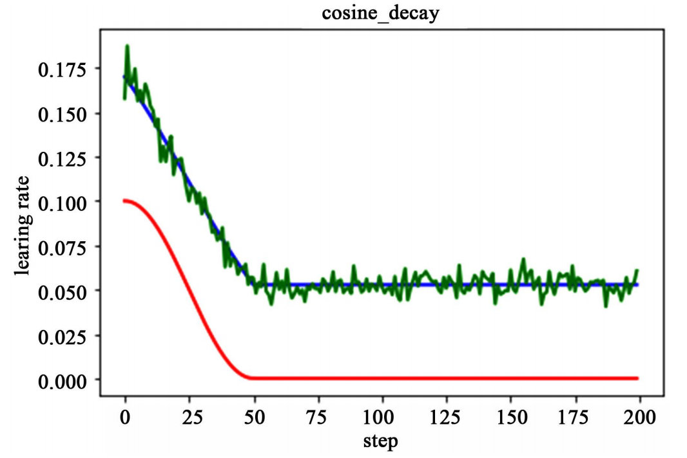

在模型优化中，常用到的几种学习率衰减方法有：分段常数衰减、多项式衰减、指数衰减、自然指数衰减、余弦衰减、线性余弦衰减、噪声线性余弦衰减

### 9.3.5 分段常数衰减

分段常数衰减需要事先定义好的训练次数区间，在对应区间置不同的学习率的常数值，一般情况刚开始的学习率要大一些，之后要越来越小，要根据样本量的大小设置区间的间隔大小，样本量越大，区间间隔要小一点。下图即为分段常数衰减的学习率变化图，横坐标代表训练次数，纵坐标代表学习率。

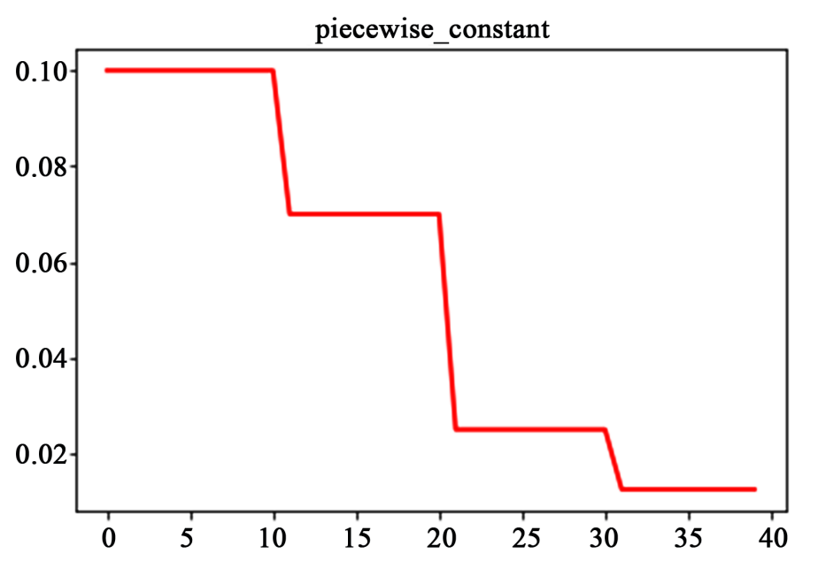

下面介绍一些实际训练中具体的学习率调整方式

### 9.3.6 StepLR

这是最简单常用的学习率调整方法，每过step_size轮，将此前的学习率乘以$ $ 。

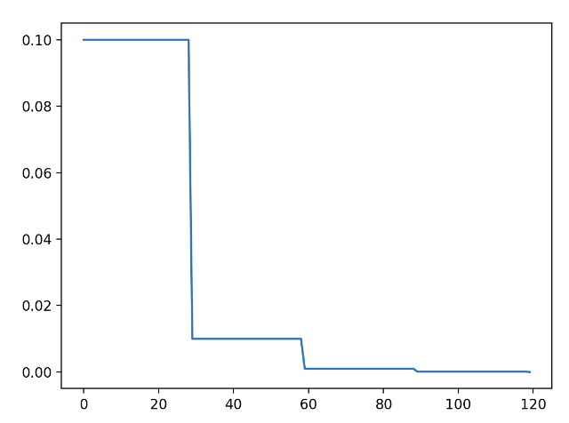

```python
scheduler=lr_scheduler.StepLR(optimizer, step_size=30, gamma=0.1)
```

### 9.3.7 MultiStepLR

`MultiStepLR`同样也是一个非常常见的学习率调整策略，它会在每个milestone时，将此前学习率乘以 $ $ 。

```python
scheduler = lr_scheduler.MultiStepLR(optimizer, milestones=[30,80], gamma=0.5)
```

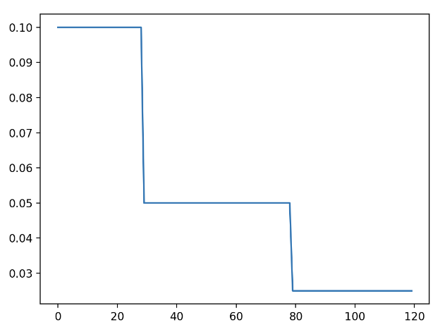

### 9.3.8 ExponentialLR

`ExponentialLR`是指数型下降的学习率调节器，每一轮会将学习率乘以 $ $ ，所以这里千万注意 $ $ 不要设置的太小，不然几轮之后学习率就会降到 $ 0 $。

```python
scheduler=lr_scheduler.ExponentialLR(optimizer, gamma=0.9)
```

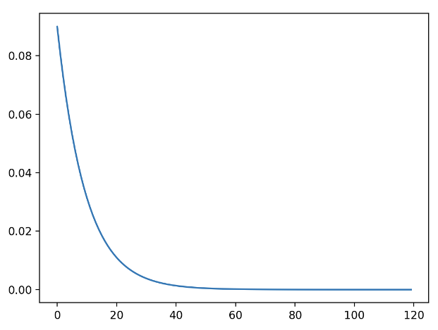

### 9.3.9 LinearLR

`LinearLR`是线性学习率，给定起始factor和最终的factor，`LinearLR`会在中间阶段做线性插值，比如学习率为 $ 0.1 $，起始factor为 $ 1 $，最终的factor为 $ 0.1 $，那么第 $ 0 $ 次迭代，学习率将为 $ 0.1 $，最终轮学习率为 $ 0.01 $ 。下面设置的总轮数total_iters为 $ 80 $,所以超过 $ 80 $时，学习率恒为 $ 0.01 $ 。

```python
scheduler=lr_scheduler.LinearLR(optimizer,start_factor=1,end_factor=0.1,total_iters=80)
```

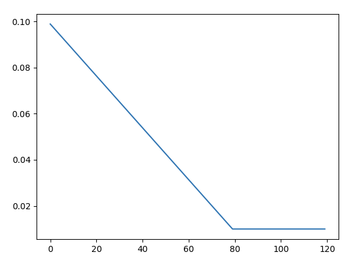

### 9.3.10 CyclicLR

`CyclicLR`的参数要更多一些，它的曲线看起来就像是不断的上坡与下坡，base_lr为谷底的学习率，max_lr为顶峰的学习率，step_size_up是从谷底到顶峰需要的轮数，step_size_down时从顶峰到谷底的轮数。至于为啥这样设置，可以参见论文,简单来说最佳学习率会在base_lr和max_lr，`CyclicLR`不是一味衰减而是出现增大的过程是为了避免陷入鞍点。

```python
scheduler=lr_scheduler.CyclicLR(optimizer,base_lr=0.1,max_lr=0.2,step_size_up=30,step_size_down=10)
```

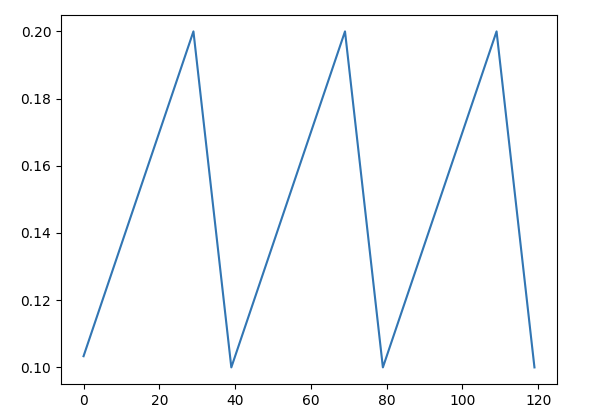

### 9.3.11 OneCycleLR

`OneCycleLR`顾名思义就像是`CyclicLR`的一周期版本，它也有多个参数，max_lr就是最大学习率，pct_start是学习率上升部分所占比例，一开始的学习率为 $  {div_factor} $,最终的学习率为 $  $，总的迭代次数为total_steps。

```python
scheduler=lr_scheduler.OneCycleLR(optimizer,max_lr=0.1,pct_start=0.5,total_steps=120,div_factor=10,final_div_factor=10)
```

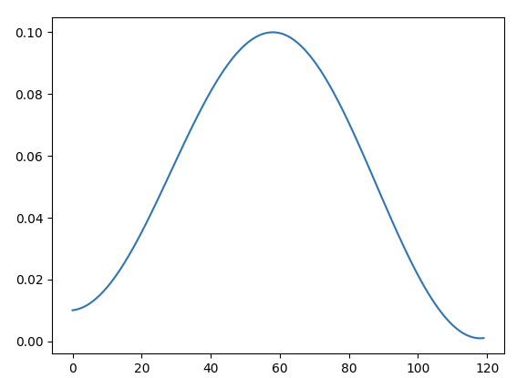

### 9.3.12 CosineAnnealingLR

`CosineAnnealingLR`是余弦退火学习率，T_max是周期的一半，最大学习率在optimizer中指定，最小学习率为eta_min。这里同样能够帮助逃离鞍点。值得注意的是最大学习率不宜太大，否则loss可能出现和学习率相似周期的上下剧烈波动。

```python
scheduler=lr_scheduler.CosineAnnealingLR(optimizer,T_max=20,eta_min=0.05)
```

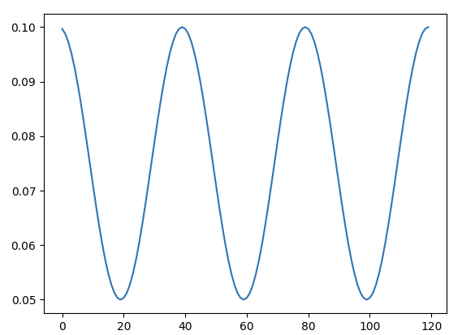

### 9.3.13 CosineAnnealingWarmRestarts

这里相对负责一些，公式如下，其中T_0是第一个周期，会从optimizer中的学习率下降至eta_min，之后的每个周期变成了前一周期乘以T_mult。

```python
scheduler=lr_scheduler.CosineAnnealingWarmRestarts(optimizer, T_0=20, T_mult=2, eta_min=0.01)
```

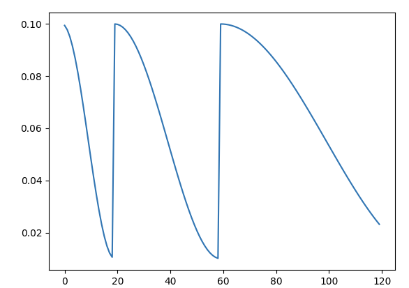

### 9.3.14 LambdaLR

`LambdaLR`其实没有固定的学习率曲线，名字中的lambda指的是可以将学习率自定义为一个有关epoch的lambda函数，比如下面我们定义了一个指数函数，实现了`ExponentialLR`的功能。

```python
scheduler=lr_scheduler.LambdaLR(optimizer,lr_lambda=lambda epoch:0.9**epoch)
```

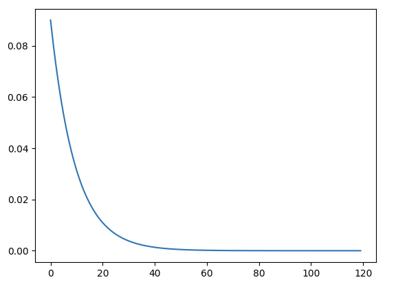

### 9.3.15 SequentialLR

`SequentialLR`可以将多个学习率调整策略按照顺序串联起来,在milestone时切换到下一个学习率调整策略。下面就是将一个指数衰减的学习率和线性衰减的学习率结合起来。

```python
scheduler=lr_scheduler.SequentialLR(optimizer,schedulers=[lr_scheduler.ExponentialLR(optimizer, gamma=0.9),lr_scheduler.LinearLR(optimizer,start_factor=1,end_factor=0.1,total_iters=80)],milestones=[50])
```

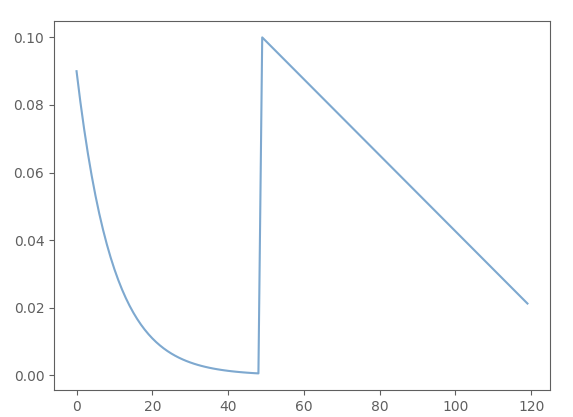

### 9.3.16 ChainedScheduler

`ChainedScheduler`和`SequentialLR`类似，也是按照顺序调用多个串联起来的学习率调整策略，不同的是`ChainedScheduler`里面的学习率变化是连续的。

```python
scheduler=lr_scheduler.ChainedScheduler([lr_scheduler.LinearLR(optimizer,start_factor=1,end_factor=0.5,total_iters=10),lr_scheduler.ExponentialLR(optimizer, gamma=0.95)])
```

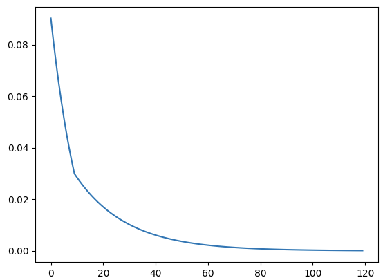

### 9.3.17 ConstantLR

`ConstantLRConstantLR`非常简单，在total_iters轮内将optimizer里面指定的学习率乘以factor,total_iters轮外恢复原学习率。

```python
scheduler=lr_scheduler.ConstantLRConstantLR(optimizer,factor=0.5,total_iters=80)
```

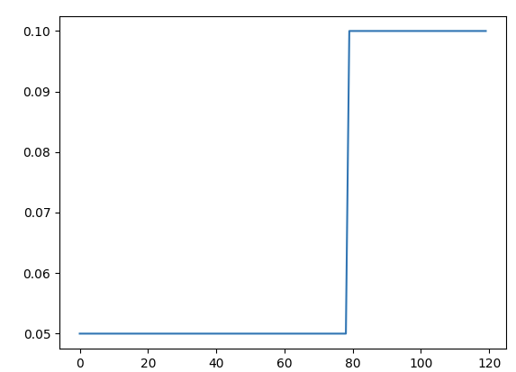

## 10. 正则化

正则化可以理解为规则化,规则就等同于一种限制。在损失函数中加入正则化项可以限制他们的拟合能力，正则化就是为了防止过拟合。

### 10.1 为什么要正则化？

深度学习可能存在过拟合问题，有两个解决方法，一个是正则化，另一个是准备更多的数据，这是非常可靠的方法，但你可能无法时时刻刻准备足够多的训练数据或者获取更多数据的成本很高，但正则化通常有助于避免过拟合或减少你的网络误差。

### 10.2 为什么正则化能减少过拟合？

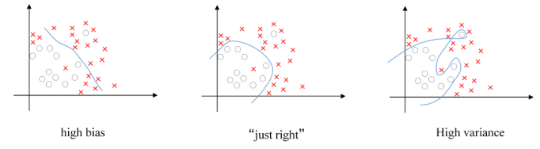

假如我们要构建的模型是能够区分图中的红色与白色部分，看上图三种模型对训练集的拟合状态：

第1种模型：欠拟合(underfitting)，此模型不能很好的区分图中的红色与白色部分。

第2种模型：拟合状态刚好，虽然有个别红色部分未被区分但考虑到实际测试集中会有噪声的存在，其拟合程度就刚刚好。

第3种模型：过拟合(overfitting)，此种模型对于训练集的拟合程度非常高，导致其泛化能力(“泛化”指的是一个假设模型能够应用到新样本的能力)较低。而且实际测试集中会有噪声的存在，在后续的测试集中得到的准确率也不高，这也会令模型的复杂度提高，让计算复杂，并不能起到理想的作用。

我们就可以使用正则化来解决过拟合，他的大致工作原理如下：

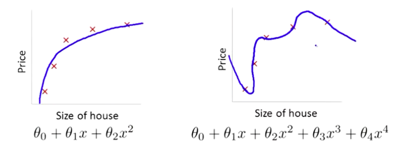

我们的目的是拟合图中的数据，对于第一幅图我们使用一个 $ 2 $ 次函数来拟合数据,这样看起来效果还不错，当我们使用一个高次函数来拟合数据时,像第二幅图,这样对于这个数据拟合的效果更加好，但这并不是我们想要的模型，因为它过度拟合了数据，我们可以想到这是由于高次项的出现，所以我们要对高次项的系数予以惩罚。

我们在损失函数的后面加上 $ 1000 $ 乘以 $ θ_3 $ 的平方，再加上 $ 1000 $ 乘以 $ θ_4 $ 的平方，这里的 $ 1000 $ 只是一个随机值。即

$ *{}  {2m} *{i=1}{m}(h_{}(x{(i)})-y{(i)}){2}+1000θ_32+1000θ_42 $

在我们如果要求损失函数的最小值，就得让 $ θ_3 $ 和 $ θ_4 $ 的值非常小，因为损失函数中加入了有关他们的两项，如果 $ θ_3 $和 $ θ_4 $的值非常大的话，损失函数的值也会变得非常大，所以和 $ θ_3 $ $ θ_4 $ 的值趋近于 $ 0 $。

也即拟合函数中的 $ θ_3 $ 和 $ θ_4 $ 两项的值近似为 $ 0 $，所以拟合函数就趋近于 $ 2 $ 次函数，这样以来，拟合函数的拟合程度就刚刚好了

这里我们只是有目的的对 $ θ_3 $ 和 $ θ_4 $ 两项进行了惩罚，那如果不知道拟合函数中哪些系数是高次项系数哪？

我们就要对所有项的系数都进行惩罚了，也即我们在损失函数中加入一项(正则化项)：

$ *{j=1}^{n} *{j}^{2} $

> 这里并没有惩罚 $ θ_0 $ ，这只会造成很小的差异。 对所有项的系数都进行惩罚相比之下还是对于高次项的惩罚程度更大。

其中 $ $ 叫做正则化参数， $ $ 越大则惩罚力度也越大，但 $ $ 并不是越大越好当 $ $ 太大时就会造成拟合函数中的参数太小以至于拟合函数就等于 $ θ_0 $ 变成一条直线，造成欠拟合。

此外正则化还分为 $ L1 $ 正则和 $ L2 $ 正则，又叫 $ L1 $ 范数和 $ L2 $ 范数，其定义如下：

**L1范数:**

$ |x|*{1}=*{i=1}^{N}|x_{i}| $

即向量元素绝对值之和

**L2范数：**

$ ||_{2}= $

即向量的每个元素的平方和再开方

**Lp范数：**

$ L_{p}=||_{p}= $

### 10.3 Dropout正则化

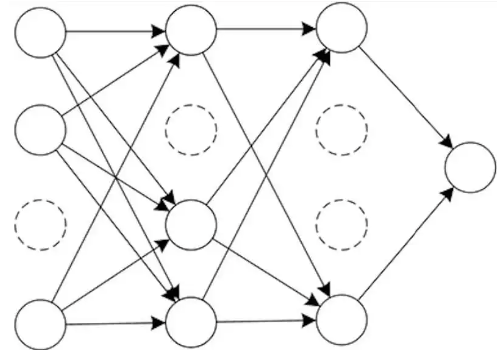

$ Dropout $ 操作是指在网络的训练阶段，每次迭代时会从基础网络中随机丢弃一定比例的神经元，然后在修改后的网络上进行数据的前向传播和误差的反向传播。注意：模型在测试阶段会恢复全部的神经元。 $ Dropout $ 是一种常见的正则化方法，可以缓解网络的过拟合问题。

**Dropout可以随机删除网络中的神经单元，它为什么可以通过正则化发挥如此大的作用呢？**

直观上理解：不要依赖于任何一个特征，因为该单元的输入可能随时被清除，因此该单元通过这种方式传播下去，并为单元的四个输入增加一点权重，通过传播所有权重， $ Dropout $ 将产生收缩权重的平方范数的效果，和之前讲的 $ L2 $ 正则化类似；实施 $ Dropout $ 的结果实它会压缩权重，并完成一些预防过拟合的外层正则化； $ L2 $对不同权重的衰减是不同的，它取决于激活函数倍增的大小。

另一种理解就是， $ Dropout $ 能够减少神经元之间复杂的共适性关系。由于 $ Dropout $ 每次丢弃的神经元是随机选择的，所以每次保留下来的网络会包含不同的神经元，这样在训练过程中，网络权值的更新不会依赖隐节点之间的固定关系。换句话说网络中每一个神经元不会对另一个神经元非常敏感，这使得网络能够学习到一些更加泛化的特征。

### 10.4 Dropout缺点

- $ Dropout $ 的一大缺点是**成本函数无法被明确定义**。因为每次迭代都会随机消除一些神经元结点的影响，因此无法确保成本函数单调递减。
- 显增加训练时间，因为引入 $ Dropout $ 之后相当于每次只是训练的原先网络的一个子网络，为了达到同样的精度需要的训练次数会增多。 $ Dropout $ 的缺点就在于训练时间是没有 $ Dropout $ 网络的 $ 2-3 $ 倍。