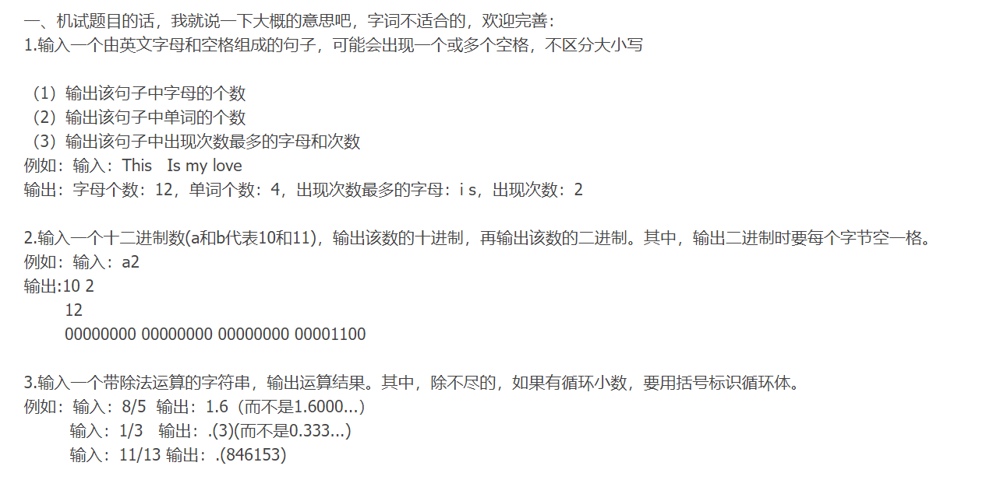
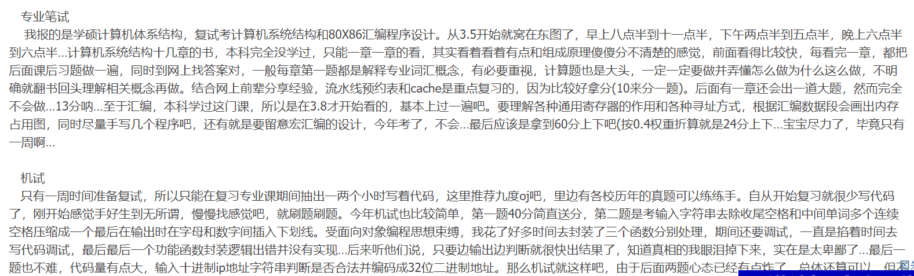
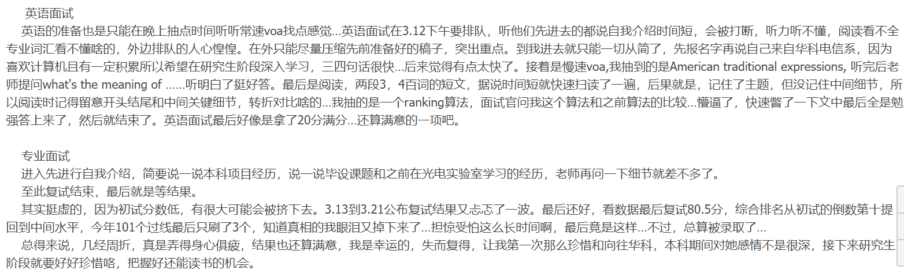

# 经验







要求：考试时间一共一个半小时。语言用C/C++，编译器不做限制，可用VC++6.0、DevC++和CodeBlocks。建议用CodeBlocks，因为它有代码提示，用起来也很顺手。

1.关于梅森素数。所谓梅森数，是指形如2p-1的一类数，其中指数p是素数，常记为M(p)。如果p是素数的同时，梅森数（即2p-1)也是素数，就称这个梅森数为梅森素数。输入一个长整型数n，输出不大于它的所有梅森素数。（30）

例：输入：1000

```plain text
   输出：M(2)=3

              M(3)=7

              M(5)=31

              M(7)=127
```

```plain text
#include <iostream>
using namespace std;
bool isPrime(long int n)//判断一个数是否为素数
{
    for(long int i=2;i*i<=n;i++)
    {
        if(n%i==0)
            return false;//若能被整除，这个数不是素数
    }
    return true;
}
long int power(long int i)//计算2^i-1并返回结果
{
    long int m=1;
    for(long int j=0;j<i;j++)
    {
        m*=2;
    }
    m=m-1;
    return m;
}
int main()
{
    long int n;
    cin>>n;
    long int i=2;
    while(power(i)<=n)
    {
        if(isPrime(i) && isPrime(power(i)))
        {
            cout<<"M("<<i<<")="<<power(i)<<endl;//输出满足条件的梅森素数
        }
        i++;
    }
    return 0;
}
```

2.文件操作及字符串处理。将第一题的源代码保存为abc.c文件。并且要求abc.c文件中有相当数量的注释，包括//和/*…*/两种形式的注释。（30）

（1）读取abc文件的内容，将其显示在控制台上，并为每行代码增加一个行号。（10）

（2）使源代码中的//类型的注释内容不显示在控制台中。（10）

（3）使源代码中的/*…*/类型的注释内容不显示在控制台中。（10）

提示：建议使用C++中的fstream这一头文件，与C中的file头文件相比，这种方法更为简洁。对于字符串的处理，若未明确规定必须用char*，建议直接使用string这一头文件，不建议使用char*，因为机试时间十分有限，使用char*非常容易出现指针错误，调试会花费很多的时间，而且string中有许多现成的方法，调用起来十分方便。

```plain text
#include <iostream>
#include <fstream>
#include <string>
using namespace std;
int main()
{
    string str;//利用string来接受读入的源代码
    ifstream file("abc.cpp");
    int cnt=1;//记录当前行号
    if(!file.is_open())
    {
        cout<<"文件打开失败！"<<endl;
    }
    else{
        while(getline(file,str))//每次获取一行源代码
        {
            //对接受的str进行处理，使其不包含//类型的字符串
            int len=str.length();
            for(int i=0;i<len-1;i++)
            {
                if(str[i]=='/')
                {
                    if(str[i+1]=='/')
                    {
                        //说明此注释为//类型，直接去掉//及其后面所有内容即可，string中有现成的函数可以直接调用
                        str.erase(str.begin()+i,str.end());
                    }
                    else if(str[i+1]=='*')
                    {
                        //说明此注释为"/*...*/类型，这时不能简单地去掉/*后面的所有内容，因为/*出现并不能简单断定注释只有一行，注释可能有多行
                        str.erase(str.begin()+i,str.end());
                        cout<<cnt<<"  "<<str<<endl;//输出处理过的这行源代码及其行号
                        cnt++;//行号加1
                        do
                        {
                            getline(file,str);
                            len=str.length();
                        }
                        while(!(str[len-2]=='*' && str[len-1]=='/')); //用循环的方式去掉多行注释
                        getline(file,str);
                    }
                }
            }
            cout<<cnt<<"  "<<str<<endl;//每次输出行号以及一行源代码
            cnt++;
        }
    }
    return 0;
}
```

3.凯撒密码。从键盘输入一个由字母组成的字符串，对字符串中的每个字符进行偏移操作，每个字符都向后偏移两个。即：a->c，Z->B。然后输出偏移后的每个字符的奇校验码及其对应的十进制数，如果字符中1的个数为偶数，将其最高位置为1。(40)

```plain text
#include <iostream>
#include <string>
#include <vector>
using namespace std;
int main()
{
    string str;
    vector<int> tmp;//用来存放字符的奇校验码
    int cnt;//记录奇校验码中1的个数
    int result;//result存放奇校验码的十进制
    cin>>str;
    cout<<"原文："<<str<<endl;
    int len=str.length();
    for(int i=0;i<len;i++)
    {
        if(str[i]>='a' && str[i]<='z')
        {
            str[i]=(str[i]-97+2)%26+97;
        }
        else if(str[i]>='A' && str[i]<='Z')
            str[i]=(str[i]-65+2)%26+65;
    }
    cout<<"密文："<<str<<endl;
    for(int i=0;i<len;i++)
    {
        tmp.clear();
        cnt=0;
        result=0;
        cout<<str[i]<<"  ";
        int temp=str[i];
        while(temp!=0)
        {
            tmp.push_back(temp%2);//除留余数法
            temp/=2;
        }
        while(tmp.size()<8)
        {
            tmp.push_back(0);//将其补齐为一个字节的长度
        }
        for(int j=0;j<8;j++)
        {
            if(tmp[j]==1)
                cnt++;
        }
        if(cnt%2==0)//如果校验码1的个数为偶数，则将最高位置为1，最高位存放在tmp[7]
            tmp[7]=1;
        for(int j=7;j>=0;j--)
        {
            result*=2;
            result+=tmp[j];
            cout<<tmp[j];
        }
        cout<<"  "<<result<<endl;
    }
    return 0;
}
```

(40’)1.输入一句英文(含空格)，求

(1)统计英文单词个数(10’)

(2)统计字符个数(10’)

(3)查找出现次数最多的字符(可能不止一个)，要求全部给出并输出出现的次数(20’)

以上输出均不区分大小写

例如 this is A pencil Case

输出:

英文单词数:5

字符个数:17

出现最多字符:i,s

出现次数:3

(30’)2.十二进制(包含0-9，a，b)转十进制，输入一串十二进制数(不区分大小写)

(1)逐个输出对应的十进制，用空格隔开(高位到地位)(10’)

(2)输出对应的十进制数(10’)

(3)转为二进制，用4个字节表示(10’)

例如:输入a2

输出:

10 2

122

00000000 00000000 00000000 01111010

(30’)3.输入三组正整数N,D，求N/D

(1)若能除尽，则直接输出

(2)若为循环小数，则输出前几位并用空格括起来

(3)若无法除尽，则保留小数并用空格括起来

如 输入8/5 1/3 11/13

输出

8/5=1.6

1/3=.(3)

11/13=.(846153)