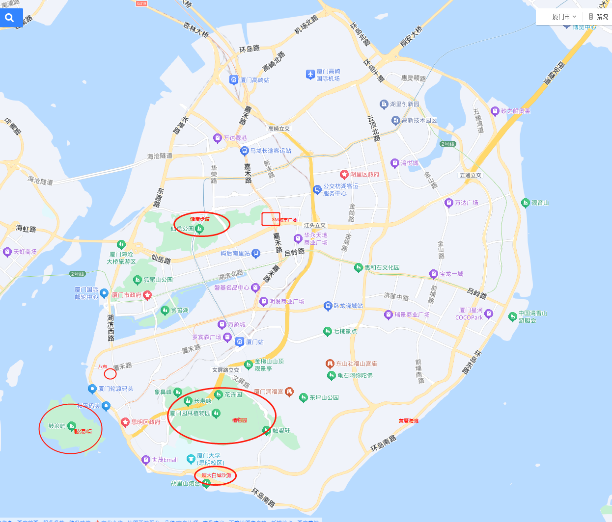

## ⏰ 行程时间

10月3日（周四）— 10月6日（周日）

交通情况：

山东航空 10月3日(四) 武汉天河-厦门高崎 14:55-17:05

高铁 10月6日(日) 厦门站 -武汉站 16:23-23:07

## 📋 行前准备

- [ ] **身份证！身份证！身份证！**
- [ ] 衣物、洗漱品、舒适的鞋子等出行用品（厦门景点靠腿）
- [ ] 防晒用品（防晒霜，帽子，防晒臂套等），雨具（以防万一）
- [ ] 数码：充电器、自拍杆、平板、电脑等

## ✈️ 交通方式

**出发：10 月 3 日（周四）武汉天河-厦门高崎 14:55-17:05**

- 🚌 `16:30`准时从`3号门`上大巴发车
- ✈️ `14:55`起飞，`17:05` 抵达厦门

**返程：10 月6 日（ 周日）厦门站-武汉站 16:23-23:07**

## 📷 特色一览

1. 黄厝海滩：
看日落，找个沙滩酒吧，听歌喝小酒很舒服，我选的是海岛日记，酒不太行，其他都好
2. 植物园：热带雨林、热带沙漠、钟鼓索道。
直接注意看热带雨林时间，从最右边大马路上去，直达热带雨林，逛完热带雨林也热带沙漠基本可以回来了，不用绕一圈了。然后旁边有一个钟鼓索道，要去的话建议提前买票，国庆人多。
3. 十里长堤：看日落
4. 中山路，八市：逛逛吃吃，
花生汤，满煎糕，乌糖沙茶面（民族路那家）
5. 鼓浪屿：
鼓浪屿真的没啥好玩的，建议请一个导游讲解一下，不然逛的的一点意思都没有（不建议坐那个观光车）。(鼓浪屿属于来都来了，不去后悔，去了也后悔，还得提前买船票，不然上不去）。鼓浪屿船票，植物园，钟鼓索道，厦大，都提前预约买票。
6. 厦大白城海滩：早上去。
厦大白城是一个免费的公共海滩（你直接搜厦大白城公交站），大家都可以玩，就在厦大旁边。清晨人少的时候很美。
7. SM城市广场：
苹果店在那边，够大的购物广场。
8. 沙坡尾：
也是逛一圈就没了，没有啥意思，既然去了沙坡尾就是演武大桥观景平台看看吧。运气好能看到海豚。
9. 环岛路，健康步道：
现在环岛路和林海健康步道非常推荐。（这两个可以连在一起）。打车去东坪山上（打车搜：山海健康步道林海线 D15 号门）然后一直走到环岛路曾山出口。建议下午 4 点以后去，你可以看看日落时间，有落日平台，拍照贼出片，又好看，心情愉悦。全程大概 2 小时左右，因为是缓慢属于下坡路段，走起来也不好很累，我那天是有风，很舒服。（健康步道从东渡到仙岳山也不错）

到出口后，对面就是环岛线了，可以坐 29 路到椰风寨站，然后往回走，环岛路随便走几个公交站。然后打车（也可以坐 29 路到轮渡公交场站下车），直接去逛八市中山路就好了（正好到晚上）。

## 🗺 行程

### Day 1· 到达

`17:05` 到达高崎机场，预计`18:00` 到达酒店，办理入住

`19:00`左右到SM城市广场吃晚饭，逛逛。

### Day 2 · 环岛

### 上午

厦大白城海滩

### 下午

环岛+健康步道

### 晚上

黄厝海滩

### Day 3 · 厦门自由行

### 上午

鼓浪屿

### 下午

沙坡尾

植物园

### 晚上

八市

### Day 4 · 半日游 + 返程

### 上午

-

