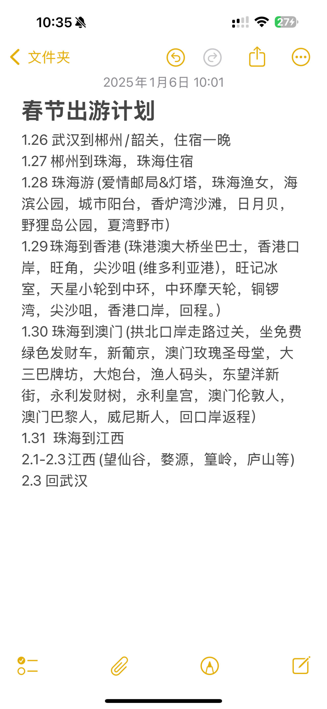

共计 6 日5 晚的「珠港澳」之旅

## ⏰ 行程时间

1月26日（周日）— 1月31日（周五）

航班情况：

南方航空 CZ5876 01月26日(周日) 武汉天河-珠海金湾 07:10-09:00

长龙航空 GJ8124 01月31日(周五) 珠海金湾-武汉天河 16:00-18:00

## 📋 行前准备

- [x] **身份证！身份证！身份证！**
- [x] 衣物、洗漱品、舒适的鞋子等出行用品
- [x] 外套、薄衣服，雨具（以防万一）
- [x] 通信：准备**境外流量卡**或者漫游包，**港澳可用**
- [x] 数码：充电器、相机、自拍杆等
- [ ] 玩乐：扑克牌

提前值机更从容推荐航旅纵横在线值机，防止到机场太晚，错过值机时间。

## ✈️ 交通方式

**出发：1 月 26 日（周日）武汉天河-珠海金湾 07:10-09:00**

- 🚌 `5:40`打车去机场。
- 🍱 自带干粮，解决早餐
- ✈️ `07:10`起飞，`09:00` 抵达珠海
- 🚌 到达珠海金湾——富米行政公寓，收拾东西。

---

**返程：1 月31 日（ 周五）珠海金湾-武汉天河 16:00-18:00**

- 🚌 午饭后 `14:00`打车到金湾机场
- ✈️ `16:00` 起飞，`18:00` 抵达 武汉
- 🚌 打车回家，收拾

## 📷 特色一览

### 关于珠海

### 珠海渔女雕像（海滨公园）

- **推荐理由**：珠海渔女是珠海的标志性雕像，坐落在海滨公园的海岸线上，是珠海最具代表性的景点之一，适合拍照留念。
- **游玩时间**：约1小时
- **交通**：市中心打车约10分钟可到达。

### 情侣路

- **推荐理由**：情侣路是珠海的著名景观道路，沿途海景美丽，是散步、骑行和拍照的好地方。
- **游玩时间**：约1-1.5小时
- **建议**：可以在情侣路漫步，享受海风，途中还可以看到渔女雕像。

### 珠海博物馆

- **推荐理由**：如果你对珠海的历史和文化感兴趣，可以来这里了解更多。馆内有丰富的珠海历史展品，值得一游。
- **游玩时间**：约1小时

### 华发商都

- **推荐理由**：珠海最大的购物中心之一，适合休闲购物和享受美食。这里还有不少餐厅和咖啡馆，适合午餐和休息。
- **游玩时间**：约1-2小时
- **建议**：如果你喜欢购物，可以在这里采购一些珠海特色商品。

### 拱北口岸与澳门

- **推荐理由**：如果你有足够的时间，可以从拱北口岸进入澳门，体验一下澳门的文化和美食。
- **游玩时间**：可选项，视情况而定，建议安排下午或傍晚去。
- **交通**：拱北口岸直通澳门，走路即可。

### 珠海长隆国际海洋度假区

- **推荐理由**：如果你喜欢娱乐项目和亲近海洋，可以去长隆海洋王国，它是一个大型的海洋主题公园，里面有丰富的水族馆、游乐项目和精彩的表演。
- **游玩时间**：约4-5小时
- **交通**：从市区打车或乘坐公交车约40分钟。

### 横琴岛

- **推荐理由**：横琴岛是一个结合生态、科技和文化的区域，岛上有横琴湿地公园、珠海国际会展中心等景点，可以漫步在自然环境中，享受宁静的海岛氛围。
- **游玩时间**：约2-3小时
- **交通**：可从市区乘车前往。

### 九洲城（珠海长隆海洋王国附近）

- **推荐理由**：这是一个以水景和生态为主题的商业娱乐区，有许多特色的餐厅和酒吧，是晚上放松和享受海风的好地方。
- **游玩时间**：约1-1.5小时

### 关于香港

香港是一个集现代都市与自然景观为一体的城市，拥有丰富的旅游资源，适合各种旅行者。

### 维多利亚港

- **推荐理由**：维多利亚港是香港的心脏，横跨香港岛与九龙。你可以乘坐渡轮游览港口，欣赏两岸的天际线和海景。
- **必做体验**：
- **星光大道**：沿着维多利亚港的海滨长廊，看到香港电影明星的雕像及他们的手印。
- **维多利亚港夜游**：晚上乘坐"天星小轮"，观看香港岛与九龙的璀璨夜景。

### 太平山顶（Victoria Peak）

- **推荐理由**：是香港的最高点，能俯瞰整个香港岛和维多利亚港的全景。
- **必做体验**：
    - **山顶缆车**：搭乘古老的山顶缆车上山，沿途欣赏香港岛的美丽风景。
    - **山顶广场**：可以在山顶广场的观景平台拍摄全景照片。

### 香港迪士尼乐园

- **推荐理由**：这是一个适合家庭旅行的地方，拥有丰富的娱乐项目和迪士尼经典角色，适合所有年龄层的游客。
- **必做体验**：
    - **奇幻花园**：参观这个充满童话气息的主题花园。
    - **玩具总动员区**：适合带小朋友游玩的项目。
    - **夜间烟花表演**：每天晚上都有精彩的烟花表演。

### 香港海洋公园

- **推荐理由**：这是一个结合了动物园、海洋馆、游乐园和海洋主题的多功能公园，适合带孩子和家庭游客。
- **必做体验**：
    - **海洋剧场**：观赏海洋生物的表演。
    - **过山车与刺激项目**：喜欢刺激的游客可以体验园内的过山车等游乐设施。

### 黄大仙祠

- **推荐理由**：这是香港最著名的道教庙宇之一，供奉的是黄大仙（黄初平）。它被视为祈求平安和吉祥的地方。
- **必做体验**：
    - **求签**：你可以在庙中向黄大仙祈福并抽签。
    - **参拜与拍照**：庙宇内的建筑非常具有中国传统特色，是文化爱好者的好去处。

### 天星小轮

- **推荐理由**：天星小轮是香港的经典交通工具之一，也是体验香港传统文化和海上风光的最佳方式。
- **必做体验**：乘坐天星小轮从九龙到香港岛，欣赏维多利亚港的美丽景色。

### 香港文化中心 & 香港艺术馆

- **推荐理由**：如果你对艺术和文化感兴趣，可以参观这些地方，它们展示了香港的艺术发展与传统文化。
- **必做体验**：
    - **香港文化中心**：有各种各样的音乐、舞蹈、话剧表演。
    - **香港艺术馆**：展示香港及国际艺术家的艺术作品。

### 尖沙咀与香港购物

- **推荐理由**：尖沙咀是香港最繁华的商业区之一，汇聚了各种国际品牌、购物中心、餐厅和娱乐场所。
- **必做体验**：
    - **购物**：可以在海港城、1881 Heritage等购物中心购物。
    - **广东道**：这是香港最著名的购物街之一，汇集了众多奢侈品牌。

### 浅水湾与沙滩

- **推荐理由**：浅水湾是香港岛的著名沙滩之一，水清沙幼，适合度过一个惬意的午后。
- **必做体验**：游泳、晒太阳或在海边散步。

### 关于澳门

## 🗺 行程

### Day 1· 到达+珠海半日游

### **上午：到达珠海**

- **9:00 - 10:30**
到达珠海后，从**金湾机场**出发，前往酒店办理入住，放下行李，稍作休息。

### **中午：品尝珠海美食**

- **12:00 - 13:00**
在珠海市区享用午餐，可以选择在**香洲区**的一些地道餐馆，尝试珠海的本地海鲜、广式点心等美食。

### **下午：珠海市区游玩**

1. **13:30 - 14:30** **珠海渔女**
    - **推荐理由**：珠海渔女是珠海最著名的地标之一，雕像与周围的海景融为一体，非常适合拍照留念。
    - **主要活动**：游览、拍照，欣赏珠海的海滨风光。
2. **14:30 - 15:30** **城市阳台**
    - **推荐理由**：城市阳台是珠海的城市公园，提供美丽的海景和城市天际线，是散步和放松的好地方。
    - **主要活动**：漫步、欣赏景色，体验珠海的城市景观。
3. **15:30 - 16:30** **爱情邮局与灯塔**
    - **推荐理由**：爱情邮局和灯塔是一对象征珠海浪漫的景点，非常适合情侣游客。可以寄明信片或者留念。
    - **主要活动**：参观爱情邮局，拍照并寄明信片。
4. **16:30 - 17:30** **海滨公园**
    - **推荐理由**：海滨公园是珠海最受欢迎的公园之一，毗邻海岸线，可以享受悠闲的步行，海风和美丽的景色。
    - **主要活动**：在海滨公园漫步，放松，享受自然景色。

### **晚上：**

- **17:30 - 19:00**
可选择在附近的餐馆享用晚餐，品尝珠海的其他美食，或者回酒店休息。

### Day 2 · 珠海

### **上午：游览香炉湾沙滩和日月贝**

5. **9:00 - 10:30** **香炉湾沙滩**
    - **推荐理由**：香炉湾沙滩是珠海最大的沙滩之一，风景优美，适合早晨前来散步、拍照。
        1. **10:30 - 12:00** **日月贝**
            - **推荐理由**：日月贝是珠海最具代表性的现代建筑，造型像贝壳，富有艺术感，适合参观和拍照。
            - **主要活动**：参观贝壳建筑，拍照，欣赏周围景观。
    - **主要活动**：沙滩散步、拍照、享受海风。

### **中午：**

- **12:30 - 13:30**
在**湾仔**或**香洲区**的餐厅用午餐，休息片刻。

### **下午：游玩自然景区与文化体验**

6. **14:00 - 15:30** **野狸岛公园**
    - **推荐理由**：野狸岛公园是一个自然保护区，适合喜欢自然景观和徒步的游客。这里有丰富的植被和鸟类，十分宁静。
    - **主要活动**：徒步游览，享受自然景色，放松。
7. **15:30 - 17:00** **夏湾野市**
    - **推荐理由**：这是一个非常有地方特色的市场，你可以在这里体验珠海的本地文化与市井生活，感受浓厚的市集氛围。
    - **主要活动**：逛市场、购物、体验本地生活。

### **晚上：**

- **17:30 - 19:00**
晚餐可以选择在市区的餐厅，结束一天的游览。

### Day 3 · 香港

- **7:00 - 8:30** 从珠海出发，通过珠港澳大桥到达香港口岸，完成入境。
- **9:00 - 10:00** 旺角，体验香港本土文化与购物街。
- **10:30 - 11:30** 参观尖沙咀与维多利亚港，游玩天星小轮。
- **12:00 - 13:00** 午餐+休息。
- **13:00 - 14:00** 中环摩天轮，俯瞰全景。
- **14:00 - 15:00** 铜锣湾购物与放松。
- **15:00 - 16:00** 再次游玩尖沙咀，参观文化中心等。
- **16:30 - 17:30** 返回珠海口岸，过关回程。

### 早晨：出发与入境

- **7:00 - 7:30从珠海出发**，乘坐巴士从**珠海口岸**出发，通过**珠港澳大桥**前往**香港口岸**。巴士的时间较为固定，可以提前确认车次与出发时间，车程大约需要45-60分钟。
- **8:30 - 9:00到达香港口岸**并完成入境手续。确保准备好**港澳通行证**或护照。通过入境后，可以进入香港并开始当天的行程。

### **上午：香港经典景点游览**

8. **9:00 - 10:00** **旺角**
    - **推荐理由**：旺角是香港最繁忙的地区之一，充满了浓厚的地道香港氛围。这里的街市、购物区、以及一些有趣的店铺都值得一看。可以感受香港本土文化，适合早晨闲逛和拍照。
    - **主要活动**：
        - 参观**女人街**（如果有兴趣），这里可以买到各种小商品和香港特色纪念品。
        - 漫步在**花园街**、**旺角电器街**等地，感受当地的市井生活。
9. **10:30 - 11:30 尖沙咀 & 维多利亚港**
    - **推荐理由**：尖沙咀是香港的购物与旅游中心，维多利亚港是香港的标志性景点之一。
    - **主要活动**：
        - 前往**海港城**或**1881 Heritage**购物中心。这里是香港最著名的商业区之一，适合稍作休息与购物。
        - 漫步至维多利亚港，欣赏香港的海景，拍摄港口和香港岛的天际线。
10. **11:30 - 12:00** **天星小轮（从尖沙咀到中环）**
    - **推荐理由**：天星小轮是香港最具代表性的交通工具之一，乘坐小轮可欣赏维多利亚港的美丽景色。
    - **主要活动**：
        - 乘坐**天星小轮**，从尖沙咀出发，途径维多利亚港，沿途欣赏香港岛和九龙的美丽景色。

### **下午：继续游览**

11. **12:00 - 13:00 午餐休息**
12. **13:00 - 14:00 中环摩天轮**
    - **推荐理由**：中环摩天轮位于香港岛，是一个小型的摩天轮，提供香港岛的另一种观景体验。站在摩天轮上，你可以俯瞰香港岛的高楼、维多利亚港以及周围的美丽景色。
    - **主要活动**：
        - 乘坐**中环摩天轮**，俯瞰香港岛与维多利亚港的美景。
13. **14:00 - 15:00** **铜锣湾**
    - **推荐理由**：铜锣湾是香港的购物和娱乐中心之一，有很多大型商场和品牌店铺，是香港的繁华商业区。你可以在这里自由逛街，购物或是参观香港的**时代广场**等地。
    - **主要活动**：
        - 参观**时代广场**和其他购物中心，可以简单购物或放松。

### **下午：回到九龙区与香港口岸**

14. **15:00 - 16:00** **尖沙咀再逛**
    - **推荐理由**：下午可以再次回到尖沙咀，因为这里的购物和娱乐设施非常齐全。如果有兴趣，可以再次逛逛香港的购物街，或者参观其他景点。
    - **主要活动**：
        - 如果有时间，可以参观**香港文化中心**，或者在尖沙咀附近的街道继续闲逛。

### **傍晚：返回珠海**

15. **16:30 - 17:30香港口岸，返回珠海**
    - **推荐理由**：结束香港一日游后，返回香港口岸，准备过境返回珠海。可以选择乘坐巴士或者其他交通工具，通常从香港口岸到珠海口岸的巴士大约需要45分钟。
    - **交通建议**：确保提前检查巴士的时间表，避免错过最后一班车。
16. **18:30 - 19:00抵达珠海**
    - **回到珠海后**，结束一天的香港之旅。晚餐安排。

### Day 4 · 澳门

- 上午：新葡京赌场、澳门玫瑰圣母堂、大三巴牌坊、大炮台
- 中午：渔人码头、午餐
- 下午：永利皇宫、澳门伦敦人、澳门巴黎人、威尼斯人
- 傍晚：回拱北口岸，返回珠海

### **早晨：出发与入境**

- **7:30 - 8:00**
从珠海出发，步行至**拱北口岸**，通过口岸入境澳门。建议提前准备好有效证件，确保顺利过境。
- **8:00 - 8:30**
完成入境手续后，步行出拱北口岸，乘坐**免费绿色发财车**（赌场班车），前往市区。

### **上午：澳门历史与文化之旅**

17. **9:30 - 10:00澳门玫瑰圣母堂**
    1. **9:00 - 9:30新葡京赌场**
        - 参观澳门的地标性赌场，感受豪华的氛围，拍照留念。
    - 参观这座历史悠久的教堂，感受澳门的宗教文化。
18. **10:00 - 10:45大三巴牌坊**
    - 澳门的象征之一，可以拍照留念，了解它的历史背景。
19. **10:45 - 11:30大炮台**
    - 参观这座历史遗迹，从这里可以俯瞰澳门的美丽景色。

### **中午：休息与游玩**

20. **12:00 - 13:00渔人码头**
    - 漫步在渔人码头，欣赏海边景色，适合休闲放松。
21. **13:00 - 14:00午餐**
    - 在渔人码头附近的餐厅或者澳门其他地道餐厅享用午餐。

### **下午：现代景点与购物**

22. **14:30 - 15:00永利皇宫与永利发财树**
    - 参观永利皇宫，拍照留念并欣赏著名的永利发财树。
23. **15:00 - 16:00澳门伦敦人 & 澳门巴黎人**
    - 参观澳门的**伦敦人**与**巴黎人**度假村，感受欧洲的浪漫与奢华。
24. **16:00 - 17:00威尼斯人度假村**
    - 参观威尼斯人，体验贡多拉船游玩，并购物或参观酒店的豪华设施。

### **傍晚：回程**

25. **17:30 - 18:00**
从澳门回到**拱北口岸**，准备返回珠海。

### Day 5 · 澳门

- 上午：东望洋新街、妈阁庙、圣方济各教堂
- 中午：路环岛或黑沙滩、午餐
- 下午：澳门塔、澳门科技大学、购物与休闲
- 傍晚：回拱北口岸，返回珠海

### **早晨：出发与入境**

- **7:30 - 8:00**
从珠海出发，步行至**拱北口岸**，通过口岸入境澳门。
- **8:00 - 8:30**
完成入境手续后，步行出拱北口岸，乘坐**免费绿色发财车**前往市区。

### **上午：澳门的特色景点**

26. **9:00 - 9:45东望洋新街**
    - 漫步在这条有历史感的街道，体验澳门的传统文化与风貌。
27. **9:45 - 10:30妈阁庙**
    - 参观这座充满历史与文化的庙宇，了解澳门的传统宗教文化。
28. **10:30 - 11:15圣方济各教堂与圣母无原罪大堂**
    - 参观澳门的另一个重要教堂，欣赏其典雅的建筑风格。

### **中午：休息与午餐**

29. **12:00 - 13:00路环岛或黑沙滩**
    - 如果你喜欢自然风光，可以到**路环岛**享受宁静的环境，或者去黑沙滩散步。
30. **13:00 - 14:00午餐**
    - 在澳门市区或附近的餐厅享用午餐，建议尝试一些地道的葡式美食。

### **下午：澳门的现代景点与娱乐**

31. **14:30 - 15:30澳门塔**
    - 参观澳门塔，可以选择登顶，欣赏整个澳门的美丽景色。如果喜欢刺激的活动，还可以体验**空中漫步**或者**蹦极**。
32. **15:30 - 16:30澳门科技大学与周边景区**
    - 如果有兴趣，可以参观一下**澳门科技大学**，了解澳门的现代教育与科研。也可以选择前往**澳门文化中心**等场所，体验更多澳门的文化艺术氛围。
33. **16:30 - 17:00澳门购物与休闲**
    - 参观澳门的一些购物商场，如**银河购物中心**等，挑选纪念品或享受购物时光。

### **傍晚：回程**

34. **17:30 - 18:00**
返回**拱北口岸**，准备回到珠海。

### Day 6 · 珠海半日游+返程

### **上午：轻松游览**

35. **9:00 - 10:00** **珠海渔女**（如果未在Day 1参观，可以在此时参观）
    - 如果第一天已经参观过珠海渔女，你可以考虑在上午前往附近的**湾仔海滨公园**或**珠海的其他小景点**。
36. **10:00 - 11:30** **珠海博物馆**（可选）
    - **推荐理由**：如果你对珠海的历史文化感兴趣，可以考虑参观珠海博物馆。这里展出了珠海的历史和文化遗产。
37. **11:30 - 13:30** **午餐**
    - 午餐后回酒店收拾行李准备返程。

### **下午：返程**

- **14:00 **确保预留足够的时间前往**金湾机场**，从珠海出发，前往金湾机场返程。

## 🤤 美食倾情推荐区
