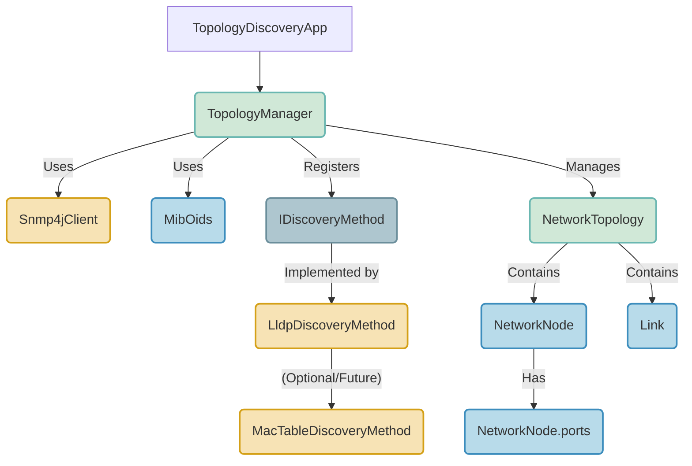
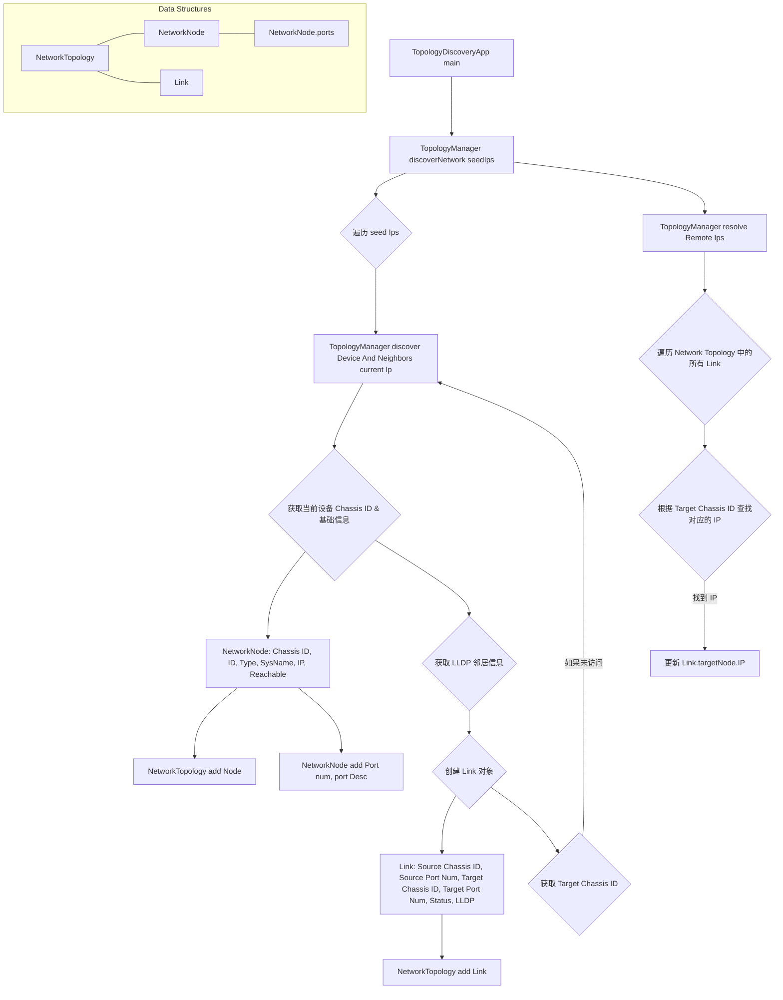

# 核心实现思路

我们将利用 SNMP (Simple Network Management Protocol) 来获取交换机的信息。SNMP 协议是管理网络设备的标准协议，Java 标准库并没有直接支持，但是有一些轻量级的开源库可以引入。通过引入 snmp4j 库来获取 LLDP 相关的信息。

<!-- more -->

## 主要模块设计



## 核心类说明

1. **`NetworkNode`：精简与业务预留**
    - **核心标识**：`chassisId` (主键)。
    - **新增字段**：
        - `id` (String): 业务 ID，由您后续填充。
        - `type` (String): 业务类型，由您后续填充。
    - **精简字段**：
        - `ipAddress` -> `ip` (String)。
        - `isReachable` -> `reachable` (boolean)。
    - **其他属性**：`sysName`。
    - **端口信息**：`Map<Integer, String> ports` (key: 端口号, value: 端口描述)，不存储 MAC 和 operStatus，因为这些是链路状态的细节，可以在链路中体现或按需查询。
2. **`Link`：精简与 LLDP 专属**
    - **核心属性**：
        - `sourceChassisId` (精简)。
        - `targetChassisId` (精简)。
        - `sourcePortNum` (本地端口号)。
        - `targetPortNum` (远程端口号)。
    - **精简字段**：
        - `discoveryMethod`：目前仅保留 `LLDP`，但可以保留枚举类型以供未来扩展。
        - `status`：链路状态，可以根据 `sourcePortNum` 的 `operStatus` 推断，但在 `Link` 中只体现为 `boolean` 状态，或 `enum`。我们先保留一个 `status` 字段。
    - **链路的唯一性**：`sourceChassisId`, `sourcePortNum`, `targetChassisId`, `targetPortNum` 四元组。
3. **`NetworkTopology`：图的容器**
    - 职责不变，管理 `NetworkNode` 和 `Link`。
    - `nodes` Map 的键仍是 `chassisId`。
4. **`TopologyManager`：发现与构建的协调者**
    - **发现方式**：目前仅使用 `LldpDiscoveryMethod`。
    - **`chassisIdToIpMap`**: 继续维护，用于后处理填充 `NetworkNode` 的 `ip`。
    - **`visitedChassisIds`**: 用于递归去重。

# 总体流程



# 主要代码

1. `SnmpConfig`

```java
package com.xxx.topology;

import lombok.Data;
import org.snmp4j.mp.SnmpConstants;

/**
 * SNMP连接配置。
 * 集中管理SNMP连接所需的所有参数
 * 如：community字符串、SNMP版本、重试次数和超时时间。
 */
@Data
public class SnmpConfig {
    private String community;
    private int snmpVersion;
    private int retries;
    private long timeoutMillis;

    public SnmpConfig() {
    }

    /**
     * 构造一个新的SnmpConfig实例。
     *
     * @param community     SNMP community字符串，用于认证。
     * @param snmpVersion   SNMP版本，如SnmpConstants.version2c。
     * @param retries       SNMP请求的重试次数。
     * @param timeoutMillis SNMP请求的超时时间（毫秒）。
     */
    public SnmpConfig(String community, int snmpVersion, int retries, long timeoutMillis) {
        this.community = community;
        this.snmpVersion = snmpVersion;
        this.retries = retries;
        this.timeoutMillis = timeoutMillis;
    }

    /**
     * 提供一个默认的SNMP配置实例。
     * 默认为community "public", SNMPv2c, 重试2次, 超时1500毫秒。
     *
     * @return 默认的SnmpConfig实例。
     */
    public static SnmpConfig getDefault() {
        return new SnmpConfig("public", SnmpConstants.version2c, 2, 1500);
    }
}
```

1. Snmp4jClient

```java
package com.xxx.topology;

import org.snmp4j.CommunityTarget;
import org.snmp4j.PDU;
import org.snmp4j.Snmp;
import org.snmp4j.TransportMapping;
import org.snmp4j.event.ResponseEvent;
import org.snmp4j.smi.*;
import org.snmp4j.transport.DefaultUdpTransportMapping;
import org.snmp4j.util.DefaultPDUFactory;
import org.snmp4j.util.TreeEvent;
import org.snmp4j.util.TreeUtils;

import java.io.IOException;
import java.util.List;
import java.util.Map;
import java.util.concurrent.ConcurrentHashMap;

/**
 * 提供了基于SNMP4J库的SNMP通信功能。
 *
 * @version 1.0.0
 * Created on 2025/6/12 11:43
 */
public class Snmp4jClient {
    private Snmp snmp;
    private SnmpConfig config;

    /**
     * 构造一个Snmp4jClient实例，并初始化SNMP会话。
     *
     * @param config SNMP配置。
     * @throws IOException 如果网络传输层初始化失败。
     */
    public Snmp4jClient(SnmpConfig config) throws IOException {
        this.config = config;
        TransportMapping<UdpAddress> transport = new DefaultUdpTransportMapping();
        snmp = new Snmp(transport);
        // 开始监听传入的SNMP消息
        transport.listen();
    }

    /**
     * 根据IP地址创建SNMP目标对象。
     *
     * @param ipAddress 目标设备的IP地址。
     * @return 配置好的CommunityTarget对象。
     */
    private CommunityTarget createTarget(String ipAddress) {
        CommunityTarget target = new CommunityTarget();
        target.setCommunity(new OctetString(config.getCommunity()));
        target.setAddress(GenericAddress.parse("udp:" + ipAddress + "/161")); // SNMP默认端口161
        target.setRetries(config.getRetries());
        target.setTimeout(config.getTimeoutMillis());
        target.setVersion(config.getSnmpVersion());
        return target;
    }

    /**
     * 规范化OID字符串，确保其以'.'开头。
     * SNMP4J的OID对象通常以'.'开头，但从设备获取的字符串可能不带。
     * 统一格式有助于避免匹配问题。
     *
     * @param oidString 原始OID字符串。
     * @return 规范化后的OID字符串。
     */
    private String normalizeOid(String oidString) {
        if (oidString != null && !oidString.startsWith(".")) {
            return "." + oidString;
        }
        return oidString;
    }

    /**
     * 执行SNMP WALK操作，获取指定OID子树下的所有值。
     * 利用SNMP4J的TreeUtils进行可靠的MIB遍历。
     *
     * @param ipAddress 目标设备的IP地址。
     * @param oid       要WALK的基准OID。
     * @return 一个Map，键是规范化后的OID字符串，值是对应的MIB变量值。
     * @throws IOException 如果SNMP通信发生错误。
     */
    public Map<String, String> snmpWalk(String ipAddress, String oid) throws IOException {
        Map<String, String> result = new ConcurrentHashMap<>();
        CommunityTarget target = createTarget(ipAddress);

        TreeUtils treeUtils = new TreeUtils(snmp, new DefaultPDUFactory());
        List<TreeEvent> events = treeUtils.getSubtree(target, new OID(normalizeOid(oid)));

        if (events == null) {
            System.err.println("SNMP TreeUtils.getSubtree returned null for OID: " + oid);
            return result;
        }

        for (TreeEvent event : events) {
            if (event.isError()) {
                System.err.println("SNMP TreeUtils Error for OID " + oid + ": " + event.getErrorMessage());
                continue;
            }
            if (event.getVariableBindings() != null) {
                for (VariableBinding vb : event.getVariableBindings()) {
                    if (vb != null && vb.getOid() != null) {
                        String normalizedOid = normalizeOid(vb.getOid().toString());
                        if (normalizedOid.startsWith(normalizeOid(oid))) {
                            result.put(normalizedOid, vb.getVariable().toString());
                        }
                    }
                }
            }
        }
        return result;
    }

    /**
     * 执行SNMP GET操作，获取单个MIB变量的值。
     *
     * @param ipAddress 目标设备的IP地址。
     * @param oid       要GET的MIB变量的OID。
     * @return OID对应的值（字符串形式），如果获取失败则返回null。
     * @throws IOException 如果SNMP通信发生错误。
     */
    public String snmpGet(String ipAddress, String oid) throws IOException {
        CommunityTarget target = createTarget(ipAddress);
        PDU pdu = new PDU();
        pdu.add(new VariableBinding(new OID(normalizeOid(oid))));
        pdu.setType(PDU.GET);

        ResponseEvent event = snmp.send(pdu, target, null);
        if (event != null && event.getResponse() != null) {
            if (event.getResponse().getErrorStatus() == PDU.noError) {
                VariableBinding vb = event.getResponse().getVariableBindings().get(0);
                String normalizedVbOid = normalizeOid(vb.getOid().toString());
                if (normalizedVbOid.equals(normalizeOid(oid))) {
                    return vb.getVariable().toString();
                }
            } else {
                System.err.println("SNMP GET Error for OID " + oid + ": " + event.getResponse().getErrorStatusText());
            }
        } else {
            System.err.println("No response or timed out for SNMP GET OID " + oid);
        }
        return null;
    }

    /**
     * 关闭SNMP会话，释放网络资源。
     *
     * @throws IOException 如果关闭过程中发生错误。
     */
    public void close() throws IOException {
        if (snmp != null) {
            snmp.close();
        }
    }
}

```

1. NetworkNode

```java
package com.xxx.topology;

import lombok.Data;

import java.util.Map;
import java.util.concurrent.ConcurrentHashMap;

/**
 * 表示网络拓扑中的一个设备节点。
 * 以Chassis ID作为唯一主键，并包含业务关联字段、设备基本信息和端口信息。
 *
 * @version 1.0.0
 * Created on 2025/6/12 11:44
 */
@Data
public class NetworkNode {

    // 设备的全局唯一标识符 (Chassis ID)，作为主键。
    private String chassisId;
    // 业务ID，由用户后续填充，与业务系统关联。
    private String id;
    // 业务类型，由用户后续填充，用于分类设备。
    private String type;
    // 设备系统名称。
    private String sysName;
    // 设备的主IP地址。
    private String ip;
    // 设备当前是否可达 (通过SNMP通信)。
    private boolean reachable;
    // 设备本地端口的映射，键为端口号(int)，值为端口描述(String)。
    private Map<Integer, String> ports;

    /**
     * 构造一个NetworkNode实例。
     *
     * @param chassisId 设备的Chassis ID。
     * @param sysName   设备系统名称。
     * @param ip        设备的主IP地址。
     * @param reachable 设备的可达性状态。
     */
    public NetworkNode(String chassisId, String sysName, String ip, boolean reachable) {
        this.chassisId = chassisId;
        this.sysName = sysName;
        this.ip = ip;
        this.reachable = reachable;
        // 端口信息初始化
        this.ports = new ConcurrentHashMap<>();
    }

    /**
     * 向节点添加或更新一个本地端口的信息。
     *
     * @param portNum  端口号。
     * @param portDesc 端口描述。
     */
    public void addPort(int portNum, String portDesc) {
        this.ports.put(portNum, portDesc);
    }

}
```

1. Link

```java
package com.xxx.topology;

import lombok.Data;

/**
 * 表示网络中两个NetworkNode之间的一条链路（边）。
 * 链路的唯一性由源节点、源端口、目标节点和目标端口共同决定。
 *
 * @version 1.0.0
 * Created on 2025/6/12 11:45
 */
@Data
public class Link {
    // 链路源节点的Chassis ID。
    private String sourceChassisId;
    // 源节点上的端口号。
    private Integer sourcePortNum;
    // 链路目标节点的Chassis ID。
    private String targetChassisId;
    // 目标节点上的端口号。
    private String targetPortNum;
    // 链路的UP/DOWN状态（true为UP，false为DOWN），基于源端口。
    private Boolean status;
    // 链路的发现方式。
    private DiscoveryMethod discoveryMethod;

    /**
     * 定义了链路被发现的方式。
     * 保留未来扩展其他发现方法的可能性。
     */
    public enum DiscoveryMethod {
        LLDP,       // 通过Link Layer Discovery Protocol发现。
        MAC_TABLE,  // 通过MAC地址表（FDB）发现。
        ARP,        // 通过ARP表发现（未来扩展）。
        MANUAL      // 手动添加（未来扩展）。
    }

    /**
     * 构造一个Link实例。
     *
     * @param sourceChassisId 源节点的Chassis ID。
     * @param sourcePortNum   源节点上的端口号。
     * @param targetChassisId 目标节点的Chassis ID。
     * @param targetPortNum   目标节点上的端口号。
     * @param status          链路状态。
     * @param discoveryMethod 链路发现方式。
     */
    public Link(String sourceChassisId, Integer sourcePortNum, String targetChassisId, String targetPortNum, Boolean status, DiscoveryMethod discoveryMethod) {
        this.sourceChassisId = sourceChassisId;
        this.sourcePortNum = sourcePortNum;
        this.targetChassisId = targetChassisId;
        this.targetPortNum = targetPortNum;
        this.status = status;
        this.discoveryMethod = discoveryMethod;
    }

}
```

1. IDiscoveryMethod

```java
package com.xxx.topology;

import java.io.IOException;
import java.util.List;
import java.util.Map;

/**
 * 定义了链路发现方法的通用接口。
 * 发现方法负责从本地设备发现直连链路。
 *
 * @version 1.0.0
 * Created on 2025/6/12 11:46
 */
public interface IDiscoveryMethod {
    /**
     * 发现从本地设备到其邻居的直连链路。
     *
     * @param snmpClient     用于查询设备的SNMP客户端。
     * @param localDeviceIp  正在发现的本地设备的IP地址。
     * @param localChassisId 本地设备的Chassis ID。
     * @param localPorts     本地设备的端口信息映射（键为端口号，值为端口描述）。
     * @return 从该本地设备发现的Link对象列表。
     * @throws IOException 如果在发现过程中发生SNMP通信错误。
     */
    List<Link> discover(Snmp4jClient snmpClient, String localDeviceIp,
                        String localChassisId,
                        Map<Integer, String> localPorts) throws IOException;
}
```

1. LldpDiscoveryMethod

```java
package com.xxx.topology;

import lombok.extern.slf4j.Slf4j;

import java.io.IOException;
import java.util.ArrayList;
import java.util.List;
import java.util.Map;

/**
 * LldpDiscoveryMethod实现了IDiscoveryMethod接口，
 * 专门通过LLDP协议（查询标准LLDP-MIB OIDs）来发现网络链路。
 *
 * @version 1.0.0
 * Created on 2025/6/12 11:47
 */
@Slf4j
public class LldpDiscoveryMethod implements IDiscoveryMethod {
    @Override
    public List<Link> discover(Snmp4jClient snmpClient, String localDeviceIp,
                               String localChassisId,
                               Map<Integer, String> localPorts) throws IOException {
        log.debug("Attempting LLDP discovery for " + localDeviceIp + " (standard LLDP-MIB)...");
        List<Link> discoveredLinks = new ArrayList<>();

        // 获取lldpRemLocalPortNumMap，即使它可能为空，也不立即返回，因为它不是唯一判断标准
        Map<String, String> remLocalPortNumMap = snmpClient.snmpWalk(localDeviceIp, MibOidManager.LLDP_REM_LOCAL_PORT_NUM_OID_COL);
        log.debug("  LLDP: remLocalPortNumMap size: " + remLocalPortNumMap.size() + " (OID: " + MibOidManager.LLDP_REM_LOCAL_PORT_NUM_OID_COL + ")");

        // 以remChassisIdMap作为主导循环的驱动，因为它代表了实际发现的远程邻居Chassis ID
        Map<String, String> remChassisIdMap = snmpClient.snmpWalk(localDeviceIp, MibOidManager.LLDP_REM_CHASSIS_ID_OID_COL);
        log.debug("LLDP: remChassisIdMap size: {} (OID: " + MibOidManager.LLDP_REM_CHASSIS_ID_OID_COL + ")", remChassisIdMap.size());

        // 如果没有发现远程Chassis ID，则认为没有LLDP邻居，直接返回
        if (remChassisIdMap.isEmpty()) {
            log.debug("No LLDP remChassisId data found for {}. Skipping remote LLDP discovery.", localDeviceIp);
            return discoveredLinks;
        }

        // 获取其他LLDP远程信息
        Map<String, String> remPortNumMap = snmpClient.snmpWalk(localDeviceIp, MibOidManager.LLDP_REM_PORT_ID_OID_COL);
        Map<String, String> remPortDescMap = snmpClient.snmpWalk(localDeviceIp, MibOidManager.LLDP_REM_PORT_DESC_OID_COL);
        Map<String, String> remSysNameMap = snmpClient.snmpWalk(localDeviceIp, MibOidManager.LLDP_REM_SYS_NAME_OID_COL);

        // 遍历remChassisIdMap中的每个远程邻居条目
        remChassisIdMap.forEach((oid, targetChassisId) -> {
            // 从当前Chassis ID的OID中提取LLDP索引后缀，这个后缀是这条远程邻居记录的唯一标识
            String oidSuffix = MibOidManager.extractLldpRemoteEntryIndexSuffix(oid, MibOidManager.LLDP_REM_CHASSIS_ID_OID_COL);
            if (oidSuffix == null) {
                log.debug("LLDP: Could not extract OID suffix from {}. Skipping this entry.", oid);
                return;
            }

            // 从索引后缀中解析出本地端口号（localPortNum），这是本设备上发现该邻居的端口
            int sourcePortNum = MibOidManager.parseLldpRemLocalPortNumFromIndexSuffix(oidSuffix);

            // 检查本地端口是否存在并获取其描述，并据此判断链路状态
            String sourcePortDesc = localPorts.get(sourcePortNum);
            boolean linkStatus = false; // 默认链路状态为DOWN
            if (sourcePortDesc != null) { // 如果本地端口存在，则认为链路是活跃的（简化处理，实际可能需要ifOperStatus）
                linkStatus = true;
            } else {
                log.debug("LLDP: Source port {} (from OID {}) not found in localPorts. Skipping this link.", sourcePortNum, oid);
                return; // 如果本地端口信息缺失，则无法有效构建该链路
            }

            // 使用相同的索引后缀获取远程端口号、远程端口描述和远程系统名称
            String targetPortNum = remPortNumMap.get(MibOidManager.LLDP_REM_PORT_ID_OID_COL + oidSuffix);
            String targetPortDesc = remPortDescMap.get(MibOidManager.LLDP_REM_PORT_DESC_OID_COL + oidSuffix);
            String targetSysName = remSysNameMap.get(MibOidManager.LLDP_REM_SYS_NAME_OID_COL + oidSuffix);

            // 创建Link对象，表示从localChassisId到targetChassisId的链路
            Link link = new Link(
                    localChassisId,
                    sourcePortNum,
                    targetChassisId,
                    // 确保targetPortNum不为null，如果没有则使用"N/A"或targetPortDesc
                    targetPortNum != null ? targetPortNum : (targetPortDesc != null ? targetPortDesc : "N/A"),
                    linkStatus,
                    Link.DiscoveryMethod.LLDP // 明确发现方式为LLDP
            );
            discoveredLinks.add(link);
        });
        return discoveredLinks;
    }
}
```

1. MacTableDiscoveryMethod

```java
package com.xxx.topology;

import lombok.extern.slf4j.Slf4j;

import java.io.IOException;
import java.util.ArrayList;
import java.util.HashMap;
import java.util.List;
import java.util.Map;

/**
 * MacTableDiscoveryMethod实现了IDiscoveryMethod接口，
 * 通过设备的MAC地址表（FDB）发现链路。
 * 注意：该方法目前仅为扩展性保留，TopologyManager默认不使用此方法。
 *
 * @version 1.0.0
 * Created on 2025/6/12 11:47
 */
@Slf4j
public class MacTableDiscoveryMethod implements IDiscoveryMethod {
    @Override
    public List<Link> discover(Snmp4jClient snmpClient, String localDeviceIp,
                               String localChassisId,
                               Map<Integer, String> localPorts) throws IOException {
        log.debug("Attempting BRIDGE-MIB discovery for {}...", localDeviceIp);
        List<Link> discoveredLinks = new ArrayList<>();

        // 获取Bridge Port到ifIndex的映射
        Map<String, String> dot1dBasePortIfIndex = snmpClient.snmpWalk(localDeviceIp, MibOidManager.DOT1D_BASE_PORT_IF_INDEX_OID);
        Map<Integer, Integer> bridgePortToIfIndex = new HashMap<>();
        dot1dBasePortIfIndex.forEach((oid, ifIndexStr) -> {
            try {
                int bridgePort = MibOidManager.extractLastOidIndex(oid);
                int ifIndex = Integer.parseInt(ifIndexStr);
                bridgePortToIfIndex.put(bridgePort, ifIndex);
            } catch (NumberFormatException e) {
                log.error("Error parsing bridge port or ifIndex from OID: {}", oid);
            }
        });

        // 获取MAC地址表项的MAC地址和对应的Bridge Port
        Map<String, String> dot1dTpFdbAddress = snmpClient.snmpWalk(localDeviceIp, MibOidManager.DOT1D_TP_FDB_ADDRESS_OID);
        Map<String, String> dot1dTpFdbPort = snmpClient.snmpWalk(localDeviceIp, MibOidManager.DOT1D_TP_FDB_PORT_OID);

        // 遍历MAC地址表项
        for (Map.Entry<String, String> entry : dot1dTpFdbAddress.entrySet()) {
            String oid = entry.getKey();
            // 远程设备的MAC地址，作为其identifier
            String macAddress = entry.getValue();

            // 提取OID后缀以查找对应的Bridge Port
            String portOidSuffix = oid.substring(MibOidManager.DOT1D_TP_FDB_ADDRESS_OID.length());
            String bridgePortStr = dot1dTpFdbPort.get(MibOidManager.DOT1D_TP_FDB_PORT_OID + portOidSuffix);

            if (bridgePortStr != null) {
                try {
                    int bridgePort = Integer.parseInt(bridgePortStr);
                    Integer sourcePortNum = bridgePortToIfIndex.get(bridgePort); // 获取本地端口号ifIndex

                    if (sourcePortNum != null && localPorts.containsKey(sourcePortNum)) {
                        // 检查本地端口是否存在，并假设链路活跃
                        Link link = getLink(localChassisId, sourcePortNum, macAddress);
                        discoveredLinks.add(link);
                    }
                } catch (NumberFormatException e) {
                    log.error("Error parsing bridge port from FDB OID: {}", bridgePortStr);
                }
            }
        }
        return discoveredLinks;
    }

    private static Link getLink(String localChassisId, Integer sourcePortNum, String macAddress) {
        // 简化处理，实际可能需要更复杂的判断
        boolean linkStatus = true;

        // 创建Link对象
        // 目标Chassis ID为发现到的MAC地址
        // 目标端口号无法通过MAC表直接获取，设置为"N/A (MAC)"
        // 目标Chassis ID为MAC地址
        // 目标端口号
        // 发现方式为MAC_TABLE
        return new Link(
                localChassisId,
                sourcePortNum,
                macAddress, // 目标Chassis ID为MAC地址
                "N/A (MAC)", // 目标端口号
                linkStatus,
                Link.DiscoveryMethod.MAC_TABLE // 发现方式为MAC_TABLE
        );
    }
}
```

1. MibOidManager

```java
package com.xxx.topology;

import lombok.extern.slf4j.Slf4j;

/**
 * 集中管理所有SNMP MIB OID常量及辅助解析函数。
 * 所有OID常量都以'.'开头，以保持与Snmp4jClient中normalizeOid逻辑的一致性。
 *
 * @version 1.0.0
 * Created on 2025/6/12 11:44
 */
@Slf4j
public class MibOidManager {
    // --- 标准MIB OIDs ---
    // System MIB (RFC 1213)
    // 设备系统名称
    public static final String SYS_NAME_OID = ".1.3.6.1.2.1.1.5.0";

    // IF-MIB (RFC 2863) - 接口信息
    // 接口索引列 (ifIndex)
    public static final String IF_INDEX_OID_COL = ".1.3.6.1.2.1.2.2.1.1";
    // 接口描述列 (ifDescr)
    public static final String IF_DESCR_OID = ".1.3.6.1.2.1.2.2.1.2";
    // 接口操作状态列 (ifOperStatus)
    public static final String IF_OPER_STATUS_OID = ".1.3.6.1.2.1.2.2.1.8";
    // 接口MAC地址列 (ifPhysAddress)
    public static final String IF_PHYS_ADDRESS_OID = ".1.3.6.1.2.1.2.2.1.6";

    // LLDP-MIB (IEEE 802.1AB)
    // 本地设备Chassis ID (lldpLocChassisId)
    public static final String LLDP_LOC_CHASSIS_ID_OID = ".1.0.8802.1.1.2.1.3.2.0";

    // LLDP 远程表 (lldpRemTable) OIDs，基于用户设备的实际OID结构进行修正
    // 结构: .1.0.8802.1.1.2.1.4.1.1.<ColumnID>.<lldpRemTimeMark>.<lldpRemLocalPortNum>.<lldpRemIndex>
    public static final String LLDP_REM_TABLE_BASE_OID = ".1.0.8802.1.1.2.1.4.1.1";

    // 远程设备所在的本地接口索引 (lldpRemLocalPortNum)
    public static final String LLDP_REM_LOCAL_PORT_NUM_OID_COL = LLDP_REM_TABLE_BASE_OID + ".3";
    // 远程设备Chassis ID (lldpRemChassisId)
    public static final String LLDP_REM_CHASSIS_ID_OID_COL = LLDP_REM_TABLE_BASE_OID + ".5";
    // 远程设备端口ID (lldpRemPortId)
    public static final String LLDP_REM_PORT_ID_OID_COL = LLDP_REM_TABLE_BASE_OID + ".8";
    // 远程设备端口描述 (lldpRemPortDesc)
    public static final String LLDP_REM_PORT_DESC_OID_COL = LLDP_REM_TABLE_BASE_OID + ".9";
    // 远程设备系统名称 (lldpRemSysName)
    public static final String LLDP_REM_SYS_NAME_OID_COL = LLDP_REM_TABLE_BASE_OID + ".10";
    // 远程设备系统描述 (lldpRemSysDesc)
    public static final String LLDP_REM_SYS_DESC_OID_COL = LLDP_REM_TABLE_BASE_OID + ".11";

    // BRIDGE-MIB (RFC 1493) - 用于MAC地址表发现 (保留扩展性)
    // Bridge Port到ifIndex的映射
    public static final String DOT1D_BASE_PORT_IF_INDEX_OID = ".1.3.6.1.2.1.17.1.4.1.2";
    // MAC地址表项的MAC地址
    public static final String DOT1D_TP_FDB_ADDRESS_OID = ".1.3.6.1.2.1.17.4.3.1.1";
    // MAC地址表项对应的Bridge Port
    public static final String DOT1D_TP_FDB_PORT_OID = ".1.3.6.1.2.1.17.4.3.1.2";

    /**
     * 从OID字符串中提取最后一个子OID作为整数索引。
     * 例如，对于".1.3.6.1.2.1.2.2.1.2.10"这样的OID，将提取并返回10。
     *
     * @param oid 规范化后的OID字符串。
     * @return 最后一个子OID的整数值，如果无法解析则返回-1。
     */
    public static int extractLastOidIndex(String oid) {
        try {
            return Integer.parseInt(oid.substring(oid.lastIndexOf(".") + 1));
        } catch (NumberFormatException | StringIndexOutOfBoundsException e) {
            return -1;
        }
    }

    /**
     * 从LLDP远程表项的完整OID中提取公共索引后缀。
     * 索引后缀格式为: .<lldpRemTimeMark>.<lldpRemLocalPortNum>.<lldpRemIndex>。
     * 例如，对于OID ".1.0.8802.1.1.2.1.4.1.1.5.12345.6.1"，传入colOidPrefix ".1.0.8802.1.1.2.1.4.1.1.5"，
     * 将返回".12345.6.1"。
     *
     * @param lldpOid      规范化后的完整LLDP OID字符串。
     * @param colOidPrefix 规范化后的列OID前缀。
     * @return 提取出的索引后缀字符串，如果OID不以指定前缀开头则返回null。
     */
    public static String extractLldpRemoteEntryIndexSuffix(String lldpOid, String colOidPrefix) {
        if (lldpOid.startsWith(colOidPrefix)) {
            return lldpOid.substring(colOidPrefix.length());
        }
        return null;
    }

    /**
     * 从LLDP远程表项的索引后缀中解析出lldpRemLocalPortNum。
     * 索引后缀格式为: .<timeMark>.<localPortNum>.<remoteIndex> (例如 ".12345.6.1")。
     * 将解析并返回<localPortNum>的值，例如6。
     *
     * @param indexSuffix 索引后缀字符串。
     * @return lldpRemLocalPortNum的整数值，如果无法解析则返回-1。
     */
    public static int parseLldpRemLocalPortNumFromIndexSuffix(String indexSuffix) {
        try {
            String[] parts = indexSuffix.split("\\.");
            if (parts.length >= 3) {
                // parts[0]为空，parts[1]是timeMark，parts[2]是localPortNum
                return Integer.parseInt(parts[2]);
            }
        } catch (NumberFormatException | ArrayIndexOutOfBoundsException e) {
            log.error("Error parsing lldpRemLocalPortNum from index suffix: {} - {}", indexSuffix, e.getMessage());
        }
        return -1;
    }
}
```

1. NetworkTopology

```java
package com.xxx.topology;

import lombok.Data;
import lombok.extern.slf4j.Slf4j;

import java.util.*;
import java.util.concurrent.ConcurrentHashMap;
import java.util.stream.Collectors;

/**
 * 表示整个网络的拓扑图。
 * 管理NetworkNodes（以Chassis ID为键）和Links。
 * 采用单例模式，以确保全局只有一个拓扑实例。
 *
 * @version 1.0.0
 * Created on 2025/6/12 11:46
 */
@Slf4j
@Data
public class NetworkTopology {

    // 存储所有NetworkNode，键为Chassis ID
    private Map<String, NetworkNode> nodes;
    // 存储所有唯一的Link对象
    private Set<Link> links;

    /**
     * 私有构造函数，实现单例模式。
     */
    private NetworkTopology() {
        this.nodes = new ConcurrentHashMap<>();
        // 使用HashSet确保Link的唯一性
        this.links = Collections.synchronizedSet(new HashSet<>());
    }

    // 静态内部类 单例
    private static class NetworkTopologyHolder {
        private static final NetworkTopology instance = new NetworkTopology();
    }

    /**
     * 获取NetworkTopology的单例实例。
     *
     * @return NetworkTopology的唯一实例。
     */
    public static NetworkTopology getInstance() {
        return NetworkTopologyHolder.instance;
    }

    /**
     * 向拓扑中添加或更新一个NetworkNode。
     * 如果已存在相同Chassis ID的节点，则会更新其信息。
     *
     * @param node 要添加的NetworkNode。
     */
    public void addNode(NetworkNode node) {
        nodes.put(node.getChassisId(), node);
    }

    /**
     * 根据Chassis ID获取NetworkNode。
     *
     * @param chassisId 节点的Chassis ID。
     * @return 对应的NetworkNode，如果不存在则返回null。
     */
    public NetworkNode getNode(String chassisId) {
        return nodes.get(chassisId);
    }

    /**
     * 获取拓扑中所有NetworkNode的集合。
     *
     * @return 所有NetworkNode的集合。
     */
    public Collection<NetworkNode> getNodes() {
        return nodes.values();
    }

    /**
     * 向拓扑中添加一条Link。Link会自动去重。
     *
     * @param link 要添加的Link。
     */
    public void addLink(Link link) {
        links.add(link);
    }

    /**
     * 打印网络拓扑的概要信息，包括节点总数和每个节点的基本连接信息。
     */
    public void printTopologySummary() {
        log.debug("===== Network Topology Summary =====");
        log.debug("Total Nodes: {}", nodes.size());
        nodes.values().forEach(node -> {
            log.debug("  Node: {} (ChassisID='{}', IP={}, Reachable={})", node.getSysName(), node.getChassisId(), node.getIp(), node.isReachable());
            // 统计从该节点发出的唯一邻居链路数量
            Map<String, Long> neighborLinkCounts = links.stream()
                    .filter(link -> link.getSourceChassisId().equals(node.getChassisId()))
                    .collect(Collectors.groupingBy(Link::getTargetChassisId, Collectors.counting()));

            if (neighborLinkCounts.isEmpty()) {
                log.debug("(No direct neighbors discovered)");
            } else {
                neighborLinkCounts.forEach((targetChassisId, count) -> {
                    NetworkNode targetNode = getNode(targetChassisId);
                    String targetIpStr = (targetNode != null && targetNode.getIp() != null) ? targetNode.getIp() : "N/A";
                    log.debug("    -> ChassisID '{}' (IP: {}) via {} link(s).", targetChassisId, targetIpStr, count);
                });
            }
        });
    }

    /**
     * 打印拓扑中所有唯一的详细链路信息。
     */
    public void printDetailedLinks() {
        log.debug("===== Detailed Network Links =====");
        if (links.isEmpty()) {
            log.debug("No links discovered.");
        } else {
            links.forEach(System.out::println);
        }
        System.out.println("Total Unique Links Found: " + links.size());
        System.out.println("==================================\n");
    }

    /**
     * 执行基本的环网状态检查。
     * 该实现基于DFS算法，在无向图表示中检测环路。
     * 注意：这是一个简化的环路检测，对于复杂的网络和链路聚合等可能需要更专业的图库。
     */
    public Boolean checkRingStatus() {
        log.debug("===== Ring Network Status Check =====");
        // 构建基于Chassis ID的邻接列表，用于DFS
        Map<String, Set<String>> adjacencyList = new HashMap<>();
        for (NetworkNode node : nodes.values()) {
            adjacencyList.put(node.getChassisId(), new HashSet<>());
        }
        // 从唯一的Link中填充邻接列表，为环路检测视为无向图
        links.forEach(link -> {
            // 只有当源节点和目标节点都存在于拓扑中时，才添加边
            if (nodes.containsKey(link.getSourceChassisId()) && nodes.containsKey(link.getTargetChassisId())) {
                adjacencyList.get(link.getSourceChassisId()).add(link.getTargetChassisId());
                adjacencyList.get(link.getTargetChassisId()).add(link.getSourceChassisId()); // Treat as undirected for cycle check
            }
        });
        System.out.println();
        log.debug("Performing basic cycle detection (Chassis ID based DFS)...");
        Set<String> visited = new HashSet<>(); // 记录DFS访问过的节点
        Set<String> recursionStack = new HashSet<>(); // 记录当前DFS递归路径上的节点
        boolean cycleDetected = false;

        // 对每个未访问过的节点启动DFS，以确保遍历所有连通分量
        for (String chassisId : adjacencyList.keySet()) {
            if (!visited.contains(chassisId)) {
                if (isCyclicDFS(chassisId, null, visited, recursionStack, adjacencyList)) {
                    cycleDetected = true;
                    // 发现一个环路就停止
                    break;
                }
            }
        }

        if (cycleDetected) {
            log.warn("  !!! WARNING: Cycles detected in the network topology!");
        } else {
            log.debug("  No immediate cycles detected (based on basic DFS).");
        }
        return cycleDetected;
    }

    /**
     * DFS辅助函数，用于在无向图中检测环路。
     * 如果在递归栈中发现已访问的邻居节点（且不是直接父节点），则存在环路。
     *
     * @param currentChassisId 当前正在访问的节点Chassis ID。
     * @param parentChassisId  在DFS树中当前节点的父节点Chassis ID，用于避免简单地回溯到父节点被误判为环路。
     * @param visited          存储所有已访问过的节点Chassis ID的集合。
     * @param recursionStack   存储当前递归路径中节点Chassis ID的集合。
     * @param adjList          图的邻接列表表示。
     * @return 如果检测到环路则返回true，否则返回false。
     */
    private boolean isCyclicDFS(String currentChassisId, String parentChassisId,
                                Set<String> visited, Set<String> recursionStack,
                                Map<String, Set<String>> adjList) {
        visited.add(currentChassisId);
        recursionStack.add(currentChassisId);

        // 遍历当前节点的所有邻居
        for (String neighborChassisId : adjList.getOrDefault(currentChassisId, Collections.emptySet())) {
            // 如果邻居是父节点，则跳过，因为这是无向图中的正常回溯
            if (neighborChassisId.equals(parentChassisId)) {
                continue;
            }
            // 如果邻居在当前递归栈中，则发现环路（回边）
            if (recursionStack.contains(neighborChassisId)) {
                return true;
            }
            // 如果邻居未被访问过，则对其进行递归DFS
            if (!visited.contains(neighborChassisId)) {
                if (isCyclicDFS(neighborChassisId, currentChassisId, visited, recursionStack, adjList)) {
                    return true;
                }
            }
        }
        // 当前节点DFS完成，从递归栈中移除
        recursionStack.remove(currentChassisId);
        return false;
    }
}
```

1. TopologyManager

```java
package com.xxx.topology;

import lombok.extern.slf4j.Slf4j;

import java.io.IOException;
import java.util.*;
import java.util.concurrent.ConcurrentHashMap;

/**
 * @version 1.0.0
 * Created on 2025/6/12 11:47
 */
@Slf4j
public class TopologyManager {
    // SNMP通信客户端
    private final Snmp4jClient snmpClient;
    // 发现链路的方法列表
    private final List<IDiscoveryMethod> discoveryMethods;
    // 记录已访问的Chassis ID，防止重复探测和无限循环
    private final Set<String> visitedChassisIds;
    // 全局Chassis ID -> IP地址的映射
    private final Map<String, String> chassisIdToIpMap;
    // 存储构建好的拓扑图的单例实例
    private final NetworkTopology networkTopology;

    public TopologyManager(Snmp4jClient snmpClient) {
        this.snmpClient = snmpClient;
        this.discoveryMethods = new ArrayList<>();
        this.visitedChassisIds = Collections.synchronizedSet(new HashSet<>());
        this.chassisIdToIpMap = new ConcurrentHashMap<>();
        this.networkTopology = NetworkTopology.getInstance(); // 获取NetworkTopology的单例实例
    }

    public void addDiscoveryMethod(IDiscoveryMethod method) {
        this.discoveryMethods.add(method);
    }

    public NetworkTopology discoverNetwork(List<String> seedIps) {
        // 第一阶段：递归发现所有设备和其链路。
        // 在此阶段，链路中的目标设备IP地址可能尚未完全填充。
        for (String seedIp : seedIps) {
            discoverDeviceAndNeighbors(seedIp);
        }

        // 第二阶段：后处理，遍历所有链路，填充远程设备的IP地址。
        log.info("-- Post-processing: Resolving Remote IPs in Links ---");
        resolveRemoteIpsInLinks();

        return networkTopology;
    }

    private void discoverDeviceAndNeighbors(String ip) {
        String chassisId = null;
        String sysName = "Unknown";
        boolean reachable = true;

        try {
            // 尝试获取设备的 ChassisId，这是设备在拓扑中的唯一标识
            chassisId = snmpClient.snmpGet(ip, MibOidManager.LLDP_LOC_CHASSIS_ID_OID);
            if (chassisId == null || chassisId.isEmpty()) {
                log.error("  Could not retrieve local LLDP ChassisId for {}. Cannot uniquely identify this device in topology. Skipping.", ip);
                // 如果无法获取 ChassisId，则认为设备无法有效被识别
                reachable = false;
                return;
            }

            // 检查Chassis ID是否已访问，防止重复探测和无限循环
            if (visitedChassisIds.contains(chassisId)) {
                log.debug("Device with ChassisId {} (IP: {}) already visited. Skipping.", chassisId, ip);
                // 如果已访问，更新其NetworkNode中可能存在的IP地址，因为可能通过不同IP再次访问到
                NetworkNode existingNode = networkTopology.getNode(chassisId);
                if (existingNode != null) {
                    existingNode.setIp(ip);
                    // 既然能再次访问到，就标记为可达
                    existingNode.setReachable(true);
                }
                return;
            }
            // 标记 ChassisId 为已访问
            visitedChassisIds.add(chassisId);
            log.debug("Starting discovery for device: {} (ChassisId: {})", ip, chassisId);

            // 获取设备系统名称
            String name = snmpClient.snmpGet(ip, MibOidManager.SYS_NAME_OID);
            if (name != null && !name.isEmpty()) {
                sysName = name;
            }

            // 创建或更新当前设备的NetworkNode
            NetworkNode currentNode = networkTopology.getNode(chassisId);
            if (currentNode == null) {
                // 如果节点不存在，则创建新节点
                currentNode = new NetworkNode(chassisId, sysName, ip, reachable);
                networkTopology.addNode(currentNode);
            } else {
                // 如果节点已存在，则更新其信息（例如，从其他路径发现的IP、名称或可达性）
                currentNode.setReachable(reachable);
                currentNode.setSysName(sysName);
                currentNode.setIp(ip);
            }
            // 维护全局Chassis ID -> IP地址的映射
            chassisIdToIpMap.put(chassisId, ip);

            // 临时存储端口信息
            Map<Integer, String> currentDevicePorts = new HashMap<>();
            try {
                // 首先获取所有接口的ifIndex
                Map<String, String> ifIndexMap = snmpClient.snmpWalk(ip, MibOidManager.IF_INDEX_OID_COL);
                log.debug("IF-MIB: ifIndexMap size: {} (OID: " + MibOidManager.IF_INDEX_OID_COL + ")", ifIndexMap.size());
                if (ifIndexMap.isEmpty()) {
                    log.error("No interfaces found for {}. Skipping interface and link discovery for this device.", ip);
                    return;
                }

                // 一次性获取其他接口属性，这些Map的键都是完整OID
                Map<String, String> ifDescrMap = snmpClient.snmpWalk(ip, MibOidManager.IF_DESCR_OID);
                Map<String, String> ifOperStatusMap = snmpClient.snmpWalk(ip, MibOidManager.IF_OPER_STATUS_OID); // operStatus用于链路状态判断，此处不存入Node
                Map<String, String> ifPhysAddressMap = snmpClient.snmpWalk(ip, MibOidManager.IF_PHYS_ADDRESS_OID); // MAC地址用于链路，此处不存入Node

                // 遍历ifIndexMap，以ifIndex作为端口号的主要来源
                NetworkNode finalCurrentNode = currentNode;
                ifIndexMap.forEach((oid, indexValueStr) -> {
                    try {
                        // ifIndex 的值就是端口号
                        int portNum = Integer.parseInt(indexValueStr);
                        // 构造完整OID的后缀
                        String fullOidSuffix = "." + portNum;
                        String desc = ifDescrMap.get(MibOidManager.IF_DESCR_OID + fullOidSuffix);
                        // 将端口号和描述添加到当前 NetworkNode 中
                        finalCurrentNode.addPort(portNum, desc != null ? desc : "N/A");
                    } catch (NumberFormatException e) {
                        log.error("Failed to parse ifIndex value from OID: {}, value: {}. Error: {}", oid, indexValueStr, e.getMessage());
                    }
                });

            } catch (IOException e) {
                log.error("Failed to discover interfaces for {}: {}", ip, e.getMessage());
                // 如果接口发现失败，标记节点为不可达
                currentNode.setReachable(false);
            }

            List<Link> currentDeviceDiscoveredLinks = new ArrayList<>();
            for (IDiscoveryMethod method : discoveryMethods) {
                try {
                    // 传入本地IP、Chassis ID和已发现的本地端口信息，获取链路
                    currentDeviceDiscoveredLinks.addAll(method.discover(snmpClient, ip, chassisId, currentNode.getPorts()));
                } catch (IOException e) {
                    log.error("Discovery method failed for {} using {}: {}", ip, method.getClass().getSimpleName(), e.getMessage());
                }
            }

            for (Link link : currentDeviceDiscoveredLinks) {
                // 避免添加自环链路 (源Chassis ID与目标Chassis ID相同)
                if (!link.getTargetChassisId().equals(link.getSourceChassisId())) {
                    networkTopology.addLink(link);
                } else {
                    log.debug("Skipping self-loop link detected: " + link);
                }

                String targetChassisId = link.getTargetChassisId();

                // 仅对LLDP发现的链路尝试递归，因为MAC_TABLE链路的目标是MAC地址，不直接对应Chassis ID
                if (link.getDiscoveryMethod() == Link.DiscoveryMethod.LLDP && !visitedChassisIds.contains(targetChassisId)) {
                    // 尝试从全局chassisIdToIpMap中获取目标Chassis ID对应的IP，用于递归
                    String targetIp = chassisIdToIpMap.get(targetChassisId);
                    if (targetIp != null && !targetIp.isEmpty()) {
                        // 如果找到了IP且Chassis ID未被访问过，则递归发现邻居
                        discoverDeviceAndNeighbors(targetIp);
                    } else {
                        log.debug("LLDP: Target ChassisId {} IP not yet known to trigger immediate recursion.", targetChassisId);
                        // 对于IP未知但Chassis ID已知的LLDP邻居，如果其他路径能发现它，它最终也会被探测到
                    }
                }
            }

        } catch (IOException e) {
            log.error("Failed to discover device {}: {}", ip, e.getMessage());
            // 如果设备不可达或SNMP通信失败，尝试更新其NetworkNode状态为不可达
            if (chassisId != null) {
                NetworkNode failedNode = networkTopology.getNode(chassisId);
                if (failedNode == null) {
                    // 如果因为某种原因节点还未被添加到拓扑，则创建一个不可达的占位节点
                    failedNode = new NetworkNode(chassisId, sysName, ip, false);
                    networkTopology.addNode(failedNode);
                } else {
                    failedNode.setReachable(false); // 更新为不可达
                    failedNode.setIp(ip); // 确保IP被记录
                }
            } else {
                log.error("  Could not even get ChassisId for {}, skipping node creation/update.", ip);
            }
        }
    }

    private void resolveRemoteIpsInLinks() {
        // 遍历拓扑中所有唯一的链路
        for (Link link : networkTopology.getLinks()) {
            // 获取链路的目标节点（NetworkNode）实例
            NetworkNode targetNode = networkTopology.getNode(link.getTargetChassisId());

            // 如果目标节点存在，并且其IP地址已知，则更新链路中的目标IP信息
            if (targetNode != null && targetNode.getIp() != null && !targetNode.getIp().isEmpty()) {
                log.debug("  Post-process: Target IP for link to {} is {}", link.getTargetChassisId(), targetNode.getIp());
            } else {
                log.debug("  Post-process: Target IP for link to {} not found in NetworkTopology. (Method: {}).", link.getTargetChassisId(), link.getDiscoveryMethod());
            }
        }
    }

    public void close() throws IOException {
        snmpClient.close();
    }
}
```

1. TopologyDiscoveryApp

```java
package com.xxx.topology;

import java.io.IOException;
import java.util.ArrayList;
import java.util.List;

/**
 * @version 1.0.0
 * Created on 2025/6/12 11:48
 */
public class TopologyDiscoveryApp {
    public static void main(String[] args) {
        List<String> seedIps = new ArrayList<>();
        seedIps.add("100.65.109.21");
        seedIps.add("100.65.109.26");
        seedIps.add("100.65.109.31");
        seedIps.add("100.65.109.36");
        seedIps.add("100.65.109.41");

        SnmpConfig snmpConfig = SnmpConfig.getDefault();
        Snmp4jClient snmpClient = null;

        try {
            snmpClient = new Snmp4jClient(snmpConfig);
            TopologyManager topologyManager = new TopologyManager(snmpClient);
            topologyManager.addDiscoveryMethod(new LldpDiscoveryMethod());

            NetworkTopology finalTopology = topologyManager.discoverNetwork(seedIps);

            finalTopology.printTopologySummary();
            finalTopology.printDetailedLinks();
            finalTopology.checkRingStatus();

        } catch (IOException e) {
        } finally {
            if (snmpClient != null) {
                try {
                    snmpClient.close();
                } catch (IOException e) {
                    System.err.println("Error closing SNMP client: " + e.getMessage());
                }
            }
        }
    }
}
```